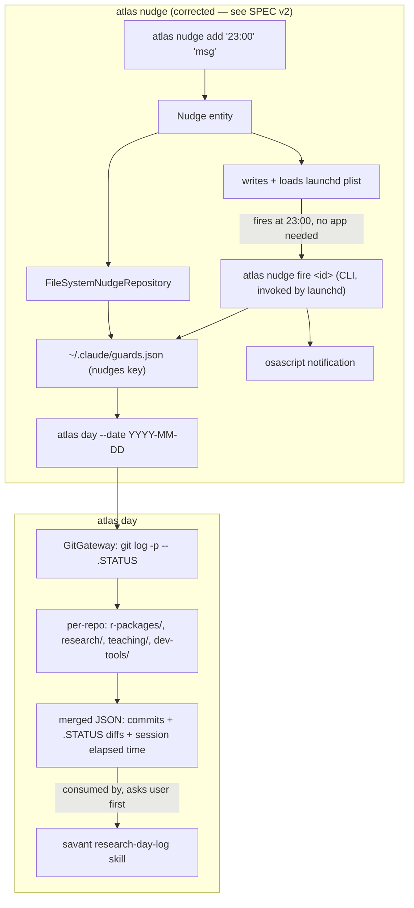

# BRAINSTORM: Cross-Surface Wall-Clock Nudges + Multi-Repo Day-Activity Provider

**Source:** [Issue #114](https://github.com/Data-Wise/atlas/issues/114)
**Date:** 2026-08-01
**Depth:** deep (6 expert questions) · **Focus:** arch
**Scope decision:** kept bundled under #114 (one SPEC, one implementation) — see Q5.

> **⚠️ Superseded (2026-08-01, same day):** Q1 (scheduler backend) and Q4
> (no-session fire handling) below were invalidated by an adversarial review
> of the resulting SPEC — `mcp__scheduled-tasks` cannot fire while every
> Claude surface is closed (it defers to next app launch, per its own
> documented contract), which fails the feature's core requirement. A
> second grill round replaced the scheduling backend with `launchd` +
> a new `atlas nudge fire <id>` CLI subcommand, and dropped `Nudge.recurrence`
> (scheduling now lives solely in the `launchd` plist). This section is kept
> for the historical record of the first pass; **the corrected design lives
> in [SPEC-cross-surface-nudges-and-day-activity-2026-08-01.md](docs/specs/SPEC-cross-surface-nudges-and-day-activity-2026-08-01.md) §3/§4, which is authoritative.**

## Context

Two adaptations from `ravila4/claude-adhd-skills` (MIT) need a home that isn't a
Claude Code hook, because both need to survive session end and/or work
cross-surface (Claude Code + Cowork). Atlas is the state hub (registry +
sessions + capture), so both land here rather than in `cc-config` (which is
not yet a real repo — only draft issue files exist at
`~/Downloads/adhd-issues/`).

| Class | Fires | Owner |
|---|---|---|
| Session-scoped nudge ("2h on this, stuck?") | next prompt submission | `cc-config` (future) |
| Wall-clock nudge ("stop at 23:00") | scheduled, session-independent | **atlas** |

## Architecture Decisions (from expert questions)

### 1. Scheduler backend → `mcp__scheduled-tasks__*`

Use the MCP scheduled-tasks tool (`create_scheduled_task` / `list` / etc.) as
the firing mechanism, not cron or launchd. It's already connected in-session,
and — critically — firing does not depend on a session being open, which is
the entire point of the feature (see the issue's own "stop me at 23:00" case).
No new OS-level scheduling code to write or maintain in atlas.

**Open dependency:** confirm the MCP's `create_scheduled_task` semantics
support a bare wall-clock time-of-day trigger (not just relative delays) —
check its schema (`ToolSearch select:mcp__scheduled-tasks__create_scheduled_task`)
before implementation starts.

### 2. State storage → direct read/write to `~/.claude/guards.json`

Matches the issue's own proposal. `guards.json` already holds `enabled` /
`muted_until` for `branch-guard`, `no-switch-guard`, `reference-scope-guard` —
it's a shared convention, not cc-config-private state. Add a `nudges` key
alongside the existing guard keys:

```json
{
  "guards": { "branch-guard": {...}, ... },
  "nudges": {
    "wall-clock": [
      { "id": "n_...", "time": "23:00", "message": "hard stop - wrap up and close the worktree", "acked": false, "created": "2026-08-01T14:00:00Z" }
    ]
  }
}
```

Direct write is the pragmatic choice specifically **because** cc-config
doesn't exist as a bootstrapped repo yet — waiting for it to expose a shared
schema/lib would block this indefinitely. Revisit if/when cc-config ships and
wants to own validation of this file.

### 3. Domain model → new `Nudge` entity, not a `ScheduleRecord` variant

`ScheduleRecord` (`src/domain/entities/ScheduleRecord.js`) is inherently
**dated** (`YYYY-MM-DD`), sourced from `.STATUS`/teach-config parsing, and
validated against `TYPES = ['teaching','research','general','recurring','holiday']`.
A nudge is wall-clock time-of-day + free-text message + ack state + optional
recurrence — different enough lifecycle (fire → ack, not "due on a date")
that forcing reuse would bolt on fields `ScheduleRecord`'s own validation
doesn't expect. New entity, new repository interface + FS/SQLite
implementations, following the existing pattern (`ScheduleRecord` →
`IScheduleRecordRepository` → `FileSystemScheduleRecordRepository` /
`SQLiteScheduleRecordRepository`).

```javascript
export class Nudge {
  static STATES = ['pending', 'fired', 'acked']
  constructor({ id, time, message, recurrence = 'none', state = 'pending', createdAt })
}
```

### 4. No-session fire handling → OS push notification (not queue-only)

The issue's headline use case — "stop me at 23:00" — is meaningless if it
silently no-ops when nothing's open; that IS the scenario cross-surface
nudges exist to cover. Needs an actual push/notify path, e.g. `osascript -e
'display notification ...'` on macOS (matches the existing
`brainstorm-mode.md` pattern already used elsewhere in this ecosystem for
file-open notifications). Queue-for-next-session-start alone was rejected —
it defeats the wall-clock guarantee (could be hours late). The "both" hybrid
(push + queued-unacked fallback) was considered but not selected; push alone
is the MVP, `atlas nudge ls` already gives an unacked-list fallback for free
once the `Nudge.STATES` model exists — no separate queue needed.

### 5. Scope: bundled, not split

Kept under one issue/SPEC despite the two sub-features sharing no code path
(nudges = scheduler + guards.json; day-activity = git/.STATUS reader across 4
trees). User's call — filing overhead avoided, single PR covers both. Flag
for implementation: **structure as two independent use-cases /
CLI-subcommand additions inside one PR**, not one intertwined change — so
review and rollback can still be reasoned about per-feature even though
they're not separately tracked.

### 6. `.STATUS` diff scope for `atlas day` → `git log -p` scoped to `.STATUS`, per repo, per date

Reuses the existing `GitGateway` — no new diffing logic, just pathspec the
existing git plumbing to `.STATUS` and filter by date, per project tree
(`r-packages/`, `research/`, `teaching/`, `dev-tools/`). A full multi-file
diff was explicitly rejected: it re-introduces the "commits are a bad proxy"
problem the issue itself warns against, undermining its own stated design
constraint ("memory aid, never source of truth").

## Architecture Diagram



## Existing Code to Reuse

- `GitGateway` (`src/adapters/gateways/GitGateway.js`) — for `atlas day`'s per-repo git reads.
- `ScheduleRecord` pattern (entity → repo interface → FS/SQLite impls) — template for the new `Nudge` entity, not a target for reuse itself (see Q3).
- `Container.js` DI wiring — register `INudgeRepository` alongside existing repos.
- Session elapsed-time data (already tracked per `atlas session`) — feeds `atlas day`'s per-lane elapsed time.

## Risks / Open Questions

- **MCP schema fit** — unverified whether `mcp__scheduled-tasks__create_scheduled_task` supports recurring wall-clock triggers or only one-shot/relative delays. Confirm before implementation.
- **guards.json write races** — cc-config's guard hooks and atlas's nudge writes will both touch this file; no locking exists today. Low risk (infrequent writes, human-paced) but worth a note, not a blocker.
- **Push notification portability** — `osascript` is macOS-only; if atlas is ever used cross-platform this path needs a fallback (explicitly out of scope for now — user's stated environment is macOS).
- **4-repo assumption is hardcoded** — `atlas day`'s tree list (`r-packages/`, `research/`, `teaching/`, `dev-tools/`) should probably come from atlas's project registry (already scans `~/projects`) rather than a hardcoded list, to avoid drift as new project categories appear.

## Test Plan Scaffold

Change shape: new command/skill/agent-equivalent (new CLI subcommands `atlas nudge *`, `atlas day`) + cross-command data flow (nudge fire → OS notify → `atlas nudge ls`) + external dependency (MCP scheduled-tasks). Tiers: `unit` + `integration` + `dependency` + `count-cascade` dogfood.

```javascript
// test/unit/domain/entities/Nudge.test.js
// TODO(author): delete if not contract-bearing
describe('Nudge', () => {
  it('rejects a time-of-day not matching HH:MM', () => {
    throw new Error('not implemented')
  })
})
```

```javascript
// test/unit/use-cases/nudge/AddNudge.test.js
// TODO(author): delete if not contract-bearing
describe('AddNudgeUseCase', () => {
  it('persists to guards.json under the nudges key without clobbering existing guard keys', () => {
    throw new Error('not implemented')
  })
})
```

```javascript
// test/integration/nudge-mcp-scheduling.test.js
// TODO(author): delete if not contract-bearing
describe('nudge scheduling (dependency: mcp scheduled-tasks)', () => {
  it('registers a scheduled task whose fire callback marks the Nudge as fired', () => {
    throw new Error('not implemented')
  })
})
```

```javascript
// test/unit/use-cases/day/GetDayActivity.test.js
// TODO(author): delete if not contract-bearing
describe('GetDayActivityUseCase', () => {
  it('scopes git log -p to .STATUS only, per repo, filtered to the given date', () => {
    throw new Error('not implemented')
  })
})
```

- `count-cascade` dogfood: N/A — no new skill/command count file exists yet in atlas for CLI subcommands; if `atlas doctor`-style count validators are added later, wire this in then.

## Documentation Scaffold

Doc-impact assessment (doc-impact-rubric, threshold ≥3):

- `[x]` **CLI-REFERENCE.md** — new top-level commands (`atlas nudge add/ls/ack`, `atlas day`). Score: 5 (new user-facing surface).
- `[x]` **CHANGELOG.md `[Unreleased]`** — mirror entry once implemented. Score: 5.
- `[ ]` **REFCARD.md** — N/A — score 2, quick-reference table churn not justified until usage patterns settle.
- `[ ]` **Demo GIF** — N/A — score 1, not a visually distinct enough interaction to warrant a VHS tape yet.
- `[ ]` **Mermaid diagram in ARCHITECTURE.md** — N/A — score 2 for now; the diagram above lives in this BRAINSTORM, promote to ARCHITECTURE.md only if the entity pattern proves durable post-implementation.

## Suggested Next Command

```bash
/craft:brainstorm --orch docs/specs/SPEC-cross-surface-nudges-and-day-activity-2026-08-01.md
```

(after a SPEC is captured — see below)
