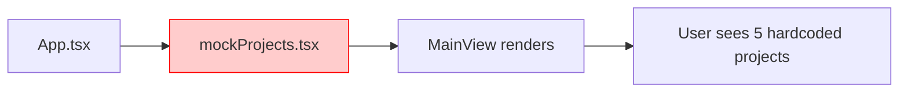
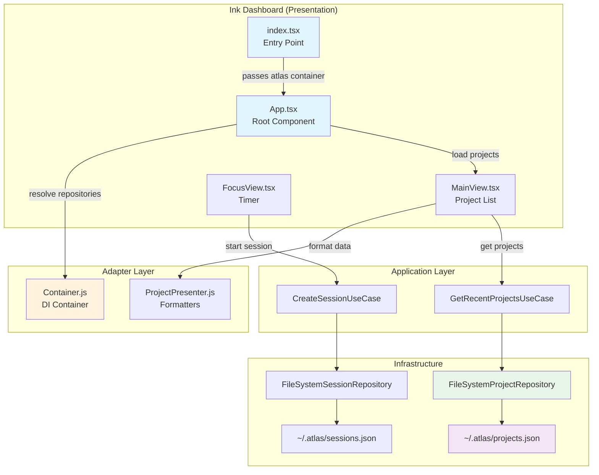
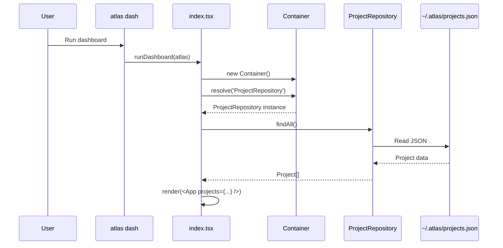
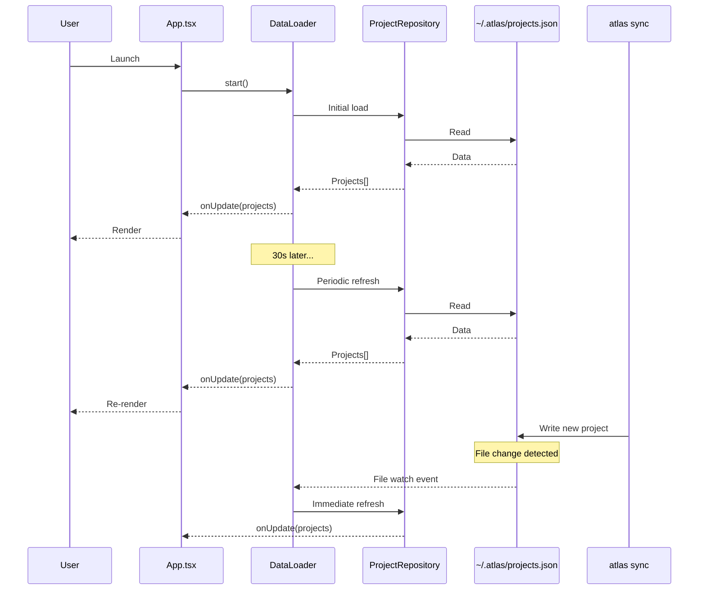
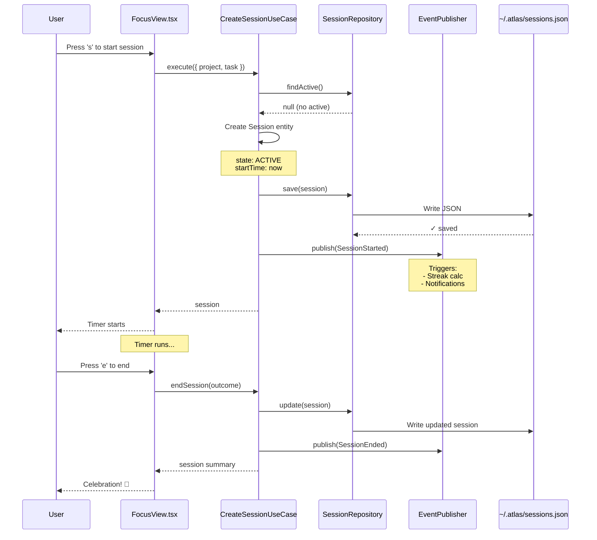
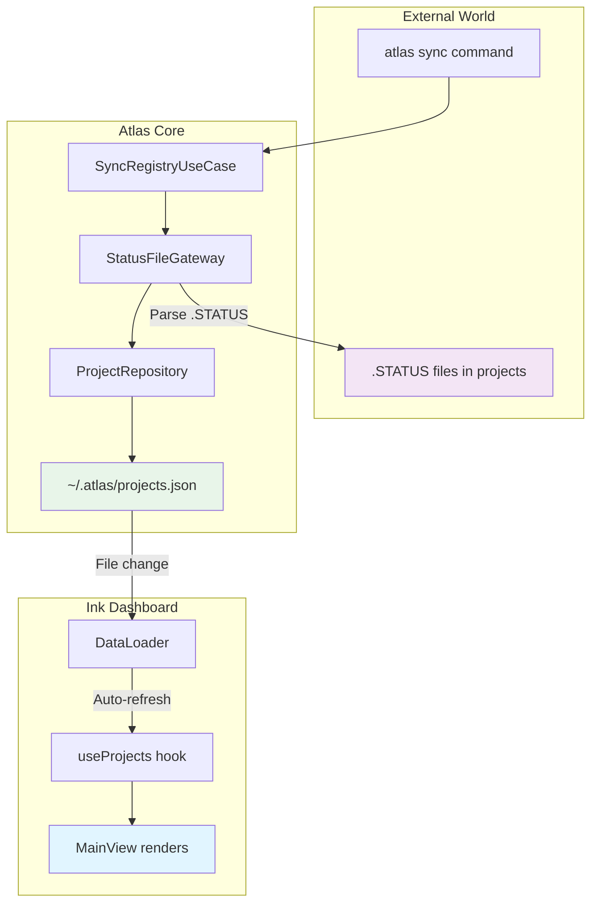
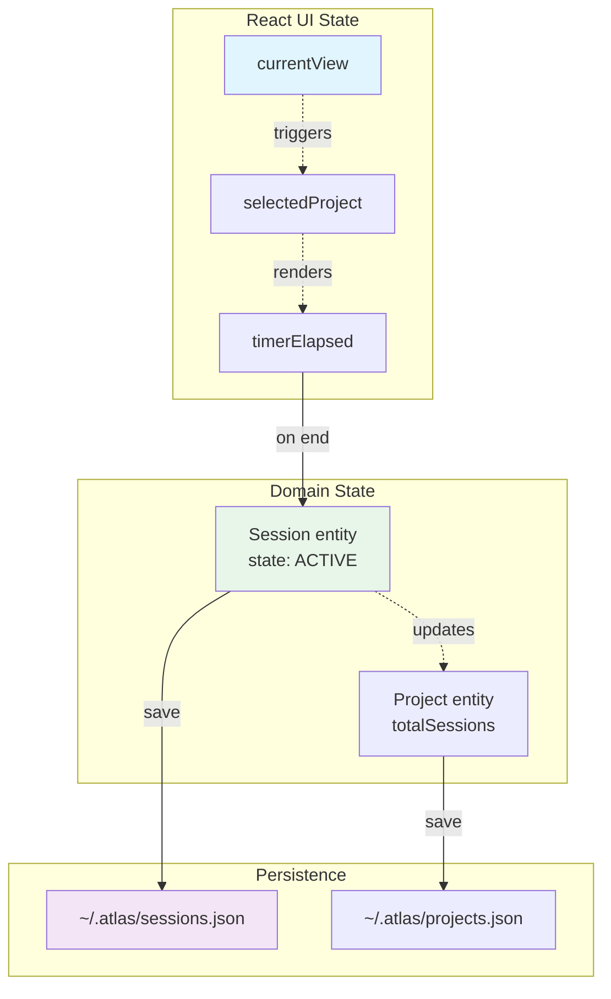

# System Design: Ink Dashboard Data Integration

**Date:** 2026-01-07
**Version:** 1.0
**Status:** Draft
**Context:** v0.9.0 Sprint 1 Complete - Ink Migration Finished

---

## Table of Contents

1. [Executive Summary](#executive-summary)
2. [Current Architecture Analysis](#current-architecture-analysis)
3. [Proposed Architecture](#proposed-architecture)
4. [Integration Proposals (3 Options)](#integration-proposals)
5. [Data Flow Diagrams](#data-flow-diagrams)
6. [Component Design](#component-design)
7. [State Management Strategy](#state-management-strategy)
8. [Performance Considerations](#performance-considerations)
9. [Testing Strategy](#testing-strategy)
10. [Migration Path](#migration-path)
11. [Recommendations](#recommendations)

---

## Executive Summary

### Problem Statement

The new Ink dashboard (React-based TUI) successfully replaced the legacy blessed dashboard with 73% code reduction. However, it currently uses **mock data** (`mockProjects.tsx`) instead of Atlas's production data infrastructure (FileSystemProjectRepository, SessionRepository, etc.).

### Goals

1. **Replace mock data** with real data from `~/.atlas/` storage
2. **Integrate session management** - Timer persistence, state transitions
3. **Maintain Clean Architecture** - No domain logic in React components
4. **Preserve testability** - Mock data still available for tests
5. **Enable real-time updates** - Dashboard reflects external changes

### Success Metrics

| Metric | Current | Target |
|--------|---------|--------|
| Data Source | Mock (5 projects) | FileSystemProjectRepository |
| Session Persistence | None | Sessions saved to ~/.atlas/ |
| Data Refresh | Static | 30s auto-refresh |
| Error Handling | None | Error boundaries + fallbacks |
| Test Coverage | Integration (25 tests) | + Unit tests for data layer |

---

## Current Architecture Analysis

### Ink Dashboard (As-Built)

```
src/cli/dashboard-ink/
├── index.tsx                 # Entry point, renders <App />
├── components/
│   ├── App.tsx              # Root component, view routing
│   ├── views/               # 7 view components
│   │   ├── MainView.tsx    # Project list (uses mockProjects)
│   │   ├── DetailView.tsx  # Single project details
│   │   ├── FocusView.tsx   # Pomodoro timer (no persistence)
│   │   └── ...
│   └── shared/
│       └── Card.tsx         # Project card component
├── lib/
│   └── stateMachine.js      # View transition logic
└── data/
    └── mockProjects.tsx     # ⚠️ HARDCODED DATA
```

### Atlas Core Architecture (Existing)

```
src/
├── domain/                   # Entities, Value Objects
│   ├── entities/
│   │   ├── Project.js       # Rich domain model
│   │   └── Session.js       # Session lifecycle
│   └── repositories/
│       └── IProjectRepository.js  # Interface
│
├── use-cases/                # Application logic
│   ├── project/
│   │   ├── GetRecentProjectsUseCase.js
│   │   └── GetStatusUseCase.js
│   └── session/
│       ├── CreateSessionUseCase.js
│       └── EndSessionUseCase.js
│
└── adapters/                 # Infrastructure
    ├── repositories/
    │   └── FileSystemProjectRepository.js  # Reads ~/.atlas/projects.json
    ├── presenters/
    │   ├── ProjectPresenter.js  # UI-agnostic formatters
    │   └── TuiPresenter.js      # Terminal-specific
    └── Container.js             # Dependency injection
```

### Current Data Flow (Mock)



**Problem:** No connection to real data, no persistence, no updates.

---

## Proposed Architecture

### Target Data Flow



### Key Design Decisions

| Decision | Rationale |
|----------|-----------|
| **Pass Container to App** | Enables dependency injection, testable |
| **Use Use Cases** | Preserves Clean Architecture, no domain logic in React |
| **Presenter Layer** | Separates formatting from business logic |
| **React Context for DI** | Components access repositories via context |
| **Async Data Loading** | useEffect hooks trigger data fetching |

---

## Integration Proposals

### Proposal A: Minimal Integration (Recommended for Phase 1)

**Approach:** Replace mock data with real data, minimal architectural changes.

**Changes:**
```typescript
// index.tsx
export async function runDashboard(atlas) {
  const container = atlas?.container || new Container({ storage: 'filesystem' });
  const projectRepo = container.resolve('ProjectRepository');

  // Load real projects
  const projects = await projectRepo.findAll();

  render(<App projects={projects} container={container} onExit={...} />);
}
```

**Pros:**
- ✅ Minimal code changes
- ✅ Fast to implement (~2 hours)
- ✅ Validates data integration works
- ✅ No breaking changes to existing components

**Cons:**
- ⚠️ Props drilling (pass container through components)
- ⚠️ No auto-refresh without restarting dashboard
- ⚠️ Limited error handling

**Diagram:**


---

### Proposal B: React Context + Hooks (Recommended for Phase 2)

**Approach:** Use React Context for DI, custom hooks for data loading.

**Architecture:**
```typescript
// New: lib/AtlasContext.tsx
export const AtlasContext = createContext<Container | null>(null);

export function useProjects() {
  const container = useContext(AtlasContext);
  const [projects, setProjects] = useState<Project[]>([]);
  const [loading, setLoading] = useState(true);
  const [error, setError] = useState<Error | null>(null);

  useEffect(() => {
    const projectRepo = container.resolve('ProjectRepository');
    projectRepo.findAll()
      .then(setProjects)
      .catch(setError)
      .finally(() => setLoading(false));
  }, [container]);

  return { projects, loading, error };
}

// Usage in MainView.tsx
const { projects, loading, error } = useProjects();
if (loading) return <Spinner />;
if (error) return <ErrorView error={error} />;
```

**Pros:**
- ✅ No props drilling
- ✅ Clean separation of concerns
- ✅ Easy to add loading/error states
- ✅ Reusable hooks across components

**Cons:**
- ⚠️ More files to create (~4 new files)
- ⚠️ Context re-renders can be expensive
- ⚠️ Still no auto-refresh

**Diagram:**
```mermaid
graph TB
    subgraph "Provider Layer"
        A[AtlasContext.Provider<br/>value=container]
    end

    subgraph "Custom Hooks"
        B[useProjects<br/>Load + cache projects]
        C[useSession<br/>Session state]
        D[useActiveSession<br/>Detect active sessions]
    end

    subgraph "Components"
        E[MainView<br/>const {projects} = useProjects]
        F[FocusView<br/>const {session} = useSession]
    end

    A --> B
    A --> C
    A --> D
    B --> E
    C --> F

    style A fill:#e1f5ff
    style B fill:#fff3e0
    style E fill:#e8f5e9
```

---

### Proposal C: Observer Pattern + Auto-Refresh (Recommended for Phase 3)

**Approach:** Add event-driven updates, auto-refresh on file changes.

**Architecture:**
```typescript
// New: lib/DataLoader.ts
export class DataLoader {
  private intervalId: NodeJS.Timeout | null = null;
  private fileWatcher: FSWatcher | null = null;

  constructor(
    private projectRepo: IProjectRepository,
    private onUpdate: (projects: Project[]) => void
  ) {}

  async start() {
    // Initial load
    await this.refresh();

    // Periodic refresh (30s)
    this.intervalId = setInterval(() => this.refresh(), 30000);

    // File system watch (optional)
    this.fileWatcher = watch('~/.atlas/projects.json', () => this.refresh());
  }

  async refresh() {
    const projects = await this.projectRepo.findAll();
    this.onUpdate(projects);
  }

  stop() {
    if (this.intervalId) clearInterval(this.intervalId);
    if (this.fileWatcher) this.fileWatcher.close();
  }
}
```

**Pros:**
- ✅ Real-time updates without restart
- ✅ Dashboard reflects external changes (atlas sync)
- ✅ Better UX for long-running sessions
- ✅ Can use file watchers for instant updates

**Cons:**
- ⚠️ More complex implementation
- ⚠️ Potential performance impact
- ⚠️ File watchers can be flaky

**Diagram:**


---

## Data Flow Diagrams

### Complete Session Lifecycle with Ink Integration



### Project Data Synchronization



---

## Component Design

### Dependency Injection via Context

```typescript
// lib/AtlasContext.tsx
import React, { createContext, useContext } from 'react';
import { Container } from '../../../adapters/Container.js';

export const AtlasContext = createContext<Container | null>(null);

export function AtlasProvider({ container, children }: Props) {
  return (
    <AtlasContext.Provider value={container}>
      {children}
    </AtlasContext.Provider>
  );
}

export function useAtlas(): Container {
  const container = useContext(AtlasContext);
  if (!container) {
    throw new Error('useAtlas must be used within AtlasProvider');
  }
  return container;
}
```

### Custom Hooks for Data Access

```typescript
// lib/hooks/useProjects.ts
import { useState, useEffect } from 'react';
import { useAtlas } from '../AtlasContext.js';
import type { Project } from '../../../domain/entities/Project.js';

export function useProjects() {
  const container = useAtlas();
  const [projects, setProjects] = useState<Project[]>([]);
  const [loading, setLoading] = useState(true);
  const [error, setError] = useState<Error | null>(null);

  useEffect(() => {
    const projectRepo = container.resolve('ProjectRepository');

    projectRepo.findAll()
      .then(projects => {
        setProjects(projects);
        setLoading(false);
      })
      .catch(err => {
        setError(err);
        setLoading(false);
      });
  }, [container]);

  const refresh = async () => {
    setLoading(true);
    try {
      const projectRepo = container.resolve('ProjectRepository');
      const projects = await projectRepo.findAll();
      setProjects(projects);
    } catch (err) {
      setError(err);
    } finally {
      setLoading(false);
    }
  };

  return { projects, loading, error, refresh };
}
```

### Error Boundary Component

```typescript
// components/shared/ErrorBoundary.tsx
import React, { Component, ReactNode } from 'react';
import { Box, Text } from 'ink';

interface Props {
  children: ReactNode;
  fallback?: (error: Error) => ReactNode;
}

interface State {
  error: Error | null;
}

export class ErrorBoundary extends Component<Props, State> {
  state: State = { error: null };

  static getDerivedStateFromError(error: Error): State {
    return { error };
  }

  render() {
    if (this.state.error) {
      return this.props.fallback?.(this.state.error) || (
        <Box flexDirection="column" padding={1}>
          <Text bold color="red">Error Loading Dashboard</Text>
          <Text>{this.state.error.message}</Text>
          <Text dimColor>Try running: atlas sync</Text>
        </Box>
      );
    }

    return this.props.children;
  }
}
```

---

## State Management Strategy

### State Location Matrix

| State Type | Location | Why |
|------------|----------|-----|
| **View Navigation** | App.tsx (React state) | Fast, local, UI-only |
| **Project Data** | Custom hook (useProjects) | Cacheable, shared |
| **Session State** | Domain entity + Repository | Persistent, business logic |
| **Timer State** | FocusView local state | Temporary, ephemeral |
| **Active Session** | Custom hook (useActiveSession) | Derived from repository |
| **Error State** | Error boundary + hooks | Localized error handling |

### State Synchronization



**Key Principle:** UI state stays in React, domain state persists via repositories.

---

## Performance Considerations

### Repository Caching

FileSystemProjectRepository already implements caching:

```javascript
// src/adapters/repositories/FileSystemProjectRepository.js:51-56
this._projectCache = null;
this._projectCacheTTL = 30000;  // 30 seconds
this._projectByIdCache = new Map();   // O(1) lookups
this._projectByPathCache = new Map();
```

**Strategy:** Leverage existing cache, align refresh interval to TTL.

### React Optimization

```typescript
// Memoize expensive computations
const sortedProjects = useMemo(() => {
  return projects.sort((a, b) => b.progress - a.progress);
}, [projects]);

// Avoid unnecessary re-renders
const Card = memo(({ project }: Props) => {
  // ...
});
```

### Virtual Scrolling (Future)

For 100+ projects, consider:
- `react-window` or `react-virtualized` equivalent for Ink
- Lazy loading of project details
- Pagination in repository queries

---

## Testing Strategy

### Unit Tests (New)

```typescript
// __tests__/hooks/useProjects.test.ts
describe('useProjects', () => {
  it('loads projects from repository', async () => {
    const mockRepo = {
      findAll: jest.fn().resolves([
        { id: '1', name: 'test-project' }
      ])
    };

    const { result } = renderHook(() => useProjects(), {
      wrapper: ({ children }) => (
        <AtlasProvider container={mockContainer(mockRepo)}>
          {children}
        </AtlasProvider>
      )
    });

    await waitFor(() => expect(result.current.loading).toBe(false));
    expect(result.current.projects).toHaveLength(1);
  });

  it('handles errors gracefully', async () => {
    const mockRepo = {
      findAll: jest.fn().rejects(new Error('Failed to load'))
    };

    const { result } = renderHook(() => useProjects(), {
      wrapper: ({ children }) => (
        <AtlasProvider container={mockContainer(mockRepo)}>
          {children}
        </AtlasProvider>
      )
    });

    await waitFor(() => expect(result.current.error).toBeTruthy());
    expect(result.current.error.message).toBe('Failed to load');
  });
});
```

### Integration Tests

```typescript
// __tests__/integration/dashboard-data.test.ts
describe('Dashboard Data Integration', () => {
  it('loads real projects from FileSystemProjectRepository', async () => {
    const container = new Container({
      dataDir: '/tmp/test-atlas',
      storage: 'filesystem'
    });

    // Seed test data
    const projectRepo = container.resolve('ProjectRepository');
    await projectRepo.save(new Project({ name: 'test-project' }));

    const { rerender } = render(<App container={container} />);

    // Should display test project
    await waitFor(() => {
      expect(screen.getByText('test-project')).toBeDefined();
    });
  });
});
```

### Manual Testing Checklist

```
Data Loading:
  [ ] Dashboard loads projects from ~/.atlas/projects.json
  [ ] Shows correct project count
  [ ] Displays project metadata (type, status, progress)
  [ ] Error handling for missing ~/.atlas/ directory
  [ ] Error handling for corrupt JSON

Data Refresh:
  [ ] Projects refresh every 30s
  [ ] External changes (atlas sync) reflected after refresh
  [ ] No UI flickering during refresh
  [ ] Spinner shows during initial load

Session Integration:
  [ ] Start session creates entry in ~/.atlas/sessions.json
  [ ] Timer runs correctly
  [ ] End session updates duration and outcome
  [ ] Active session indicator shows on project card
```

---

## Migration Path

### Phase 1: Core Data Integration (Week 1)

**Tasks:**
1. Create AtlasContext and provider
2. Update index.tsx to pass Container
3. Replace mockProjects in MainView
4. Add error boundary
5. Test with real data

**Deliverable:** Dashboard loads real projects from FileSystemProjectRepository

---

### Phase 2: Session Integration (Week 1-2)

**Tasks:**
1. Create useSession hook
2. Integrate CreateSessionUseCase in FocusView
3. Integrate EndSessionUseCase
4. Add session persistence
5. Implement active session detection

**Deliverable:** Timer creates/updates real sessions

---

### Phase 3: Auto-Refresh (Week 2)

**Tasks:**
1. Implement DataLoader class
2. Add periodic refresh (30s interval)
3. Optional: File system watchers
4. Add loading states during refresh

**Deliverable:** Dashboard updates automatically

---

## Recommendations

### Recommended Path: Hybrid Approach

**Phase 1:** Proposal A (Minimal Integration)
- Fast to implement
- Validates approach
- Low risk

**Phase 2:** Proposal B (React Context + Hooks)
- Cleaner architecture
- Better DX
- Easier to test

**Phase 3:** Proposal C (Auto-Refresh)
- Enhanced UX
- Production-ready
- Handles long-running sessions

### Why Not All at Once?

1. **Incremental validation** - Catch issues early
2. **Easier debugging** - Isolate problems to specific phase
3. **ADHD-friendly** - Smaller, achievable milestones
4. **Reversible** - Can rollback to previous phase

### Architectural Principles to Maintain

✅ **Clean Architecture** - No domain logic in React components
✅ **Dependency Injection** - Use Container for all dependencies
✅ **Presenter Pattern** - Format data outside components
✅ **Repository Pattern** - Abstract storage details
✅ **Testability** - Mock repositories for tests

---

## Appendix: Comparison Matrix

| Aspect | Proposal A | Proposal B | Proposal C |
|--------|-----------|-----------|-----------|
| **Complexity** | Low | Medium | High |
| **Implementation Time** | 2 hours | 4-6 hours | 8-10 hours |
| **Maintainability** | Medium | High | High |
| **Testability** | Medium | High | High |
| **Performance** | Good | Good | Excellent |
| **UX** | Basic | Good | Excellent |
| **Auto-Refresh** | ❌ | ❌ | ✅ |
| **Error Handling** | Basic | Good | Excellent |
| **Type Safety** | Basic | Good | Good |
| **Recommended For** | Phase 1 | Phase 2 | Phase 3 |

---

**Generated:** 2026-01-07
**Authors:** System Architect + Atlas Development Team
**Status:** Ready for Review
**Next Steps:** Review proposals, select path, implement Phase 1
