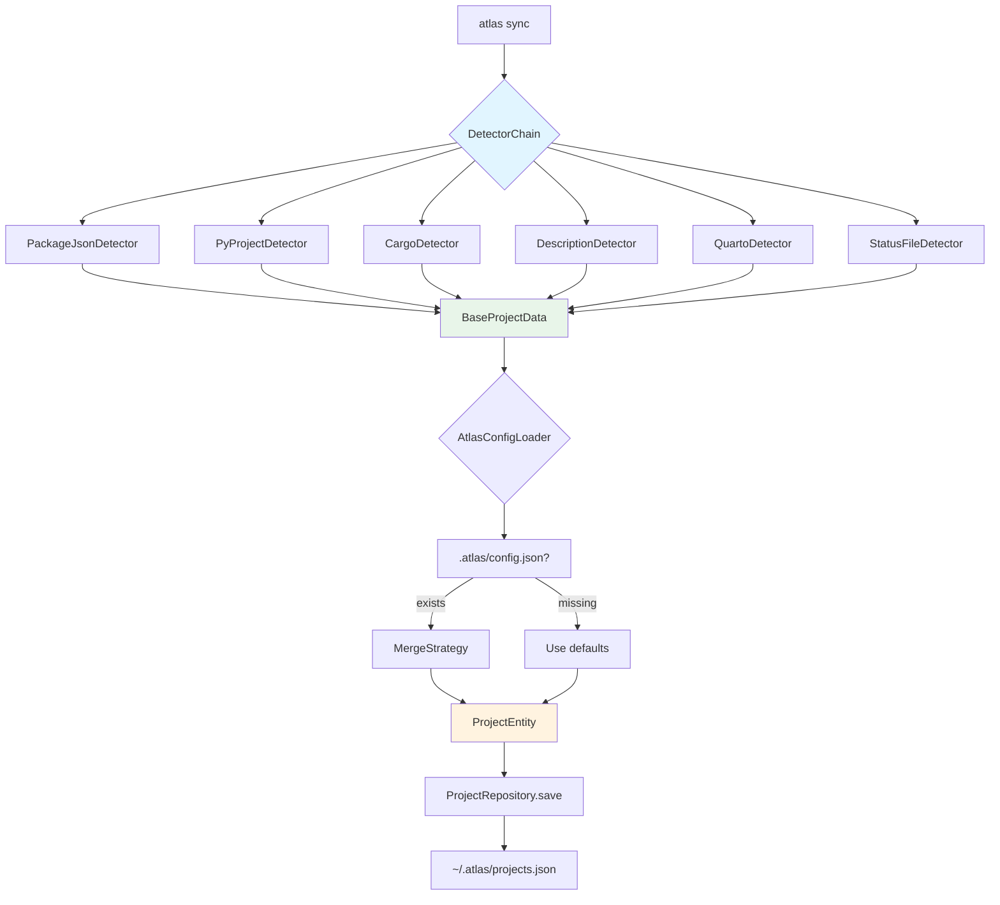
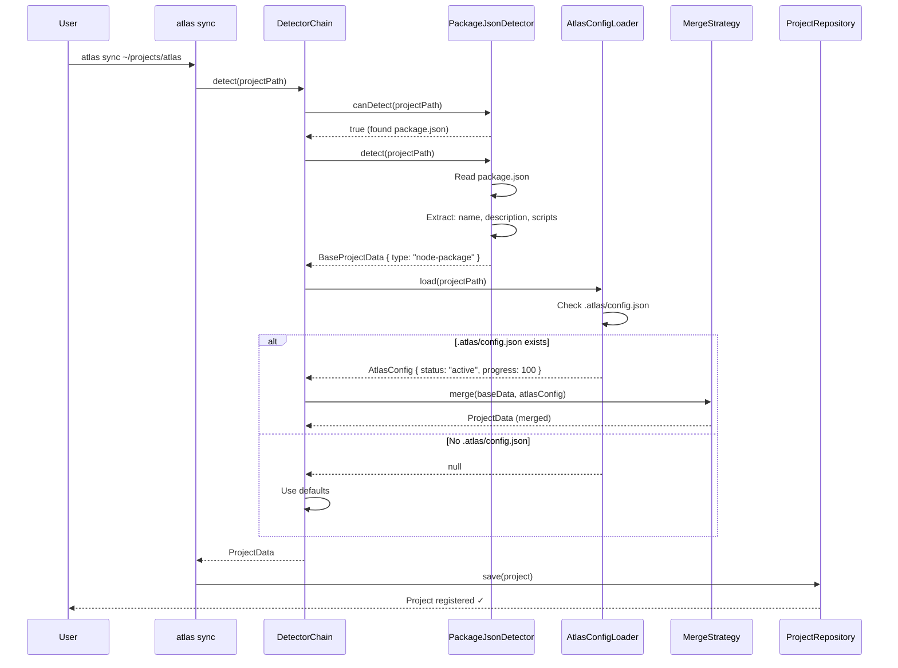

# System Design: Polyglot Project Metadata Detection

**Status:** Draft
**Created:** 2026-01-07
**From Brainstorm:** [BRAINSTORM-project-metadata-collection-2026-01-07.md](./BRAINSTORM-project-metadata-collection-2026-01-07.md)
**Version:** 1.0

---

## Overview

This system design details the architecture for implementing **Polyglot Project Detection** - an auto-detection system that identifies project types from ecosystem files (package.json, pyproject.toml, Cargo.toml, etc.) and augments with optional `.atlas/` directory for Atlas-specific metadata.

**Goal:** Eliminate manual .STATUS file maintenance while preserving user control and leveraging existing project metadata.

**Strategy:** Auto-detect → Augment → Override pattern

---

## Problem Statement

### Current Limitations

Atlas currently requires users to manually create and maintain `.STATUS` files:

```yaml
## Project: atlas
## Type: node-package
## Status: active
## Progress: 100
```

**Issues:**
1. **High friction** - Users must remember to create .STATUS files
2. **Duplication** - Project type already in package.json, pyproject.toml, etc.
3. **Out of sync** - Easy to forget updating .STATUS when project changes
4. **No validation** - Typos in "Type:" cause silent failures
5. **Non-standard** - Custom format not recognized by other tools

### Desired Outcome

```typescript
// Auto-detected from package.json
{
  id: "atlas",
  name: "atlas",
  type: "node-package",  // ← Detected from package.json
  path: "/Users/dt/projects/dev-tools/atlas",
  // ... other fields auto-populated
}

// Augmented with .atlas/config.json (optional)
{
  // ... auto-detected fields
  status: "active",      // ← User-provided in .atlas/config.json
  progress: 100,         // ← User-provided
  priority: 1            // ← User-provided
}
```

**Benefits:**
✅ Zero-config for basic project tracking
✅ Leverage existing ecosystem metadata
✅ Optional user augmentation via `.atlas/`
✅ Schema validation
✅ Gradual migration from .STATUS files

---

## Architecture

### High-Level Design



### Data Flow Sequence



---

## Component Design

### 1. Detector Interface

```typescript
/**
 * Core abstraction for project type detection
 */
interface ProjectDetector {
  /**
   * Check if this detector can handle the project
   * @param projectPath - Absolute path to project root
   * @returns true if detector recognizes this project type
   */
  canDetect(projectPath: string): boolean;

  /**
   * Extract project metadata
   * @param projectPath - Absolute path to project root
   * @returns Base project data auto-detected from ecosystem files
   */
  detect(projectPath: string): Promise<BaseProjectData>;

  /**
   * Priority for detector chain (higher = checked first)
   */
  readonly priority: number;
}
```

### 2. Base Project Data

```typescript
/**
 * Auto-detected data from ecosystem files
 */
interface BaseProjectData {
  // Required fields (auto-detected)
  name: string;           // From package.json, pyproject.toml, DESCRIPTION, etc.
  type: ProjectType;      // node-package, python-package, r-package, etc.
  path: string;           // Absolute path

  // Optional fields (if available)
  description?: string;   // From package.json description, pyproject.toml, etc.
  version?: string;       // From package.json version, pyproject.toml, etc.
  repository?: string;    // From package.json repository.url
  homepage?: string;      // From package.json homepage
  license?: string;       // From package.json license

  // Metadata
  detectedBy: string;     // Which detector found this (for debugging)
  detectedAt: Date;       // When detected
  ecosystemFiles: string[]; // Files used for detection
}
```

### 3. Atlas Config Schema

```typescript
/**
 * User-provided augmentation in .atlas/config.json
 */
interface AtlasConfig {
  // Project state (user-maintained)
  status?: 'active' | 'paused' | 'archived';
  progress?: number;      // 0-100
  priority?: 1 | 2 | 3;   // P1, P2, P3

  // Current focus
  phase?: string;         // Current phase/milestone
  focus?: string;         // What you're working on now
  next?: string;          // Next action

  // Organization
  tags?: string[];        // Custom tags

  // Overrides (optional - use with caution)
  overrides?: {
    name?: string;        // Override auto-detected name
    type?: string;        // Override auto-detected type
    description?: string; // Override auto-detected description
  };
}
```

**JSON Schema for Validation:**

```json
{
  "$schema": "http://json-schema.org/draft-07/schema#",
  "title": "Atlas Project Configuration",
  "type": "object",
  "properties": {
    "status": {
      "type": "string",
      "enum": ["active", "paused", "archived"],
      "description": "Current project state"
    },
    "progress": {
      "type": "number",
      "minimum": 0,
      "maximum": 100,
      "description": "Completion percentage"
    },
    "priority": {
      "type": "number",
      "enum": [1, 2, 3],
      "description": "Priority level (1=highest)"
    },
    "phase": {
      "type": "string",
      "description": "Current phase or milestone"
    },
    "focus": {
      "type": "string",
      "description": "Current work focus"
    },
    "next": {
      "type": "string",
      "description": "Next action item"
    },
    "tags": {
      "type": "array",
      "items": { "type": "string" },
      "description": "Custom tags for filtering"
    },
    "overrides": {
      "type": "object",
      "properties": {
        "name": { "type": "string" },
        "type": { "type": "string" },
        "description": { "type": "string" }
      },
      "description": "Override auto-detected values (use with caution)"
    }
  },
  "additionalProperties": false
}
```

### 4. Detector Chain

```typescript
/**
 * Orchestrates detector selection and execution
 */
class DetectorChain {
  private detectors: ProjectDetector[];

  constructor() {
    this.detectors = [
      new PackageJsonDetector(),     // priority: 100
      new PyProjectDetector(),       // priority: 90
      new CargoDetector(),           // priority: 85
      new DescriptionDetector(),     // priority: 80
      new QuartoDetector(),          // priority: 75
      new GoModDetector(),           // priority: 70
      new ComposerDetector(),        // priority: 65
      new StatusFileDetector(),      // priority: 10 (fallback)
    ].sort((a, b) => b.priority - a.priority);
  }

  /**
   * Detect project type using first matching detector
   */
  async detect(projectPath: string): Promise<ProjectData> {
    // 1. Find matching detector
    const detector = this.detectors.find(d => d.canDetect(projectPath));

    if (!detector) {
      throw new Error(`No detector found for project: ${projectPath}`);
    }

    // 2. Get base data from ecosystem files
    const baseData = await detector.detect(projectPath);

    // 3. Load .atlas/config.json (if exists)
    const atlasConfig = await this.loadAtlasConfig(projectPath);

    // 4. Merge base + atlas config
    const projectData = this.merge(baseData, atlasConfig);

    // 5. Apply defaults
    return this.applyDefaults(projectData);
  }

  private async loadAtlasConfig(projectPath: string): Promise<AtlasConfig | null> {
    const configPath = join(projectPath, '.atlas', 'config.json');

    if (!existsSync(configPath)) {
      return null;
    }

    const content = await readFile(configPath, 'utf-8');
    const config = JSON.parse(content);

    // Validate against JSON schema
    const valid = this.validator.validate(config);
    if (!valid) {
      throw new ValidationError(
        `Invalid .atlas/config.json: ${this.validator.errors}`
      );
    }

    return config;
  }

  private merge(base: BaseProjectData, atlas: AtlasConfig | null): ProjectData {
    if (!atlas) {
      return { ...base, ...DEFAULT_ATLAS_CONFIG };
    }

    return {
      // Base data (auto-detected)
      ...base,

      // Atlas config (user-provided)
      status: atlas.status ?? 'active',
      progress: atlas.progress ?? 0,
      priority: atlas.priority ?? 3,
      phase: atlas.phase,
      focus: atlas.focus,
      next: atlas.next,
      tags: atlas.tags ?? [],

      // Overrides (if provided)
      ...(atlas.overrides && {
        name: atlas.overrides.name ?? base.name,
        type: atlas.overrides.type ?? base.type,
        description: atlas.overrides.description ?? base.description,
      }),
    };
  }

  private applyDefaults(data: Partial<ProjectData>): ProjectData {
    return {
      ...data,
      status: data.status ?? 'active',
      progress: data.progress ?? 0,
      priority: data.priority ?? 3,
      tags: data.tags ?? [],
      createdAt: data.createdAt ?? new Date(),
      lastAccessedAt: data.lastAccessedAt ?? new Date(),
    } as ProjectData;
  }
}
```

---

## Detector Implementations

### PackageJsonDetector (Node.js/npm)

```typescript
class PackageJsonDetector implements ProjectDetector {
  readonly priority = 100;

  canDetect(projectPath: string): boolean {
    return existsSync(join(projectPath, 'package.json'));
  }

  async detect(projectPath: string): Promise<BaseProjectData> {
    const pkgPath = join(projectPath, 'package.json');
    const content = await readFile(pkgPath, 'utf-8');
    const pkg = JSON.parse(content);

    return {
      name: pkg.name ?? basename(projectPath),
      type: this.inferType(pkg),
      path: projectPath,
      description: pkg.description,
      version: pkg.version,
      repository: pkg.repository?.url,
      homepage: pkg.homepage,
      license: pkg.license,
      detectedBy: 'PackageJsonDetector',
      detectedAt: new Date(),
      ecosystemFiles: ['package.json'],
    };
  }

  private inferType(pkg: any): ProjectType {
    // Check for bin field (CLI tool)
    if (pkg.bin) {
      return 'node-cli';
    }

    // Check for main/exports (library)
    if (pkg.main || pkg.exports) {
      return 'node-package';
    }

    // Check for scripts.start (app)
    if (pkg.scripts?.start) {
      return 'node-app';
    }

    // Default
    return 'node-package';
  }
}
```

### PyProjectDetector (Python/Poetry/Hatch)

```typescript
class PyProjectDetector implements ProjectDetector {
  readonly priority = 90;

  canDetect(projectPath: string): boolean {
    return existsSync(join(projectPath, 'pyproject.toml'));
  }

  async detect(projectPath: string): Promise<BaseProjectData> {
    const tomlPath = join(projectPath, 'pyproject.toml');
    const content = await readFile(tomlPath, 'utf-8');
    const parsed = TOML.parse(content);

    const project = parsed.project ?? parsed.tool?.poetry;

    return {
      name: project.name ?? basename(projectPath),
      type: this.inferType(parsed),
      path: projectPath,
      description: project.description,
      version: project.version,
      homepage: project.urls?.Homepage,
      license: project.license,
      detectedBy: 'PyProjectDetector',
      detectedAt: new Date(),
      ecosystemFiles: ['pyproject.toml'],
    };
  }

  private inferType(parsed: any): ProjectType {
    // Check for [tool.poetry] or [build-system]
    if (parsed.tool?.poetry || parsed['build-system']) {
      return 'python-package';
    }

    // Check for [project.scripts]
    if (parsed.project?.scripts) {
      return 'python-cli';
    }

    return 'python-package';
  }
}
```

### DescriptionDetector (R Package)

```typescript
class DescriptionDetector implements ProjectDetector {
  readonly priority = 80;

  canDetect(projectPath: string): boolean {
    return existsSync(join(projectPath, 'DESCRIPTION'));
  }

  async detect(projectPath: string): Promise<BaseProjectData> {
    const descPath = join(projectPath, 'DESCRIPTION');
    const content = await readFile(descPath, 'utf-8');
    const parsed = this.parseDCF(content);

    return {
      name: parsed.Package ?? basename(projectPath),
      type: 'r-package',
      path: projectPath,
      description: parsed.Title,
      version: parsed.Version,
      license: parsed.License,
      detectedBy: 'DescriptionDetector',
      detectedAt: new Date(),
      ecosystemFiles: ['DESCRIPTION'],
    };
  }

  private parseDCF(content: string): Record<string, string> {
    const lines = content.split('\n');
    const result: Record<string, string> = {};
    let currentKey = '';

    for (const line of lines) {
      if (line.match(/^[A-Za-z]+:/)) {
        const [key, ...valueParts] = line.split(':');
        currentKey = key.trim();
        result[currentKey] = valueParts.join(':').trim();
      } else if (currentKey && line.trim()) {
        result[currentKey] += ' ' + line.trim();
      }
    }

    return result;
  }
}
```

### QuartoDetector

```typescript
class QuartoDetector implements ProjectDetector {
  readonly priority = 75;

  canDetect(projectPath: string): boolean {
    return existsSync(join(projectPath, '_quarto.yml'));
  }

  async detect(projectPath: string): Promise<BaseProjectData> {
    const quartoPath = join(projectPath, '_quarto.yml');
    const content = await readFile(quartoPath, 'utf-8');
    const parsed = YAML.parse(content);

    return {
      name: parsed.project?.title ?? basename(projectPath),
      type: this.inferType(parsed),
      path: projectPath,
      description: parsed.project?.description,
      detectedBy: 'QuartoDetector',
      detectedAt: new Date(),
      ecosystemFiles: ['_quarto.yml'],
    };
  }

  private inferType(parsed: any): ProjectType {
    const type = parsed.project?.type;

    if (type === 'book') return 'quarto-book';
    if (type === 'website') return 'quarto-website';
    if (type === 'manuscript') return 'quarto-manuscript';

    return 'quarto';
  }
}
```

### StatusFileDetector (Legacy Fallback)

```typescript
class StatusFileDetector implements ProjectDetector {
  readonly priority = 10;  // Lowest priority (fallback only)

  canDetect(projectPath: string): boolean {
    return existsSync(join(projectPath, '.STATUS'));
  }

  async detect(projectPath: string): Promise<BaseProjectData> {
    const statusPath = join(projectPath, '.STATUS');
    const content = await readFile(statusPath, 'utf-8');
    const parsed = this.parseStatus(content);

    return {
      name: parsed.Project ?? basename(projectPath),
      type: parsed.Type ?? 'unknown',
      path: projectPath,
      description: parsed.Description,
      detectedBy: 'StatusFileDetector (legacy)',
      detectedAt: new Date(),
      ecosystemFiles: ['.STATUS'],
    };
  }

  private parseStatus(content: string): Record<string, string> {
    const result: Record<string, string> = {};
    const lines = content.split('\n');

    for (const line of lines) {
      const match = line.match(/^##\s+([^:]+):\s*(.+)$/);
      if (match) {
        const [, key, value] = match;
        result[key.trim()] = value.trim();
      }
    }

    return result;
  }
}
```

---

## Migration Strategy

### Phase 1: Add Detectors Alongside .STATUS (Week 1-2)

**Goal:** Auto-detection works, but .STATUS still takes precedence

```typescript
class DetectorChain {
  async detect(projectPath: string): Promise<ProjectData> {
    // 1. Try .STATUS first (backward compatibility)
    if (existsSync(join(projectPath, '.STATUS'))) {
      return this.detectFromStatus(projectPath);
    }

    // 2. Try auto-detection
    const detector = this.detectors.find(d => d.canDetect(projectPath));
    if (detector) {
      return detector.detect(projectPath);
    }

    // 3. Fallback to manual input
    throw new Error('Could not auto-detect project type');
  }
}
```

**User experience:**
- Existing .STATUS files continue working
- New projects get auto-detected
- Users can opt-in to migration

### Phase 2: Gradual Migration Tool (Week 3-4)

**Goal:** Help users migrate from .STATUS to .atlas/config.json

```bash
# New command: atlas migrate
atlas migrate --dry-run     # Show what would happen
atlas migrate               # Migrate one project
atlas migrate --all         # Migrate all projects
```

**Migration logic:**

```typescript
async function migrateProject(projectPath: string): Promise<void> {
  const statusPath = join(projectPath, '.STATUS');
  const atlasDir = join(projectPath, '.atlas');
  const configPath = join(atlasDir, 'config.json');

  // 1. Parse .STATUS
  const statusData = await parseStatus(statusPath);

  // 2. Auto-detect base data
  const baseData = await detectorChain.detect(projectPath);

  // 3. Create .atlas/config.json with user-maintained fields
  const atlasConfig: AtlasConfig = {
    status: statusData.Status,
    progress: parseInt(statusData.Progress ?? '0'),
    priority: parseInt(statusData.Priority ?? '3'),
    phase: statusData.Phase,
    focus: statusData.Focus,
    next: statusData.Next,
    tags: statusData.Tags?.split(',').map(t => t.trim()) ?? [],
  };

  // 4. Write .atlas/config.json
  await mkdir(atlasDir, { recursive: true });
  await writeFile(configPath, JSON.stringify(atlasConfig, null, 2));

  // 5. Archive .STATUS
  await rename(statusPath, join(projectPath, '.STATUS.backup'));

  console.log(`✓ Migrated ${projectPath}`);
  console.log(`  Created: .atlas/config.json`);
  console.log(`  Archived: .STATUS → .STATUS.backup`);
}
```

### Phase 3: Deprecate .STATUS (Week 5+)

**Goal:** .STATUS becomes read-only, warn users to migrate

```typescript
if (existsSync(join(projectPath, '.STATUS'))) {
  console.warn(
    chalk.yellow('⚠ Warning: .STATUS files are deprecated.\n') +
    chalk.yellow('  Run `atlas migrate` to convert to .atlas/config.json\n') +
    chalk.yellow('  .STATUS will be removed in v0.10.0')
  );
}
```

---

## .atlas/ Directory Structure

```
project-root/
├── .atlas/
│   ├── config.json          # User-maintained metadata
│   ├── captures/            # Quick captures (optional)
│   │   └── YYYYMMDD-*.md
│   ├── breadcrumbs/         # Context trail (optional)
│   │   └── YYYYMMDD.json
│   └── sessions/            # Session snapshots (optional)
│       └── YYYYMMDD-session-*.json
├── package.json             # Auto-detected by PackageJsonDetector
├── .git/                    # Git metadata
└── ... (rest of project)
```

**Purpose of .atlas/ directory:**
- **config.json** - User-maintained state (status, progress, priority, focus)
- **captures/** - Per-project quick captures (alternative to global inbox)
- **breadcrumbs/** - Per-project context trail
- **sessions/** - Per-project session history

**Benefits:**
✅ Project-local metadata (travels with repo)
✅ Git-friendly (can .gitignore captures/ and sessions/)
✅ Optional (only create if user needs it)
✅ Future-proof (add new files without breaking changes)

---

## Schema Validation

### Validation on Load

```typescript
import Ajv from 'ajv';

class AtlasConfigLoader {
  private ajv = new Ajv();
  private validator = this.ajv.compile(ATLAS_CONFIG_SCHEMA);

  async load(projectPath: string): Promise<AtlasConfig | null> {
    const configPath = join(projectPath, '.atlas', 'config.json');

    if (!existsSync(configPath)) {
      return null;
    }

    const content = await readFile(configPath, 'utf-8');

    let config;
    try {
      config = JSON.parse(content);
    } catch (err) {
      throw new ValidationError(
        `Invalid JSON in .atlas/config.json: ${err.message}`
      );
    }

    const valid = this.validator(config);
    if (!valid) {
      const errors = this.validator.errors!.map(e =>
        `  - ${e.instancePath} ${e.message}`
      ).join('\n');

      throw new ValidationError(
        `Invalid .atlas/config.json:\n${errors}`
      );
    }

    return config;
  }
}
```

### Helpful Error Messages

```typescript
// Example error output
throw new ValidationError(`
Invalid .atlas/config.json:

  - /status must be equal to one of the allowed values: active, paused, archived
  - /progress must be <= 100
  - /priority must be equal to one of the allowed values: 1, 2, 3

Expected format:
{
  "status": "active",
  "progress": 75,
  "priority": 1,
  "focus": "Current task"
}

See: https://data-wise.github.io/atlas/config-schema/
`);
```

---

## User Experience

### Zero-Config Experience

```bash
# Scenario: User has a Node.js project with package.json
cd ~/projects/my-app
atlas sync

# Output:
✓ Auto-detected: Node.js package
  Name: my-app
  Type: node-package
  Description: (from package.json)
  Version: 1.2.3

Project registered successfully!

# Optional: Add Atlas-specific metadata
atlas project update my-app --status active --progress 50
# OR create .atlas/config.json manually
```

### Augmented Experience

```bash
# Create .atlas/config.json for fine-grained control
mkdir .atlas
cat > .atlas/config.json << EOF
{
  "status": "active",
  "progress": 75,
  "priority": 1,
  "phase": "v2.0 MVP",
  "focus": "Refactor authentication",
  "next": "Add OAuth2 support",
  "tags": ["backend", "auth"]
}
EOF

atlas sync

# Output:
✓ Auto-detected: Node.js package (from package.json)
✓ Augmented: .atlas/config.json
  Status: active
  Progress: 75%
  Priority: P1
  Phase: v2.0 MVP
  Focus: Refactor authentication
  Next: Add OAuth2 support
```

### Override Experience

```bash
# Rare case: Override auto-detected type
cat > .atlas/config.json << EOF
{
  "overrides": {
    "type": "node-cli",
    "name": "my-custom-name"
  }
}
EOF

atlas sync --verbose

# Output:
✓ Auto-detected: Node.js package (from package.json)
⚠ Override applied: type → node-cli
⚠ Override applied: name → my-custom-name
```

---

## Testing Strategy

### Unit Tests

```typescript
describe('PackageJsonDetector', () => {
  it('detects Node.js CLI from bin field', async () => {
    const detector = new PackageJsonDetector();
    const projectPath = '/tmp/test-project';

    await writeFile(join(projectPath, 'package.json'), JSON.stringify({
      name: 'my-cli',
      version: '1.0.0',
      bin: { 'my-cli': './bin/cli.js' }
    }));

    const result = await detector.detect(projectPath);

    expect(result.type).toBe('node-cli');
    expect(result.name).toBe('my-cli');
    expect(result.detectedBy).toBe('PackageJsonDetector');
  });
});

describe('DetectorChain', () => {
  it('uses first matching detector', async () => {
    const chain = new DetectorChain();
    const projectPath = '/tmp/multi-project';

    // Has both package.json AND pyproject.toml
    await writeFile(join(projectPath, 'package.json'), '{"name":"test"}');
    await writeFile(join(projectPath, 'pyproject.toml'), '[project]\nname="test"');

    const result = await chain.detect(projectPath);

    // PackageJsonDetector has priority 100 > PyProjectDetector priority 90
    expect(result.detectedBy).toBe('PackageJsonDetector');
  });

  it('merges atlas config with base data', async () => {
    const chain = new DetectorChain();
    const projectPath = '/tmp/atlas-project';

    await writeFile(join(projectPath, 'package.json'), '{"name":"test"}');
    await writeFile(join(projectPath, '.atlas', 'config.json'), JSON.stringify({
      status: 'active',
      progress: 85,
      priority: 1
    }));

    const result = await chain.detect(projectPath);

    expect(result.name).toBe('test');  // From package.json
    expect(result.status).toBe('active');  // From .atlas/config.json
    expect(result.progress).toBe(85);
  });
});
```

### Integration Tests

```typescript
describe('atlas sync with auto-detection', () => {
  it('registers Node.js project from package.json', async () => {
    const projectPath = await createTestProject({
      'package.json': {
        name: 'test-app',
        version: '2.0.0',
        description: 'Test application'
      }
    });

    await exec(`atlas sync ${projectPath}`);

    const project = await getProject('test-app');
    expect(project.type).toBe('node-package');
    expect(project.description).toBe('Test application');
    expect(project.version).toBe('2.0.0');
  });

  it('augments with .atlas/config.json', async () => {
    const projectPath = await createTestProject({
      'package.json': { name: 'test-app' },
      '.atlas/config.json': {
        status: 'paused',
        progress: 60,
        tags: ['backend', 'api']
      }
    });

    await exec(`atlas sync ${projectPath}`);

    const project = await getProject('test-app');
    expect(project.status).toBe('paused');
    expect(project.progress).toBe(60);
    expect(project.tags).toEqual(['backend', 'api']);
  });
});
```

---

## Performance Considerations

### Caching Strategy

```typescript
class DetectorChain {
  private cache = new Map<string, ProjectData>();
  private cacheTTL = 30_000; // 30 seconds

  async detect(projectPath: string): Promise<ProjectData> {
    // 1. Check cache first
    const cached = this.cache.get(projectPath);
    if (cached && Date.now() - cached._cachedAt < this.cacheTTL) {
      return cached;
    }

    // 2. Detect
    const result = await this.detectInternal(projectPath);

    // 3. Cache result
    this.cache.set(projectPath, { ...result, _cachedAt: Date.now() });

    return result;
  }
}
```

### Lazy Loading

```typescript
// Don't read all ecosystem files upfront
class PackageJsonDetector {
  canDetect(projectPath: string): boolean {
    // Fast check: file exists?
    return existsSync(join(projectPath, 'package.json'));
  }

  async detect(projectPath: string): Promise<BaseProjectData> {
    // Expensive operation: only when needed
    const content = await readFile(join(projectPath, 'package.json'), 'utf-8');
    return this.parse(content);
  }
}
```

### Parallel Detection

```typescript
async function syncMultipleProjects(paths: string[]): Promise<void> {
  // Run detectors in parallel
  const results = await Promise.all(
    paths.map(path => detectorChain.detect(path))
  );

  // Save in batch
  await projectRepository.saveAll(results);
}
```

---

## Error Handling

### Graceful Degradation

```typescript
async detect(projectPath: string): Promise<ProjectData> {
  try {
    // Try auto-detection
    return await this.detectorChain.detect(projectPath);
  } catch (err) {
    if (err instanceof ValidationError) {
      // .atlas/config.json is invalid
      console.error(chalk.red(`Invalid .atlas/config.json in ${projectPath}`));
      console.error(err.message);

      // Fallback: use auto-detected data without augmentation
      console.warn(chalk.yellow('Using auto-detected data only (no augmentation)'));
      return await this.detectWithoutAtlasConfig(projectPath);
    }

    if (err instanceof DetectionError) {
      // No detector found
      console.error(chalk.red(`Could not auto-detect project type: ${projectPath}`));
      console.error('Supported types: Node.js, Python, R, Quarto, Rust, Go');

      // Offer manual registration
      console.log('\nRun: atlas project add --help');
      throw err;
    }

    throw err;
  }
}
```

### User-Friendly Messages

```typescript
// Bad: Technical error
throw new Error('ENOENT: no such file or directory, open package.json');

// Good: Actionable message
throw new DetectionError(
  'No ecosystem file found in this project.\n\n' +
  'Atlas can auto-detect:\n' +
  '  • Node.js (package.json)\n' +
  '  • Python (pyproject.toml)\n' +
  '  • R (DESCRIPTION)\n' +
  '  • Quarto (_quarto.yml)\n' +
  '  • Rust (Cargo.toml)\n\n' +
  'To register manually:\n' +
  '  atlas project add . --type <type>\n'
);
```

---

## CLI Integration

### Updated `atlas sync` Command

```typescript
program
  .command('sync')
  .description('Sync project registry with auto-detection')
  .option('--from-status', 'Migrate from .STATUS files (deprecated)')
  .option('--dry-run', 'Show what would be detected without saving')
  .option('--verbose', 'Show detailed detection info')
  .argument('[paths...]', 'Project paths to sync')
  .action(async (paths, options) => {
    const atlas = getAtlas();
    const detectorChain = new DetectorChain();

    // Default: scan config paths
    const projectPaths = paths.length > 0
      ? paths
      : await findProjects(atlas.config.scanPaths);

    for (const projectPath of projectPaths) {
      try {
        const projectData = await detectorChain.detect(projectPath);

        if (options.dryRun) {
          console.log(chalk.cyan(`\n${projectPath}:`));
          console.log(formatProjectData(projectData));
          continue;
        }

        await atlas.projectRepository.save(projectData);
        console.log(chalk.green(`✓ ${projectData.name}`));

        if (options.verbose) {
          console.log(`  Type: ${projectData.type}`);
          console.log(`  Detected by: ${projectData.detectedBy}`);
          console.log(`  Files: ${projectData.ecosystemFiles.join(', ')}`);
        }
      } catch (err) {
        console.error(chalk.red(`✗ ${projectPath}`));
        console.error(`  ${err.message}`);
      }
    }
  });
```

### New `atlas migrate` Command

```typescript
program
  .command('migrate')
  .description('Migrate from .STATUS to .atlas/config.json')
  .option('--all', 'Migrate all projects with .STATUS files')
  .option('--dry-run', 'Show migration plan without applying')
  .argument('[project]', 'Project to migrate')
  .action(async (project, options) => {
    const migrator = new StatusMigrator();

    if (options.all) {
      const projects = await findProjectsWithStatus();
      for (const proj of projects) {
        await migrator.migrate(proj.path, options.dryRun);
      }
    } else if (project) {
      const proj = await getProject(project);
      await migrator.migrate(proj.path, options.dryRun);
    } else {
      // Migrate current directory
      await migrator.migrate(process.cwd(), options.dryRun);
    }
  });
```

---

## Documentation Requirements

### User-Facing Docs

**Location:** `docs/guides/project-detection.md`

**Contents:**
1. **Overview** - How auto-detection works
2. **Supported project types** - Table with examples
3. **Creating .atlas/config.json** - Step-by-step guide
4. **Schema reference** - All fields explained
5. **Migration guide** - .STATUS → .atlas/config.json
6. **Troubleshooting** - Common issues

### Developer Docs

**Location:** `docs/architecture/detector-system.md`

**Contents:**
1. **Architecture overview** - Component diagram
2. **Detector interface** - How to implement
3. **Adding new detectors** - Step-by-step
4. **Testing detectors** - Examples
5. **Performance guidelines** - Caching, lazy loading

---

## Open Questions

### Q1: Should .atlas/ be in .gitignore by default?

**Options:**
- **A)** Always commit .atlas/ (share state with team)
- **B)** Add to .gitignore by default (local-only)
- **C)** User choice (atlas init asks)

**Recommendation:** Option C with smart defaults:
- .atlas/config.json → **Committed** (project state is shared)
- .atlas/captures/ → **Gitignored** (personal notes)
- .atlas/sessions/ → **Gitignored** (personal history)

---

### Q2: What if multiple detectors match?

**Example:** Project has both package.json AND pyproject.toml (polyglot project)

**Options:**
- **A)** Use first detector (by priority)
- **B)** Merge data from all detectors
- **C)** Let user choose via .atlas/config.json override

**Recommendation:** Option A (simplicity) with warning:

```typescript
if (matchingDetectors.length > 1) {
  console.warn(
    chalk.yellow(`⚠ Multiple project types detected: ${types.join(', ')}\n`) +
    chalk.yellow(`  Using: ${selectedDetector.name}\n`) +
    chalk.yellow(`  To override: add "type" to .atlas/config.json`)
  );
}
```

---

### Q3: How to handle monorepos?

**Example:** packages/app1/, packages/app2/ each with package.json

**Options:**
- **A)** Detect each package separately
- **B)** Detect root + children (ecosystem view)
- **C)** User configures via .atlas/config.json

**Recommendation:** Option A for MVP, Option B for v0.10.0

**Future enhancement:**
```json
// Root .atlas/config.json
{
  "type": "monorepo",
  "packages": [
    "packages/app1",
    "packages/app2",
    "packages/lib"
  ]
}
```

---

## Success Metrics

| Metric | Before | After | Target |
|--------|--------|-------|--------|
| Manual .STATUS creation | 100% | 10% | <20% |
| Auto-detection accuracy | 0% | - | >90% |
| Migration completion | 0% | - | >80% by v0.10.0 |
| User complaints (config) | High | - | <5 issues/month |
| Time to register project | ~2 min | <10 sec | <30 sec |

---

## Implementation Checklist

### Phase 1: Core Detectors (Week 1-2)
- [ ] DetectorChain class
- [ ] PackageJsonDetector (Node.js)
- [ ] PyProjectDetector (Python)
- [ ] DescriptionDetector (R)
- [ ] QuartoDetector
- [ ] Unit tests (>80% coverage)
- [ ] Integration with `atlas sync`

### Phase 2: .atlas/ Directory (Week 3-4)
- [ ] JSON schema for .atlas/config.json
- [ ] Validation using Ajv
- [ ] Merge strategy (base + atlas)
- [ ] Error handling and messages
- [ ] User documentation

### Phase 3: Migration Tool (Week 5-6)
- [ ] `atlas migrate` command
- [ ] .STATUS parser
- [ ] Migration logic
- [ ] Dry-run mode
- [ ] Migration guide docs

### Phase 4: Additional Detectors (Ongoing)
- [ ] CargoDetector (Rust)
- [ ] GoModDetector (Go)
- [ ] ComposerDetector (PHP)
- [ ] GemspecDetector (Ruby)
- [ ] Future: plugin system for custom detectors

---

## References

- [Brainstorm Document](./BRAINSTORM-project-metadata-collection-2026-01-07.md)
- [XDG Base Directory Spec](https://specifications.freedesktop.org/basedir-spec/basedir-spec-latest.html)
- [JSON Schema Specification](https://json-schema.org/)
- [Atlas Architecture](./docs/ARCHITECTURE.md)

---

**Status:** Ready for review and specification phase
**Estimated Effort:** 6 weeks (3 phases)
**Risk Level:** Medium (requires careful migration strategy)
**Impact:** High (eliminates manual .STATUS maintenance)
