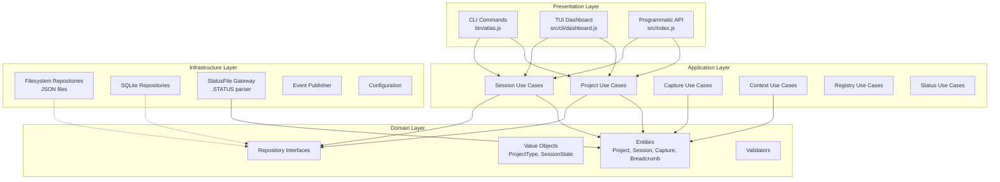
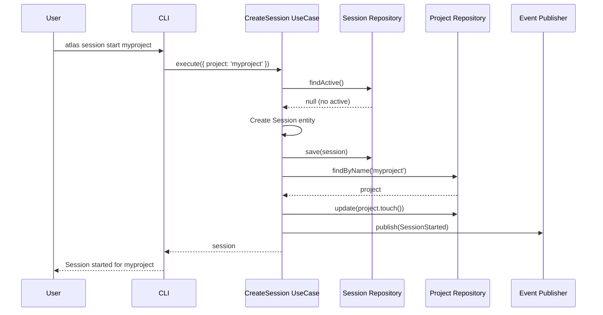
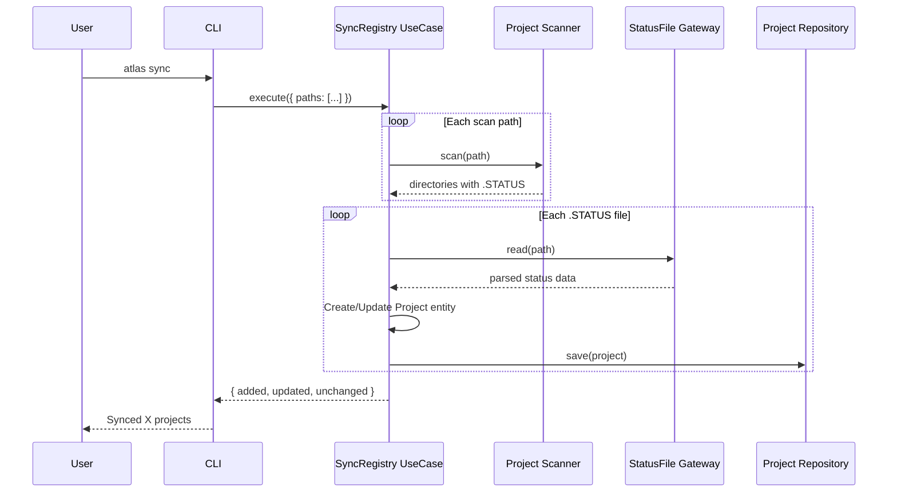
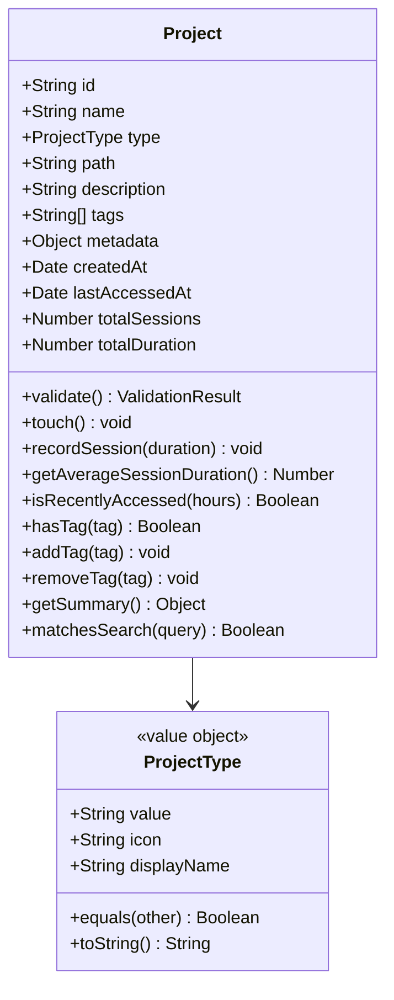
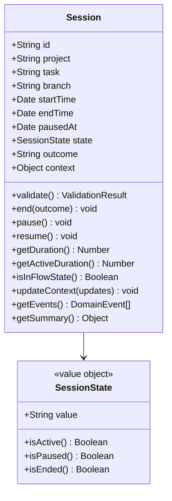
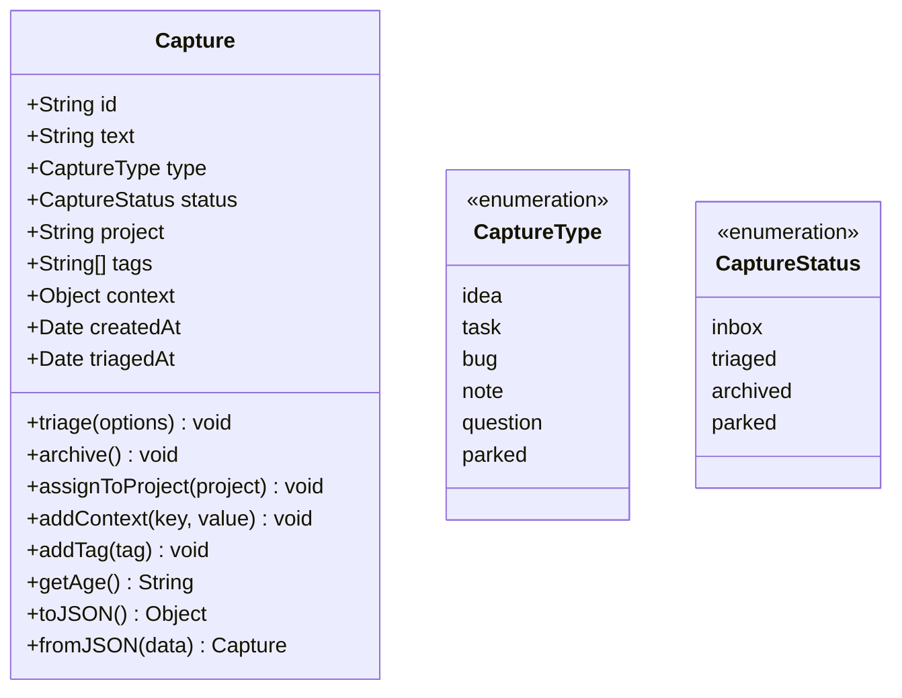
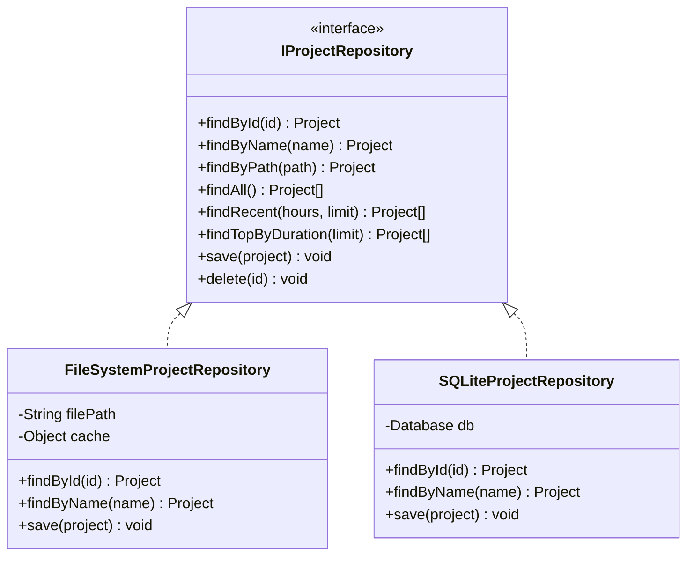
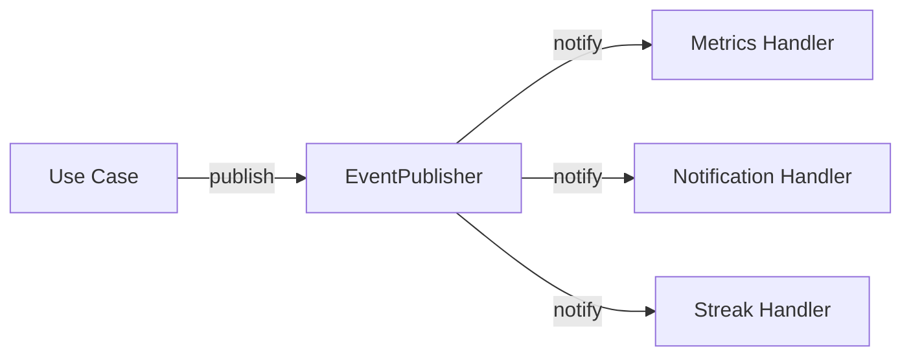
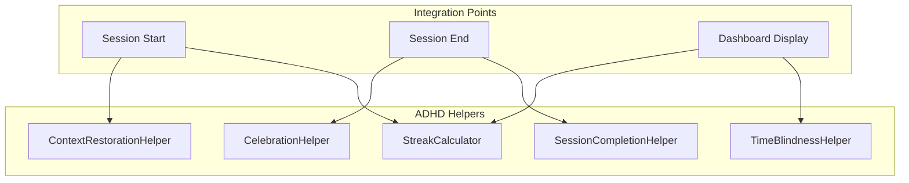
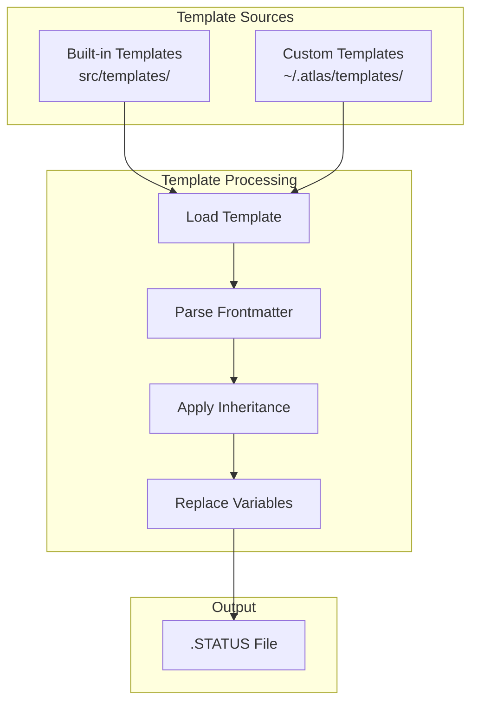

# Atlas Architecture

Atlas follows **Clean Architecture** principles, ensuring separation of concerns, testability, and maintainability.

## Overview

```
┌─────────────────────────────────────────────────────────────────┐
│                         CLI / Dashboard                          │
│                    (bin/atlas.js, src/cli/)                      │
├─────────────────────────────────────────────────────────────────┤
│                          Adapters                                │
│         Controllers, Repositories, Gateways, Events             │
├─────────────────────────────────────────────────────────────────┤
│                         Use Cases                                │
│              Application Business Logic (atomic ops)             │
├─────────────────────────────────────────────────────────────────┤
│                          Domain                                  │
│           Entities, Value Objects, Repository Interfaces         │
└─────────────────────────────────────────────────────────────────┘
```

## Layer Diagram



## Directory Structure

```
src/
├── domain/                      # Core business logic (no dependencies)
│   ├── entities/               # Business entities
│   │   ├── Project.js          # Project entity with business rules
│   │   ├── Session.js          # Work session entity
│   │   ├── Capture.js          # Quick capture entity
│   │   ├── Breadcrumb.js       # Context marker entity
│   │   └── Task.js             # Task entity
│   ├── value-objects/          # Immutable value types
│   │   ├── ProjectType.js      # Project type classification
│   │   ├── SessionState.js     # Session lifecycle states
│   │   └── TaskPriority.js     # Task priority levels
│   ├── repositories/           # Repository interfaces (contracts)
│   │   ├── IProjectRepository.js
│   │   ├── ISessionRepository.js
│   │   ├── ICaptureRepository.js
│   │   └── IBreadcrumbRepository.js
│   ├── validators/             # Domain validation
│   │   └── StatusFileValidator.js
│   └── events/                 # Domain events
│       └── SessionEvent.js
│
├── use-cases/                   # Application business logic
│   ├── project/                # Project management
│   │   ├── ScanProjectsUseCase.js
│   │   ├── GetStatusUseCase.js
│   │   └── GetRecentProjectsUseCase.js
│   ├── session/                # Session management
│   │   ├── CreateSessionUseCase.js
│   │   └── EndSessionUseCase.js
│   ├── capture/                # Quick capture
│   │   ├── CaptureIdeaUseCase.js
│   │   ├── GetInboxUseCase.js
│   │   └── TriageInboxUseCase.js
│   ├── context/                # Context management
│   │   ├── GetContextUseCase.js
│   │   ├── LogBreadcrumbUseCase.js
│   │   ├── GetTrailUseCase.js
│   │   ├── ParkContextUseCase.js
│   │   └── UnparkContextUseCase.js
│   ├── registry/               # Project registry
│   │   ├── SyncRegistryUseCase.js
│   │   └── RegisterProjectUseCase.js
│   └── status/                 # Status updates
│       ├── UpdateStatusUseCase.js
│       └── UpdateStatusFileUseCase.js
│
├── adapters/                    # External interfaces
│   ├── repositories/           # Repository implementations
│   │   ├── FileSystemProjectRepository.js
│   │   ├── FileSystemSessionRepository.js
│   │   ├── FileSystemCaptureRepository.js
│   │   ├── FileSystemBreadcrumbRepository.js
│   │   ├── SQLiteProjectRepository.js
│   │   ├── SQLiteSessionRepository.js
│   │   ├── SQLiteCaptureRepository.js
│   │   └── SQLiteBreadcrumbRepository.js
│   ├── gateways/               # External system interfaces
│   │   └── StatusFileGateway.js
│   ├── controllers/            # Presentation controllers
│   │   └── StatusController.js
│   ├── events/                 # Event infrastructure
│   │   └── SimpleEventPublisher.js
│   └── Container.js            # Dependency injection container
│
├── cli/                         # Command-line interface
│   ├── dashboard.js            # TUI dashboard entry
│   └── dashboard/              # Dashboard components
│       ├── DashboardState.js
│       ├── TimerManager.js
│       └── ...
│
├── utils/                       # Shared utilities
│   ├── Config.js               # Configuration management
│   ├── StreakCalculator.js     # Streak tracking
│   ├── CelebrationHelper.js    # ADHD-friendly celebrations
│   ├── TimeBlindnessHelper.js  # Time awareness
│   ├── ContextRestorationHelper.js
│   ├── SessionCompletionHelper.js
│   ├── ProjectScanCache.js     # Caching
│   ├── MRUTracker.js           # Most recently used
│   ├── ProjectFilters.js       # Filtering
│   ├── ascii-charts.js         # ASCII visualizations
│   └── migrate.js              # Storage migration
│
├── templates/                   # Project templates
│   └── index.js                # Template system
│
└── index.js                     # Main export (Atlas class)

bin/
└── atlas.js                     # CLI entry point (Commander.js)
```

## Data Flow

### Session Start Flow



### Project Sync Flow



## Domain Entities

### Project Entity



### Session Entity



### Capture Entity



## Repository Pattern



## Storage Backends

### Filesystem (Default)

```
~/.atlas/
├── projects.json        # Project registry
├── sessions.json        # Session history
├── captures.json        # Captured items
├── breadcrumbs.json     # Breadcrumb trail
├── config.json          # Configuration
└── templates/           # Custom templates
    └── *.md             # Template files
```

### SQLite

```
~/.atlas/
└── atlas.db             # Single database file
    ├── projects         # Projects table
    ├── sessions         # Sessions table
    ├── captures         # Captures table
    └── breadcrumbs      # Breadcrumbs table
```

## Dependency Injection

Atlas uses manual dependency injection via the Container class:

```javascript
// src/adapters/Container.js
export class Container {
  constructor(options = {}) {
    this.storage = options.storage || 'filesystem'
    this.configPath = options.configPath || '~/.atlas'
    this._instances = new Map()
  }

  resolve(name) {
    if (!this._instances.has(name)) {
      this._instances.set(name, this._create(name))
    }
    return this._instances.get(name)
  }

  _create(name) {
    switch (name) {
      case 'ProjectRepository':
        return this.storage === 'sqlite'
          ? new SQLiteProjectRepository(this.configPath)
          : new FileSystemProjectRepository(this.configPath)
      // ... other repositories
    }
  }
}
```

## Event System

Domain events are published for cross-cutting concerns:



**Event Types:**
- `SessionStarted` - When a session begins
- `SessionEnded` - When a session ends
- `SessionPaused` - When a session is paused
- `CaptureCreated` - When an item is captured
- `ProjectUpdated` - When project status changes

## ADHD-Friendly Features Architecture



## Template System



**Template Variables:**
- `{{name}}` - Project name
- `{{date}}` - Current date
- `{{author}}` - From config
- `{{github_user}}` - From config
- `{{parent}}` - Parent template content (for inheritance)

## Testing Architecture

```
test/
├── unit/                    # Unit tests (isolated)
│   ├── domain/             # Entity tests
│   ├── use-cases/          # Use case tests
│   └── utils/              # Utility tests
├── integration/            # Integration tests
│   ├── repositories/       # Repository tests
│   └── *.test.js          # Feature tests
├── e2e/                    # End-to-end tests
│   └── cli.test.js        # CLI command tests
└── dogfood-noninteractive.sh  # Dogfood script (71 tests)
```

## Performance Considerations

### Caching

```javascript
// ProjectScanCache for directory scanning
const cache = new ProjectScanCache({
  maxSize: 100,        // Max entries
  ttlMs: 5 * 60 * 1000 // 5 minute TTL
})
```

### Lazy Loading

- Repositories load data on first access
- SQLite uses prepared statements
- Dashboard uses virtual rendering

### Parallel Operations

- Directory scanning runs in parallel
- Multiple scan paths processed concurrently

## See Also

- [CLI Reference](./CLI-REFERENCE.md)
- [API Guide](./API-GUIDE.md)
- [Configuration](./CONFIGURATION.md)
