# Atlas Architecture

Atlas follows **Clean Architecture** principles, ensuring separation of concerns, testability, and maintainability.

## Overview

```
┌─────────────────────────────────────────────────────────────────┐
│                    CLI / Dashboard / MCP Server                  │
│              (bin/atlas.js, src/cli/, src/mcp/)                  │
├─────────────────────────────────────────────────────────────────┤
│                          Adapters                                │
│         Controllers, Repositories, Gateways, Events             │
├─────────────────────────────────────────────────────────────────┤
│                         Use Cases                                │
│              Application Business Logic (atomic ops)             │
├─────────────────────────────────────────────────────────────────┤
│                          Domain                                  │
│           Entities, Value Objects, Repository Interfaces         │
└─────────────────────────────────────────────────────────────────┘
```

## Layer Diagram


```mermaid
graph TB
    subgraph "Presentation Layer"
        CLI[CLI Commands<br/>bin/atlas.js]
        Dashboard[TUI Dashboard<br/>src/cli/dashboard.js]
        API[Programmatic API<br/>src/index.js]
        MCP[MCP Server<br/>src/mcp/index.js]
    end

    subgraph "Application Layer"
        UC_Project[Project Use Cases]
        UC_Session[Session Use Cases]
        UC_Capture[Capture Use Cases]
        UC_Context[Context Use Cases]
        UC_Registry[Registry Use Cases]
        UC_Status[Status Use Cases]
    end

    subgraph "Domain Layer"
        Entities[Entities<br/>Project, Session, Capture, Breadcrumb]
        ValueObjects[Value Objects<br/>ProjectType, SessionState]
        RepoInterfaces[Repository Interfaces]
        Validators[Validators]
    end

    subgraph "Infrastructure Layer"
        FSRepo[Filesystem Repositories<br/>JSON files]
        SQLRepo[SQLite Repositories]
        Presenters[Presenters<br/>ProjectPresenter, TuiPresenter]
        StatusGateway[StatusFile Gateway<br/>.STATUS parser]
        EventPub[Event Publisher]
        Config[Configuration]
    end

    CLI --> UC_Project
    CLI --> UC_Session
    Dashboard --> UC_Project
    Dashboard --> UC_Session
    API --> UC_Project
    API --> UC_Session
    MCP --> UC_Project
    MCP --> UC_Session
    MCP --> UC_Capture
    MCP --> UC_Context

    UC_Project --> Entities
    UC_Session --> Entities
    UC_Capture --> Entities
    UC_Context --> Entities

    UC_Project --> RepoInterfaces
    UC_Session --> RepoInterfaces

    FSRepo -.-> RepoInterfaces
    SQLRepo -.-> RepoInterfaces
    StatusGateway --> Entities
```

## Directory Structure

```
src/
├── domain/                      # Core business logic (no dependencies)
│   ├── entities/               # Business entities
│   │   ├── Project.js          # Project entity with business rules
│   │   ├── Session.js          # Work session entity
│   │   ├── Capture.js          # Quick capture entity
│   │   ├── Breadcrumb.js       # Context marker entity
│   │   └── Task.js             # Task entity
│   ├── value-objects/          # Immutable value types
│   │   ├── ProjectType.js      # Project type classification
│   │   ├── SessionState.js     # Session lifecycle states
│   │   └── TaskPriority.js     # Task priority levels
│   ├── repositories/           # Repository interfaces (contracts)
│   │   ├── IProjectRepository.js
│   │   ├── ISessionRepository.js
│   │   ├── ICaptureRepository.js
│   │   └── IBreadcrumbRepository.js
│   ├── validators/             # Domain validation
│   │   └── StatusFileValidator.js
│   └── events/                 # Domain events
│       └── SessionEvent.js
│
├── use-cases/                   # Application business logic
│   ├── project/                # Project management
│   │   ├── ScanProjectsUseCase.js
│   │   ├── GetStatusUseCase.js
│   │   └── GetRecentProjectsUseCase.js
│   ├── session/                # Session management
│   │   ├── CreateSessionUseCase.js
│   │   ├── EndSessionUseCase.js
│   │   ├── GetSessionStatsUseCase.js
│   │   ├── ExportSessionsUseCase.js  # v0.7.0: iCal/JSON export
│   │   └── PlanDayUseCase.js         # v0.8.0: Morning ritual data
│   ├── capture/                # Quick capture
│   │   ├── CaptureIdeaUseCase.js
│   │   ├── GetInboxUseCase.js
│   │   └── TriageInboxUseCase.js
│   ├── context/                # Context management
│   │   ├── GetContextUseCase.js
│   │   ├── LogBreadcrumbUseCase.js
│   │   ├── GetTrailUseCase.js
│   │   ├── ParkContextUseCase.js
│   │   └── UnparkContextUseCase.js
│   ├── registry/               # Project registry
│   │   ├── SyncRegistryUseCase.js
│   │   └── RegisterProjectUseCase.js
│   └── status/                 # Status updates
│       ├── UpdateStatusUseCase.js
│       └── UpdateStatusFileUseCase.js
│
├── adapters/                    # External interfaces
│   ├── repositories/           # Repository implementations
│   │   ├── FileSystemProjectRepository.js
│   │   ├── FileSystemSessionRepository.js
│   │   ├── FileSystemCaptureRepository.js
│   │   ├── FileSystemBreadcrumbRepository.js
│   │   ├── SQLiteProjectRepository.js
│   │   ├── SQLiteSessionRepository.js
│   │   ├── SQLiteCaptureRepository.js
│   │   └── SQLiteBreadcrumbRepository.js
│   ├── gateways/               # External system interfaces
│   │   ├── StatusFileGateway.js
│   │   └── StatusFileParser.js # .STATUS file YAML parser (v0.8.0)
│   ├── presenters/             # Formatting and presentation logic
│   │   ├── ProjectPresenter.js # UI-agnostic formatters
│   │   ├── TuiPresenter.js     # blessed-specific formatters
│   │   └── index.js            # Re-exports
│   ├── controllers/            # Presentation controllers
│   │   └── StatusController.js
│   ├── events/                 # Event infrastructure
│   │   └── SimpleEventPublisher.js
│   └── Container.js            # Dependency injection container
│
├── cli/                         # Command-line interface
│   ├── dashboard.js            # TUI dashboard entry (legacy blessed)
│   ├── dashboard-ink/          # ✨ v0.9.x Ink TUI (default)
│   │   ├── components/         # Leaf components
│   │   │   ├── App.tsx         # Root component, state machine driver
│   │   │   ├── SidebarPanel.tsx  # Compact project list (D2, v0.9.1)
│   │   │   ├── InspectorPanel.tsx # Detail + Pomodoro right panel (D3, v0.9.1)
│   │   │   ├── shared/
│   │   │   │   └── Card.tsx    # Project card component
│   │   │   └── views/
│   │   │       ├── MainView.tsx    # Card stack (BROWSE)
│   │   │       ├── DetailView.tsx  # Project details (DETAIL)
│   │   │       ├── FocusView.tsx   # Pomodoro timer (FOCUS)
│   │   │       ├── ZenView.tsx     # Minimal mode (ZEN)
│   │   │       ├── TimelineView.tsx # Time blocks (TIMELINE)
│   │   │       ├── EcosystemView.tsx # Multi-project (ECOSYSTEM)
│   │   │       └── PlanView.tsx    # Morning ritual (PLAN)
│   │   └── lib/
│   │       ├── LayoutManager.tsx   # ✨ Layout engine: SINGLE/SPLIT/TRIPLE (D1, v0.9.1)
│   │       └── stateMachine.ts     # View state machine
│   └── dashboard/              # Legacy blessed components
│       ├── constants.js
│       ├── helpers.js
│       ├── stateMachine.js
│       ├── timerManager.js
│       ├── dialogs.js
│       └── views/              # Blessed view components
│
├── mcp/                         # Model Context Protocol server (v0.7.0)
│   ├── index.js                # MCP server entry point
│   └── formatters.js           # Response formatting functions
│
├── utils/                       # Shared utilities
│   ├── Config.js               # Configuration management
│   ├── StreakCalculator.js     # Streak tracking
│   ├── CelebrationHelper.js    # ADHD-friendly celebrations
│   ├── TimeBlindnessHelper.js  # Time awareness
│   ├── ContextRestorationHelper.js
│   ├── SessionCompletionHelper.js
│   ├── ProjectScanCache.js     # Caching
│   ├── MRUTracker.js           # Most recently used
│   ├── ProjectFilters.js       # Filtering
│   ├── ascii-charts.js         # ASCII visualizations
│   └── migrate.js              # Storage migration
│
├── templates/                   # Project templates
│   └── index.js                # Template system
│
└── index.js                     # Main export (Atlas class)

bin/
└── atlas.js                     # CLI entry point (Commander.js)
```

## Data Flow

### Session Start Flow

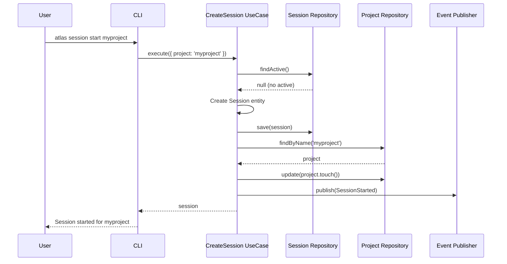
```mermaid
sequenceDiagram
    participant User
    participant CLI
    participant CreateSessionUC as CreateSession UseCase
    participant SessionRepo as Session Repository
    participant ProjectRepo as Project Repository
    participant EventPub as Event Publisher

    User->>CLI: atlas session start myproject
    CLI->>CreateSessionUC: execute({ project: 'myproject' })
    CreateSessionUC->>SessionRepo: findActive()
    SessionRepo-->>CreateSessionUC: null (no active)
    CreateSessionUC->>CreateSessionUC: Create Session entity
    CreateSessionUC->>SessionRepo: save(session)
    CreateSessionUC->>ProjectRepo: findByName('myproject')
    ProjectRepo-->>CreateSessionUC: project
    CreateSessionUC->>ProjectRepo: update(project.touch())
    CreateSessionUC->>EventPub: publish(SessionStarted)
    CreateSessionUC-->>CLI: session
    CLI-->>User: Session started for myproject
```

### Project Sync Flow

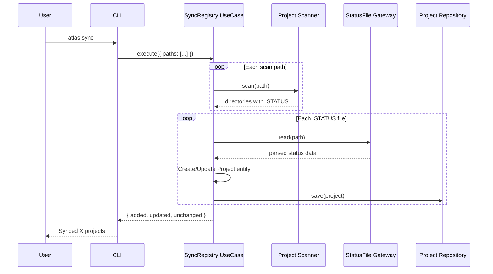
```mermaid
sequenceDiagram
    participant User
    participant CLI
    participant SyncUC as SyncRegistry UseCase
    participant Scanner as Project Scanner
    participant Gateway as StatusFile Gateway
    participant ProjectRepo as Project Repository

    User->>CLI: atlas sync
    CLI->>SyncUC: execute({ paths: [...] })

    loop Each scan path
        SyncUC->>Scanner: scan(path)
        Scanner-->>SyncUC: directories with .STATUS
    end

    loop Each .STATUS file
        SyncUC->>Gateway: read(path)
        Gateway-->>SyncUC: parsed status data
        SyncUC->>SyncUC: Create/Update Project entity
        SyncUC->>ProjectRepo: save(project)
    end

    SyncUC-->>CLI: { added, updated, unchanged }
    CLI-->>User: Synced X projects
```

## Domain Entities

### Project Entity

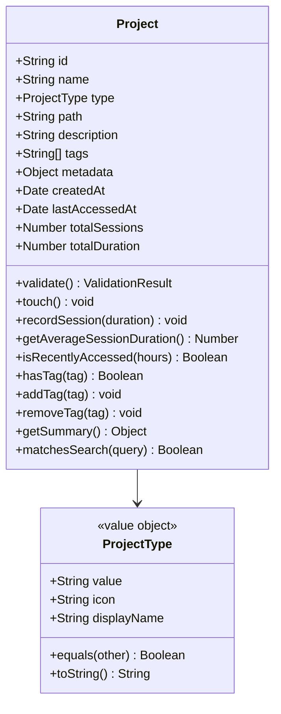
```mermaid
classDiagram
    class Project {
        +String id
        +String name
        +ProjectType type
        +String path
        +String description
        +String[] tags
        +Object metadata
        +Date createdAt
        +Date lastAccessedAt
        +Number totalSessions
        +Number totalDuration

        +validate() ValidationResult
        +touch() void
        +recordSession(duration) void
        +getAverageSessionDuration() Number
        +isRecentlyAccessed(hours) Boolean
        +hasTag(tag) Boolean
        +addTag(tag) void
        +removeTag(tag) void
        +getSummary() Object
        +matchesSearch(query) Boolean
    }

    class ProjectType {
        <<value object>>
        +String value
        +String icon
        +String displayName
        +equals(other) Boolean
        +toString() String
    }

    Project --> ProjectType
```

### Session Entity

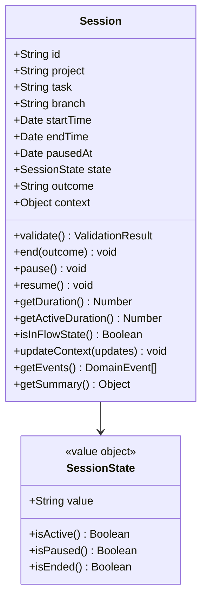
```mermaid
classDiagram
    class Session {
        +String id
        +String project
        +String task
        +String branch
        +Date startTime
        +Date endTime
        +Date pausedAt
        +SessionState state
        +String outcome
        +Object context

        +validate() ValidationResult
        +end(outcome) void
        +pause() void
        +resume() void
        +getDuration() Number
        +getActiveDuration() Number
        +isInFlowState() Boolean
        +updateContext(updates) void
        +getEvents() DomainEvent[]
        +getSummary() Object
    }

    class SessionState {
        <<value object>>
        +String value
        +isActive() Boolean
        +isPaused() Boolean
        +isEnded() Boolean
    }

    Session --> SessionState
```

### Capture Entity

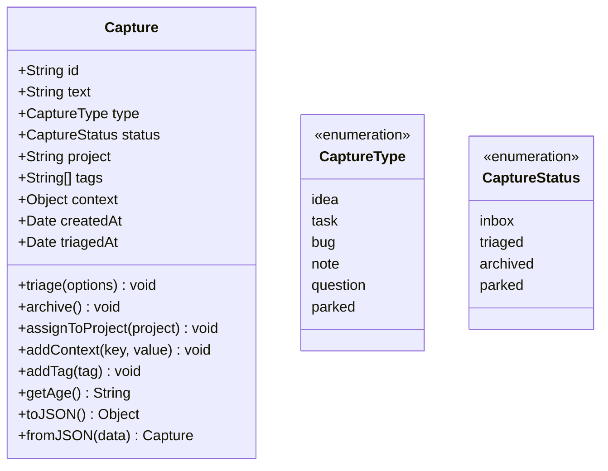
```mermaid
classDiagram
    class Capture {
        +String id
        +String text
        +CaptureType type
        +CaptureStatus status
        +String project
        +String[] tags
        +Object context
        +Date createdAt
        +Date triagedAt

        +triage(options) void
        +archive() void
        +assignToProject(project) void
        +addContext(key, value) void
        +addTag(tag) void
        +getAge() String
        +toJSON() Object
        +fromJSON(data) Capture
    }

    class CaptureType {
        <<enumeration>>
        idea
        task
        bug
        note
        question
        parked
    }

    class CaptureStatus {
        <<enumeration>>
        inbox
        triaged
        archived
        parked
    }
```

## Repository Pattern

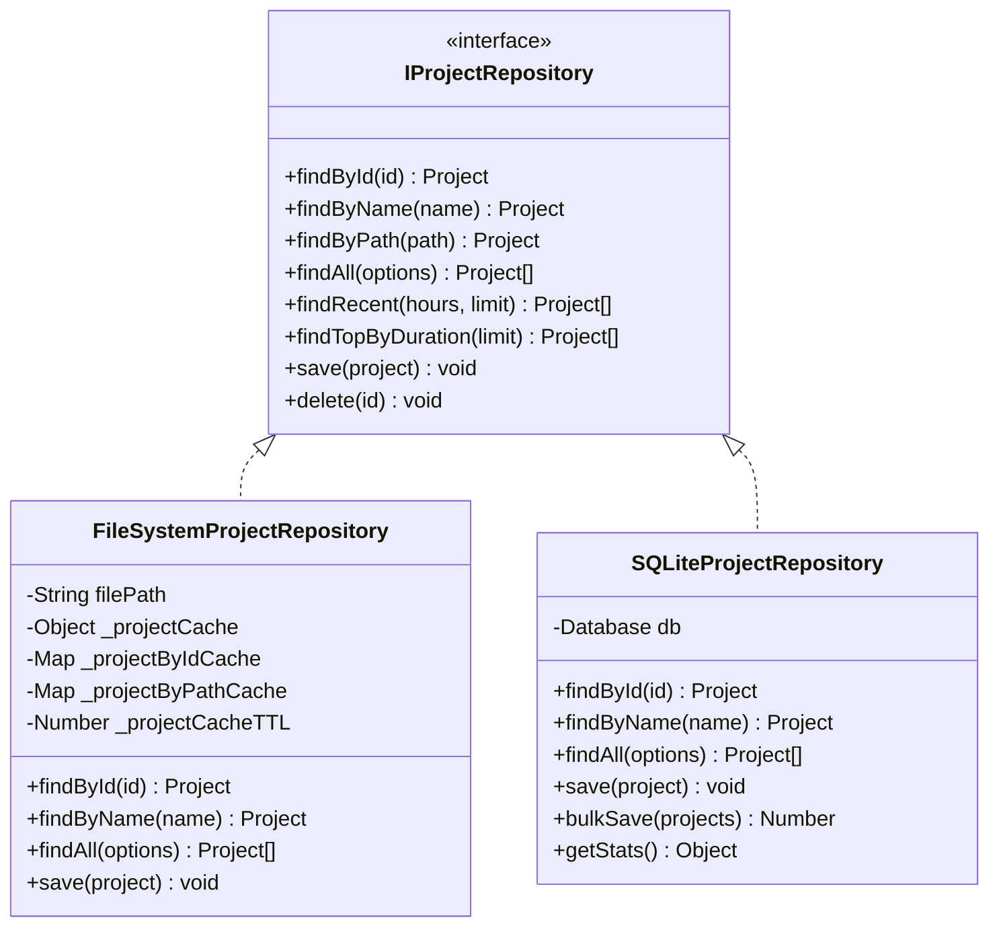
```mermaid
classDiagram
    class IProjectRepository {
        <<interface>>
        +findById(id) Project
        +findByName(name) Project
        +findByPath(path) Project
        +findAll(options) Project[]
        +findRecent(hours, limit) Project[]
        +findTopByDuration(limit) Project[]
        +save(project) void
        +delete(id) void
    }

    class FileSystemProjectRepository {
        -String filePath
        -Object _projectCache
        -Map _projectByIdCache
        -Map _projectByPathCache
        -Number _projectCacheTTL
        +findById(id) Project
        +findByName(name) Project
        +findAll(options) Project[]
        +save(project) void
    }

    class SQLiteProjectRepository {
        -Database db
        +findById(id) Project
        +findByName(name) Project
        +findAll(options) Project[]
        +save(project) void
        +bulkSave(projects) Number
        +getStats() Object
    }

    IProjectRepository <|.. FileSystemProjectRepository
    IProjectRepository <|.. SQLiteProjectRepository
```

## Presenter Pattern

Separates UI formatting from business logic:

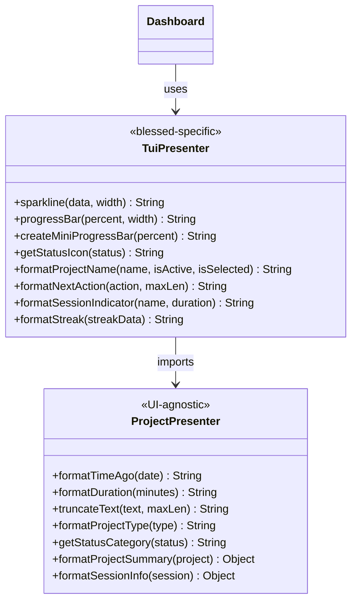
```mermaid
classDiagram
    class ProjectPresenter {
        <<UI-agnostic>>
        +formatTimeAgo(date) String
        +formatDuration(minutes) String
        +truncateText(text, maxLen) String
        +formatProjectType(type) String
        +getStatusCategory(status) String
        +formatProjectSummary(project) Object
        +formatSessionInfo(session) Object
    }

    class TuiPresenter {
        <<blessed-specific>>
        +sparkline(data, width) String
        +progressBar(percent, width) String
        +createMiniProgressBar(percent) String
        +getStatusIcon(status) String
        +formatProjectName(name, isActive, isSelected) String
        +formatNextAction(action, maxLen) String
        +formatSessionIndicator(name, duration) String
        +formatStreak(streakData) String
    }

    TuiPresenter --> ProjectPresenter : imports
    Dashboard --> TuiPresenter : uses
```

## Storage Backends

### Filesystem (Default)

```
~/.atlas/
├── projects.json        # Project registry
├── sessions.json        # Session history
├── captures.json        # Captured items
├── breadcrumbs.json     # Breadcrumb trail
├── config.json          # Configuration
└── templates/           # Custom templates
    └── *.md             # Template files
```

### SQLite

```
~/.atlas/
└── atlas.db             # Single database file
    ├── projects         # Projects table
    ├── sessions         # Sessions table
    ├── captures         # Captures table
    └── breadcrumbs      # Breadcrumbs table
```

## Dependency Injection

Atlas uses manual dependency injection via the Container class:

```javascript
// src/adapters/Container.js
export class Container {
  constructor(options = {}) {
    this.storage = options.storage || 'filesystem'
    this.configPath = options.configPath || '~/.atlas'
    this._instances = new Map()
  }

  resolve(name) {
    if (!this._instances.has(name)) {
      this._instances.set(name, this._create(name))
    }
    return this._instances.get(name)
  }

  _create(name) {
    switch (name) {
      case 'ProjectRepository':
        return this.storage === 'sqlite'
          ? new SQLiteProjectRepository(this.configPath)
          : new FileSystemProjectRepository(this.configPath)
      // ... other repositories
    }
  }
}
```

## Event System

Domain events are published for cross-cutting concerns:

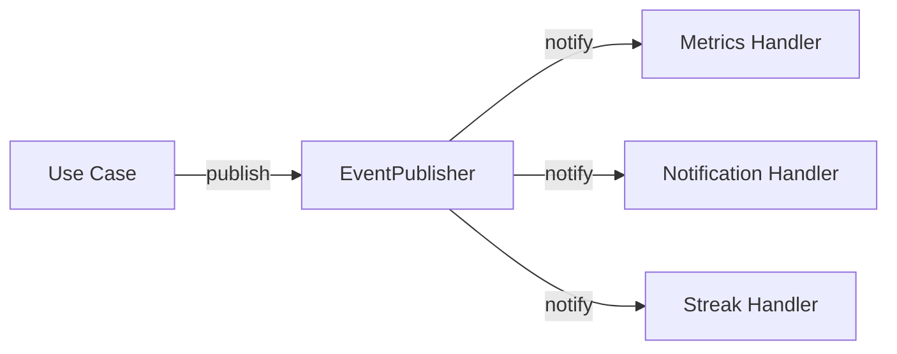
```mermaid
flowchart LR
    UseCase[Use Case] -->|publish| EventPublisher
    EventPublisher -->|notify| Handler1[Metrics Handler]
    EventPublisher -->|notify| Handler2[Notification Handler]
    EventPublisher -->|notify| Handler3[Streak Handler]
```

**Event Types:**
- `SessionStarted` - When a session begins
- `SessionEnded` - When a session ends
- `SessionPaused` - When a session is paused
- `CaptureCreated` - When an item is captured
- `ProjectUpdated` - When project status changes

## ADHD-Friendly Features Architecture

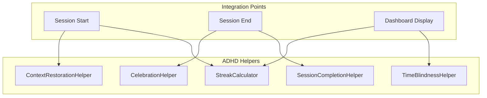
```mermaid
graph TB
    subgraph "ADHD Helpers"
        Streak[StreakCalculator]
        Time[TimeBlindnessHelper]
        Celebrate[CelebrationHelper]
        Context[ContextRestorationHelper]
        Complete[SessionCompletionHelper]
    end

    subgraph "Integration Points"
        SessionStart[Session Start]
        SessionEnd[Session End]
        Dashboard[Dashboard Display]
    end

    SessionStart --> Context
    SessionStart --> Streak
    SessionEnd --> Celebrate
    SessionEnd --> Complete
    Dashboard --> Streak
    Dashboard --> Time
```

## Dashboard State Machine (v0.8.0)

The dashboard uses a state machine pattern for view management:

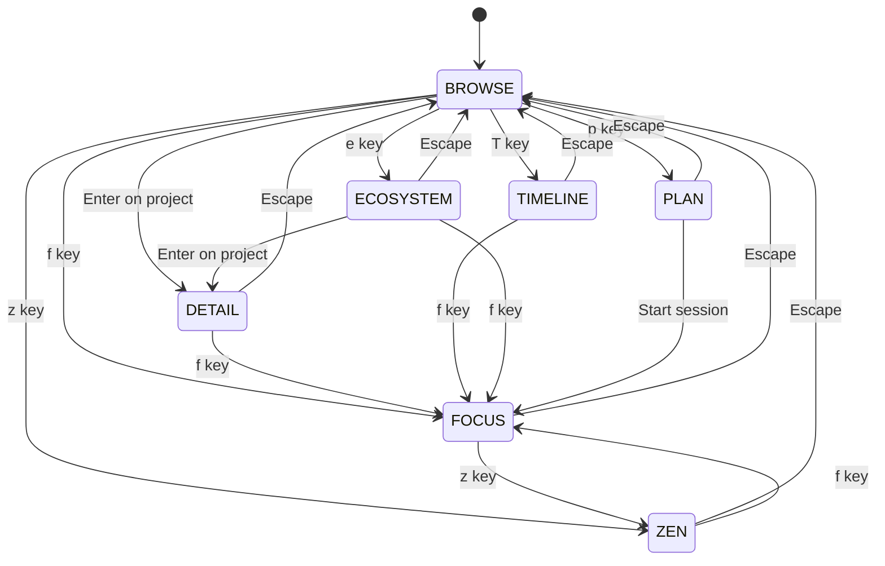
```mermaid
stateDiagram-v2
    [*] --> BROWSE
    BROWSE --> DETAIL: Enter on project
    BROWSE --> FOCUS: f key
    BROWSE --> ZEN: z key
    BROWSE --> TIMELINE: T key
    BROWSE --> ECOSYSTEM: e key
    BROWSE --> PLAN: p key

    DETAIL --> BROWSE: Escape
    DETAIL --> FOCUS: f key

    FOCUS --> BROWSE: Escape
    FOCUS --> ZEN: z key

    ZEN --> BROWSE: Escape
    ZEN --> FOCUS: f key

    TIMELINE --> BROWSE: Escape
    TIMELINE --> FOCUS: f key

    ECOSYSTEM --> BROWSE: Escape
    ECOSYSTEM --> DETAIL: Enter on project
    ECOSYSTEM --> FOCUS: f key

    PLAN --> BROWSE: Escape
    PLAN --> FOCUS: Start session
```

**States:**
| State       | View          | Purpose                          |
| ----------- | ------------- | -------------------------------- |
| `BROWSE`    | MainView      | Default card-based project list  |
| `DETAIL`    | DetailView    | Single project details panel     |
| `FOCUS`     | FocusView     | Pomodoro timer with task         |
| `ZEN`       | ZenView       | Minimal distraction mode         |
| `TIMELINE`  | TimelineView  | Time block visualization         |
| `ECOSYSTEM` | EcosystemView | Multi-project ecosystem overview |
| `PLAN`      | PlanView      | Morning ritual daily planning    |

**Implementation:** `src/cli/dashboard-ink/lib/stateMachine.ts`

## TUI Component Architecture (v0.9.1)

The v0.9.1 Ink TUI uses a three-layer component model:

```
┌────────────────────────────────────────────────────────┐
│  App.tsx  (state machine driver, data provider)        │
├────────────────────────────────────────────────────────┤
│  LayoutManager.tsx  (layout engine — SINGLE/SPLIT/TRIPLE)│
│  useLayout() hook → Tab cycles modes, Shift+Tab focus  │
├──────────────┬──────────────────┬──────────────────────┤
│ SidebarPanel │   View Layer     │  InspectorPanel      │
│ (25-28%)     │ (MainView,       │  (28%)               │
│              │  DetailView,     │                      │
│ compact list │  FocusView…)     │  detail + Pomodoro   │
└──────────────┴──────────────────┴──────────────────────┘
```

### LayoutManager (D1)

```typescript
// useLayout() returns:
{
  layout: 'single' | 'split' | 'triple',
  focusedPanel: 'main' | 'sidebar' | 'inspector',
  panelConfig: {
    sidebar: { width: 28 } | null,
    main:    { width: 72 } | { width: 47 } | { width: 100 },
    inspector: { width: 28 } | null,
  }
}
// Tab → cycles SINGLE → SPLIT → TRIPLE → SINGLE
// Shift+Tab → cycles panel focus
```

**Key exports:** `LAYOUT`, `PANEL_CONFIG`, `useLayout`, `LayoutManager`, `LayoutStatusBar`, `PanelBox`

### SidebarPanel (D2)

Compact project list column for SPLIT and TRIPLE modes.

```typescript
interface SidebarPanelProps {
  projects: SidebarProject[];   // project list
  selectedIndex: number;        // controlled selection
  onSelect: (idx: number) => void;
  onSelectProject: (p: SidebarProject) => void; // fires on Enter
  isActive: boolean;            // guards keyboard input
  pendingCaptures?: number;     // inbox badge count
  activeProjectId?: string;     // ⏱ session indicator
}
```

- **Windowing:** 12 visible rows, scroll indicator when > 12 projects
- **Row format:** `● name   75%` (icon + 14-char name + 4-char %-padded)
- **isActive guard:** `j/k/Enter` are no-ops when sidebar is not focused

### InspectorPanel (D3)

Right-hand detail + embedded Pomodoro mini-timer for TRIPLE mode.

```typescript
interface InspectorPanelProps {
  project?: InspectorProject;   // undefined → empty state
  isActive: boolean;            // guards Space/r keys
  sessionSeconds?: number;      // > 0 → shows live timer
  pomodoroLength?: number;      // default: 25 min
  breadcrumbs?: string[];       // newest-first, max 3 shown
}
```

- **Sections:** Name/type → Status bar → Focus → Next actions → Pomodoro → Breadcrumbs
- **Pomodoro states:** `● FOCUSING` → `◑ PAUSED` → `☕ BREAK TIME`
- **Timer resets** when `sessionSeconds` changes (new session)
- **next actions** parsed from `project.next` via comma/newline split, sliced to 3

### Component Communication

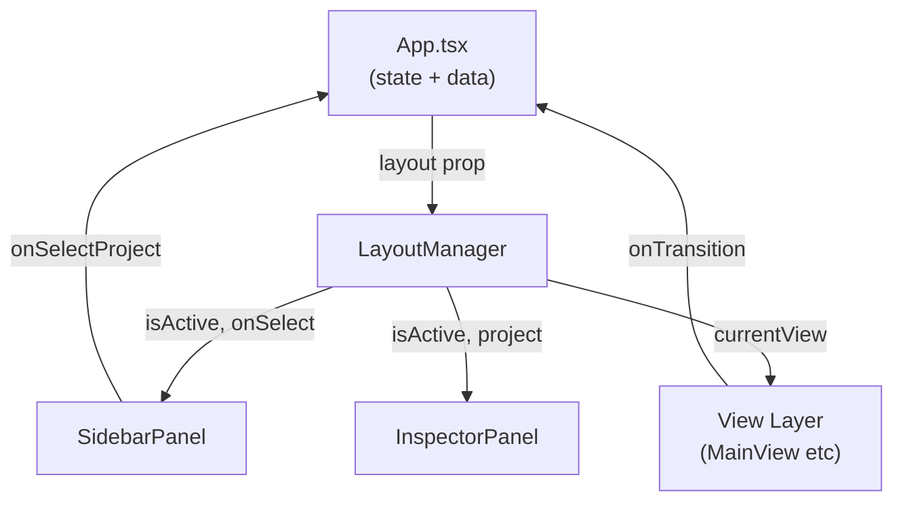
```mermaid
graph TB
  App["App.tsx\n(state + data)"] -->|layout prop| LM["LayoutManager"]
  LM -->|isActive, onSelect| SP["SidebarPanel"]
  LM -->|currentView| VL["View Layer\n(MainView etc)"]
  LM -->|isActive, project| IP["InspectorPanel"]
  SP -->|onSelectProject| App
  VL -->|onTransition| App
```

## Template System

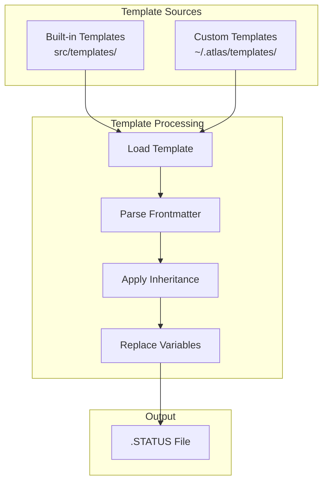
```mermaid
flowchart TD
    subgraph "Template Sources"
        BuiltIn[Built-in Templates<br/>src/templates/]
        Custom[Custom Templates<br/>~/.atlas/templates/]
    end

    subgraph "Template Processing"
        Load[Load Template]
        Parse[Parse Frontmatter]
        Inherit[Apply Inheritance]
        Variables[Replace Variables]
    end

    subgraph "Output"
        STATUS[.STATUS File]
    end

    BuiltIn --> Load
    Custom --> Load
    Load --> Parse
    Parse --> Inherit
    Inherit --> Variables
    Variables --> STATUS
```

**Template Variables:**
- `{{name}}` - Project name
- `{{date}}` - Current date
- `{{author}}` - From config
- `{{github_user}}` - From config
- `{{parent}}` - Parent template content (for inheritance)

## MCP Server (v0.7.0)

Atlas exposes project intelligence via [Model Context Protocol](https://modelcontextprotocol.io/), enabling Claude to query and control your workflow.

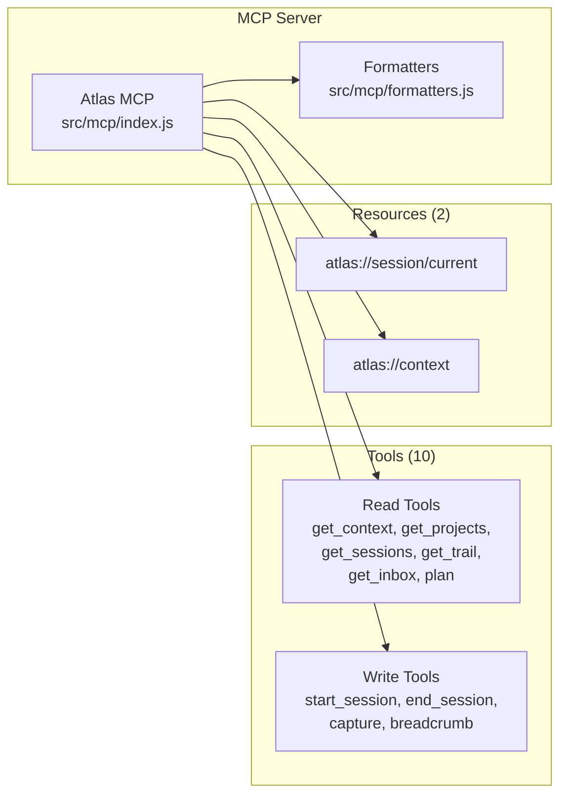
```mermaid
graph LR
    subgraph "MCP Server"
        Server[Atlas MCP<br/>src/mcp/index.js]
        Formatters[Formatters<br/>src/mcp/formatters.js]
    end

    subgraph "Tools (10)"
        Read[Read Tools<br/>get_context, get_projects,<br/>get_sessions, get_trail,<br/>get_inbox, plan]
        Write[Write Tools<br/>start_session, end_session,<br/>capture, breadcrumb]
    end

    subgraph "Resources (2)"
        Res1[atlas://session/current]
        Res2[atlas://context]
    end

    Server --> Read
    Server --> Write
    Server --> Res1
    Server --> Res2
    Server --> Formatters
```

**Integration Points:**
- Uses Atlas core APIs (`atlas.sessions`, `atlas.capture`, `atlas.context`)
- Formatters convert domain objects to MCP-friendly text responses
- Resources provide real-time JSON data for session/context

**See also:** [MCP Server Documentation](./MCP-SERVER.md)

## Testing Architecture

```
test/
├── setup.js                 # Jest timer cleanup
├── unit/                    # Unit tests (isolated)
│   ├── domain/             # Entity tests
│   ├── use-cases/          # Use case tests
│   ├── utils/              # Utility tests
│   ├── adapters/           # Adapter tests
│   │   └── presenters/     # Presenter tests
│   └── mcp/                # MCP server tests (v0.7.0)
│       ├── mcpServer.test.js
│       └── formatters.test.js
├── integration/            # Integration tests
│   ├── repositories/       # Repository tests
│   └── *.test.js          # Feature tests
├── e2e/                    # End-to-end tests
│   └── cli.test.js        # CLI command tests
└── dogfood-noninteractive.sh  # Dogfood script (71 tests)
```

**Test Commands:**
```bash
npm test                  # All 1,486+ tests
npm run test:debug        # With --detectOpenHandles
npm run test:unit         # Unit tests only
npm run test:coverage     # With coverage report
```

**v0.9.1 dashboard-ink integration tests:**
```
test/integration/dashboard-ink/
├── layoutManager.test.js   # 30 tests — LayoutManager D1
├── sidebarPanel.test.js    # 35 tests — SidebarPanel D2
├── inspectorPanel.test.js  # 40 tests — InspectorPanel D3
└── view-transitions.test.js # State machine transitions
```

## Performance Considerations

### Caching

```javascript
// ProjectScanCache for directory scanning (1 hour TTL)
const scanCache = new ProjectScanCache({
  maxSize: 100,
  ttlMs: 60 * 60 * 1000
})

// FileSystemProjectRepository in-memory cache (30s TTL)
this._projectCache = null
this._projectCacheTTL = 30000
this._projectByIdCache = new Map()   // O(1) lookups
this._projectByPathCache = new Map() // O(1) lookups
```

### Lazy Loading

- Repositories load data on first access
- SQLite uses prepared statements
- Dashboard uses virtual rendering
- Project cache populated on first read

### Parallel Operations

- Directory scanning runs in parallel
- Multiple scan paths processed concurrently

### Pagination

```javascript
// Repositories support pagination for large datasets
const projects = await repo.findAll({
  limit: 20,
  offset: 0
})
```

## See Also

- [CLI Reference](./CLI-REFERENCE.md)
- [API Guide](./API-GUIDE.md)
- [Configuration](./CONFIGURATION.md)
