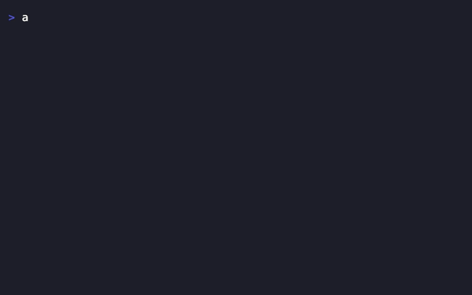

# Demos

Terminal recordings of Atlas in action. Each demo shows a common workflow pattern.

## Getting Started

A quick overview of the core Atlas workflow: check context, start a session, capture an idea, check status, and end with celebration.


**Commands shown:**

```bash
atlas where                           # Show current context
atlas session start atlas             # Start work session
atlas catch 'add dark mode'           # Capture idea
atlas session status                  # Check session
atlas session end                     # End with celebration
atlas stats                           # View analytics
```

---

## Session Workflow

The complete session lifecycle with breadcrumbs for context tracking.


**Commands shown:**

```bash
atlas where                           # Check context
atlas trail                           # View breadcrumb trail
atlas session start myproject         # Start session
atlas session status                  # Check progress
atlas crumb 'OAuth callback working'  # Leave breadcrumb
atlas session end                     # Complete session
```

---

## Quick Capture

Capture ideas without losing focus. Never let a thought slip away.



**Commands shown:**

```bash
atlas catch 'use Redis for session cache'     # Capture idea
atlas catch 'add retry logic to API calls'    # Another thought
atlas catch 'login button misaligned' --type bug  # Bug capture
atlas inbox                                   # View inbox
atlas inbox --stats                           # Inbox statistics
```

---

## Context Switching

ADHD-friendly park/unpark for handling interruptions without losing context.


**Commands shown:**

```bash
atlas session start myproject         # Working on project
atlas session status                  # Check status
atlas park 'OAuth almost done'        # Park with note
atlas session start api               # Switch to urgent task
atlas session end                     # Complete urgent task
atlas unpark                          # Restore original context
atlas session status                  # Back where you left off
```

---

## Session Analytics

Track productivity patterns with weekly/monthly summaries and per-project breakdowns.


**Commands shown:**

```bash
atlas stats                   # Weekly summary (default)
atlas stats month             # Monthly overview
atlas stats --project atlas   # Filter by project
```

---

## Create Your Own

These demos were created using [VHS](https://github.com/charmbracelet/vhs). The tape files are in `docs/demos/`:

```bash
# Install VHS
brew install charmbracelet/tap/vhs

# Generate GIFs
cd docs/demos
vhs getting-started.tape
vhs session-workflow.tape
vhs quick-capture.tape
vhs context-switch.tape
vhs stats.tape

# Optimize with gifsicle
brew install gifsicle
for f in *.gif; do gifsicle -O3 --lossy=80 "$f" -o "${f%.gif}-opt.gif"; done
```
