# Atlas CLI - Architecture Diagrams

This document contains comprehensive Mermaid diagrams visualizing the Atlas CLI architecture, data flows, and system interactions.

---

## 1. System Architecture (Clean Architecture Layers)

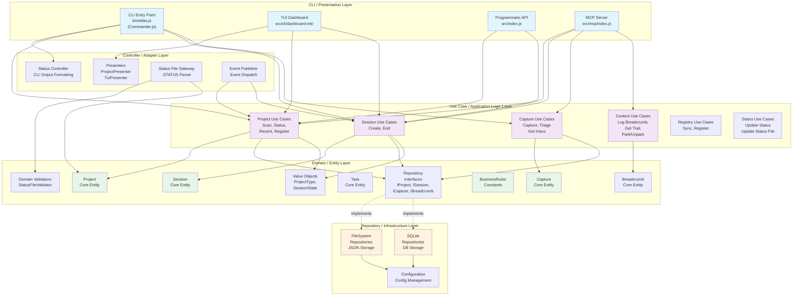
```mermaid
graph TB
    subgraph "CLI / Presentation Layer"
        CLI["CLI Entry Point<br/>bin/atlas.js<br/>(Commander.js)"]
        Dashboard["TUI Dashboard<br/>src/cli/dashboard-ink/"]
        API["Programmatic API<br/>src/index.js"]
        MCP["MCP Server<br/>src/mcp/index.js"]
    end

    subgraph "Controller / Adapter Layer"
        StatusCtl["Status Controller<br/>CLI Output Formatting"]
        Presenters["Presenters<br/>ProjectPresenter<br/>TuiPresenter"]
        FSGateway["Status File Gateway<br/>.STATUS Parser"]
        EventPub["Event Publisher<br/>Event Dispatch"]
    end

    subgraph "Use Case / Application Logic Layer"
        ProjectUC["Project Use Cases<br/>Scan, Status,<br/>Recent, Register"]
        SessionUC["Session Use Cases<br/>Create, End"]
        CaptureUC["Capture Use Cases<br/>Capture, Triage<br/>Get Inbox"]
        ContextUC["Context Use Cases<br/>Log Breadcrumb,<br/>Get Trail,<br/>Park/Unpark"]
        RegistryUC["Registry Use Cases<br/>Sync, Register"]
        StatusUC["Status Use Cases<br/>Update Status<br/>Update Status File"]
    end

    subgraph "Domain / Entity Layer"
        Project["Project<br/>Core Entity"]
        Session["Session<br/>Core Entity"]
        Capture["Capture<br/>Core Entity"]
        Breadcrumb["Breadcrumb<br/>Core Entity"]
        Task["Task<br/>Core Entity"]
        RepoIface["Repository<br/>Interfaces<br/>IProject, ISession,<br/>ICapture, IBreadcrumb"]
        BizRules["BusinessRules<br/>Constants"]
        ValueObj["Value Objects<br/>ProjectType,<br/>SessionState"]
        Validators["Domain Validators<br/>StatusFileValidator"]
    end

    subgraph "Repository / Infrastructure Layer"
        FSRepo["FileSystem<br/>Repositories<br/>JSON Storage"]
        SQLiteRepo["SQLite<br/>Repositories<br/>DB Storage"]
        Config["Configuration<br/>Config Management"]
    end

    CLI --> StatusCtl
    CLI --> ProjectUC
    CLI --> SessionUC
    CLI --> CaptureUC
    Dashboard --> Presenters
    Dashboard --> ProjectUC
    Dashboard --> SessionUC
    API --> ProjectUC
    API --> SessionUC
    MCP --> ProjectUC
    MCP --> SessionUC
    MCP --> CaptureUC
    MCP --> ContextUC

    ProjectUC --> Project
    SessionUC --> Session
    CaptureUC --> Capture
    ContextUC --> Breadcrumb
    ProjectUC --> RepoIface
    SessionUC --> RepoIface
    CaptureUC --> RepoIface

    FSGateway --> Validators
    FSGateway --> Project
    EventPub --> ProjectUC
    EventPub --> SessionUC

    RepoIface -.->|implements| FSRepo
    RepoIface -.->|implements| SQLiteRepo

    FSRepo --> Config
    SQLiteRepo --> Config
    ProjectUC --> ValueObj
    SessionUC --> ValueObj

    style CLI fill:#e1f5ff
    style Dashboard fill:#e1f5ff
    style MCP fill:#e1f5ff
    style API fill:#e1f5ff
    style ProjectUC fill:#f3e5f5
    style SessionUC fill:#f3e5f5
    style CaptureUC fill:#f3e5f5
    style ContextUC fill:#f3e5f5
    style Project fill:#e8f5e9
    style BizRules fill:#e8f5e9
    style Session fill:#e8f5e9
    style Capture fill:#e8f5e9
    style FSRepo fill:#fff3e0
    style SQLiteRepo fill:#fff3e0
```

**Layers Explained:**

- **Presentation:** CLI, Dashboard, and programmatic API interfaces
- **Controllers/Adapters:** Convert between presentation and business logic
  - **Presenters:** Format data for display (UI-agnostic and TUI-specific)
- **Use Cases:** Atomic application operations (Session Start, Capture Idea, etc.)
- **Domain:** Core entities and business rules
- **Infrastructure:** Storage backends (Filesystem JSON or SQLite) and configuration

---

## 2. Data Flow - Complete Session Lifecycle

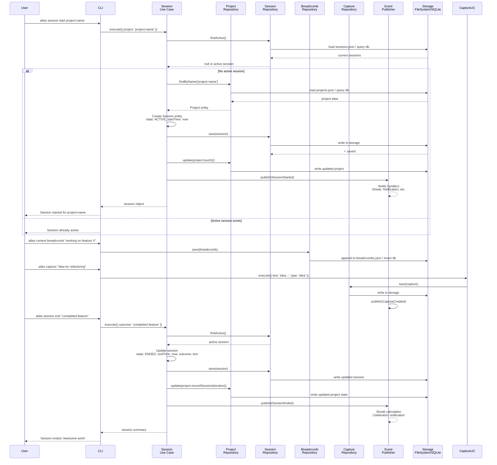
```mermaid
sequenceDiagram
    participant User
    participant CLI as CLI
    participant SessionUC as Session<br/>Use Case
    participant ProjectRepo as Project<br/>Repository
    participant SessionRepo as Session<br/>Repository
    participant BreadcrumbRepo as Breadcrumb<br/>Repository
    participant CaptureRepo as Capture<br/>Repository
    participant EventPub as Event<br/>Publisher
    participant FSOrDB as Storage<br/>FileSystem/SQLite

    User->>CLI: atlas session start project-name

    CLI->>SessionUC: execute({ project: 'project-name' })

    SessionUC->>SessionRepo: findActive()
    SessionRepo->>FSOrDB: load sessions.json / query db
    FSOrDB-->>SessionRepo: current sessions
    SessionRepo-->>SessionUC: null or active session

    alt No active session
        SessionUC->>ProjectRepo: findByName('project-name')
        ProjectRepo->>FSOrDB: load projects.json / query db
        FSOrDB-->>ProjectRepo: project data
        ProjectRepo-->>SessionUC: Project entity

        SessionUC->>SessionUC: Create Session entity<br/>state: ACTIVE, startTime: now

        SessionUC->>SessionRepo: save(session)
        SessionRepo->>FSOrDB: write to storage
        FSOrDB-->>SessionRepo: ✓ saved

        SessionUC->>ProjectRepo: update(project.touch())
        ProjectRepo->>FSOrDB: write updated project

        SessionUC->>EventPub: publish(SessionStarted)
        EventPub-->>EventPub: Notify handlers<br/>Streak, Notification, etc.

        SessionUC-->>CLI: session object
        CLI-->>User: Session started for project-name
    else Active session exists
        CLI-->>User: Session already active
    end

    User->>CLI: atlas context breadcrumb "working on feature X"
    CLI->>BreadcrumbRepo: save(breadcrumb)
    BreadcrumbRepo->>FSOrDB: append to breadcrumbs.json / insert db

    User->>CLI: atlas capture "idea for refactoring"
    CLI->>CaptureUC: execute({ text: 'idea...', type: 'idea' })
    CaptureUC->>CaptureRepo: save(capture)
    CaptureRepo->>FSOrDB: write to storage
    EventPub->>EventPub: publish(CaptureCreated)

    User->>CLI: atlas session end "completed feature"
    CLI->>SessionUC: execute({ outcome: 'completed feature' })

    SessionUC->>SessionRepo: findActive()
    SessionRepo-->>SessionUC: active session

    SessionUC->>SessionUC: Update session<br/>state: ENDED, endTime: now, outcome: text

    SessionUC->>SessionRepo: save(session)
    SessionRepo->>FSOrDB: write updated session

    SessionUC->>ProjectRepo: update(project.recordSession(duration))
    ProjectRepo->>FSOrDB: write updated project stats

    SessionUC->>EventPub: publish(SessionEnded)
    EventPub-->>EventPub: Streak calculation<br/>Celebration notification

    SessionUC-->>CLI: session summary
    CLI-->>User: Session ended. Awesome work!
```

**Key Points:**
- Session lifecycle flows through Use Cases → Domain Entities → Repositories
- Each write operation persists to storage (Filesystem JSON or SQLite)
- Domain events trigger cross-cutting concerns (streak, notifications, etc.)
- Breadcrumbs and Captures are logged independently during session

---

## 3. Entity Relationship Diagram

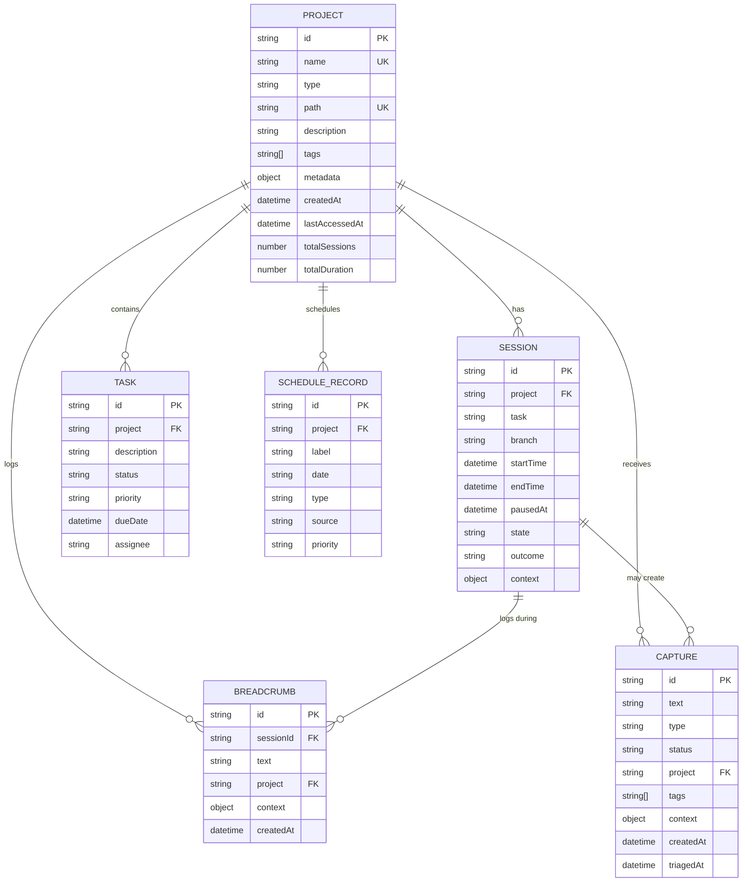
```mermaid
erDiagram
    PROJECT ||--o{ SESSION : has
    PROJECT ||--o{ CAPTURE : receives
    PROJECT ||--o{ BREADCRUMB : logs
    PROJECT ||--o{ TASK : contains
    PROJECT ||--o{ SCHEDULE_RECORD : schedules

    SESSION ||--o{ BREADCRUMB : "logs during"
    SESSION ||--o{ CAPTURE : "may create"

    PROJECT {
        string id PK
        string name UK
        string type
        string path UK
        string description
        string[] tags
        object metadata
        datetime createdAt
        datetime lastAccessedAt
        number totalSessions
        number totalDuration
    }

    SESSION {
        string id PK
        string project FK
        string task
        string branch
        datetime startTime
        datetime endTime
        datetime pausedAt
        string state
        string outcome
        object context
    }

    CAPTURE {
        string id PK
        string text
        string type
        string status
        string project FK
        string[] tags
        object context
        datetime createdAt
        datetime triagedAt
    }

    BREADCRUMB {
        string id PK
        string sessionId FK
        string text
        string project FK
        object context
        datetime createdAt
    }

    TASK {
        string id PK
        string project FK
        string description
        string status
        string priority
        datetime dueDate
        string assignee
    }

    SCHEDULE_RECORD {
        string id PK
        string project FK
        string label
        string date
        string type
        string source
        string priority
    }
```

**Relationships:**
- **1:N (Project → Session):** Each project has multiple sessions
- **1:N (Project → Capture):** Each project receives multiple captures
- **1:N (Project → Breadcrumb):** Each project logs multiple breadcrumbs
- **1:N (Project → Task):** Each project contains multiple tasks
- **1:N (Project → ScheduleRecord):** Each project has multiple scheduled records
- **1:N (Session → Breadcrumb):** Each session logs multiple breadcrumbs
- **1:N (Session → Capture):** Sessions may trigger captures

---

## 4. Session State Machine

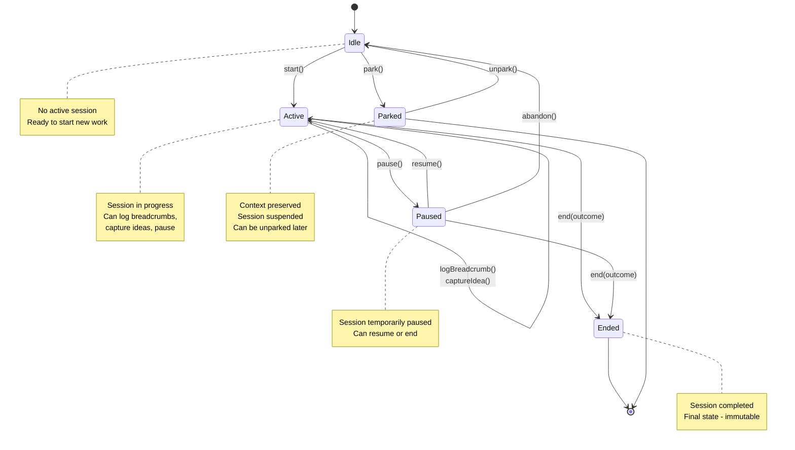
```mermaid
stateDiagram-v2
    [*] --> Idle

    Idle --> Active: start()

    Active --> Paused: pause()
    Active --> Ended: end(outcome)
    Active --> Active: logBreadcrumb()<br/>captureIdea()

    Paused --> Active: resume()
    Paused --> Ended: end(outcome)
    Paused --> Idle: abandon()

    Ended --> [*]

    Idle --> Parked: park()
    Parked --> Idle: unpark()
    Parked --> [*]

    note right of Idle
        No active session
        Ready to start new work
    end note

    note right of Active
        Session in progress
        Can log breadcrumbs,
        capture ideas, pause
    end note

    note right of Paused
        Session temporarily paused
        Can resume or end
    end note

    note right of Ended
        Session completed
        Final state - immutable
    end note

    note right of Parked
        Context preserved
        Session suspended
        Can be unparked later
    end note
```

**State Transitions:**
- **Idle → Active:** Start work session
- **Active → Paused:** Take a break (preserves start time)
- **Active → Ended:** Complete work (calculates duration)
- **Paused → Active:** Resume work
- **Active/Paused → Parked:** Save context for later
- **Parked → Unparked:** Restore context

---

## 5. CLI Command Tree


```mermaid
graph TD
    Atlas["atlas<br/>CLI Root"]

    %% Project Commands
    Atlas -->|project| Project["project<br/>Project registry"]
    Project -->|add| PAdd["add [PATH]<br/>Register project<br/>-t tags, -s status"]
    Project -->|list| PList["list<br/>List projects<br/>-s status, -t tag, --kind<br/>--count, --suggest, --format"]
    Project -->|show| PShow["show NAME<br/>Project details<br/>--format json|shell"]
    Project -->|remove| PRm["remove NAME<br/>Unregister project"]

    %% Session Commands
    Atlas -->|session| Session["session<br/>Session management"]
    Session -->|start| SStart["start [PROJECT]<br/>Begin session<br/>-t task, -e estimate, --energy"]
    Session -->|end| SEnd["end [NOTE]<br/>End session"]
    Session -->|status| SStatus["status<br/>Active session<br/>--format json"]
    Session -->|export| SExport["export [FILE]<br/>iCal/JSON export<br/>-d days, -p project, --format"]

    %% Status & Focus
    Atlas -->|status| Status["status [PROJECT]<br/>Get/update status<br/>--set, --progress, --focus<br/>--next, --complete, --then<br/>--increment, --create"]
    Atlas -->|focus| Focus["focus PROJECT [TEXT]<br/>Get/set focus"]

    %% Capture Commands
    Atlas -->|catch| Catch["catch TEXT<br/>Quick capture<br/>-p project, -t type"]
    Atlas -->|inbox| Inbox["inbox<br/>View captures<br/>-p project, --type, --limit<br/>--stats, --count, --triage"]

    %% Context Commands
    Atlas -->|where| Where["where [PROJECT]<br/>Show context"]
    Atlas -->|crumb| Crumb["crumb TEXT<br/>Leave breadcrumb<br/>-p project"]
    Atlas -->|trail| Trail["trail [PROJECT]<br/>Breadcrumb trail<br/>-d days, --limit"]
    Atlas -->|park| Park["park [NOTE]<br/>Save context<br/>-f force, -k keep-session"]
    Atlas -->|unpark| Unpark["unpark [ID]<br/>Restore context"]
    Atlas -->|parked| Parked["parked<br/>List parked contexts"]

    %% Task Commands
    Atlas -->|task| TaskCmd["task<br/>Task management"]
    TaskCmd -->|add| TAdd["add DESC<br/>Add task<br/>-p priority, --due, --project"]
    TaskCmd -->|list| TList["list<br/>List tasks<br/>--completed, --incomplete<br/>--overdue, --due-soon<br/>--project, --format"]
    TaskCmd -->|done| TDone["done ID<br/>Complete task"]
    TaskCmd -->|rm| TRm["rm ID<br/>Delete task"]

    %% Schedule & Agenda
    Atlas -->|schedule| ScheduleCmd["schedule<br/>Schedule sync"]
    ScheduleCmd -->|push| SPush["push<br/>Push records<br/>--data json, --format"]
    Atlas -->|agenda| Agenda["agenda [DAYS]<br/>Merged view<br/>--format json"]

    %% Analytics
    Atlas -->|stats| Stats["stats [PERIOD]<br/>Session analytics<br/>-d days, -p project<br/>--format, -e export<br/>--velocity, --patterns<br/>--calibrate, --minutes"]

    %% Planning
    Atlas -->|plan| Plan["plan<br/>Morning ritual<br/>--ecosystem, --json"]

    %% Setup & Diagnostics
    Atlas -->|init| Init["init<br/>Initialize atlas<br/>-g global, -t template<br/>-n name, --list-templates"]
    Atlas -->|doctor| Doctor["doctor<br/>Audit projects<br/>--kind, --all, --fix<br/>--write, --format"]
    Atlas -->|sync| Sync["sync<br/>Sync registry<br/>-d dry-run, -w watch<br/>-p paths, --remove-orphans<br/>--from-status, --research"]
    Atlas -->|migrate| Migrate["migrate<br/>Storage migration<br/>-f from, -t to, --dry-run"]

    %% Configuration
    Atlas -->|config| Config["config<br/>Configuration"]
    Config -->|paths| CPaths["paths<br/>Show scan paths"]
    Config -->|add-path| CAdd["add-path PATH<br/>Add scan path"]
    Config -->|remove-path| CRm["remove-path PATH<br/>Remove scan path"]
    Config -->|show| CShow["show<br/>Show config"]
    Config -->|setup| CSetup["setup<br/>Interactive wizard"]
    Config -->|prefs| CPrefs["prefs<br/>Manage preferences<br/>show/get/set/reset/defaults"]

    %% Templates
    Atlas -->|template| Template["template<br/>Template management"]
    Template -->|list| TList2["list<br/>List templates"]
    Template -->|show| TShow["show ID<br/>Template content"]
    Template -->|create| TCreate["create ID<br/>Create template<br/>-f from, -e extends"]
    Template -->|export| TExport["export ID<br/>Export built-in"]
    Template -->|delete| TDelete["delete ID<br/>Delete custom"]
    Template -->|dir| TDir["dir<br/>Templates directory"]

    %% Dashboard & Completions
    Atlas -->|dashboard| Dashboard["dashboard / dash<br/>TUI Dashboard"]
    Atlas -->|completions| Completions["completions [SHELL]<br/>zsh | bash | fish"]

    style Atlas fill:#e1f5ff,stroke:#01579b,stroke-width:3px
    style Project fill:#f3e5f5,stroke:#4a148c
    style Session fill:#f3e5f5,stroke:#4a148c
    style Status fill:#f3e5f5,stroke:#4a148c
    style Focus fill:#f3e5f5,stroke:#4a148c
    style Catch fill:#f3e5f5,stroke:#4a148c
    style Inbox fill:#f3e5f5,stroke:#4a148c
    style Where fill:#f3e5f5,stroke:#4a148c
    style TaskCmd fill:#f3e5f5,stroke:#4a148c
    style ScheduleCmd fill:#f3e5f5,stroke:#4a148c
    style Stats fill:#f3e5f5,stroke:#4a148c
    style Config fill:#f3e5f5,stroke:#4a148c
    style Template fill:#f3e5f5,stroke:#4a148c
    style SStart fill:#e8f5e9,stroke:#1b5e20
    style SEnd fill:#e8f5e9,stroke:#1b5e20
    style PAdd fill:#e8f5e9,stroke:#1b5e20
    style PList fill:#e8f5e9,stroke:#1b5e20
    style Catch fill:#e8f5e9,stroke:#1b5e20
    style Inbox fill:#e8f5e9,stroke:#1b5e20
    style Plan fill:#e8f5e9,stroke:#1b5e20
    style Stats fill:#e8f5e9,stroke:#1b5e20
    style TaskCmd fill:#e8f5e9,stroke:#1b5e20
    style Agenda fill:#e8f5e9,stroke:#1b5e20
    style Sync fill:#fff3e0,stroke:#e65100
    style Doctor fill:#fff3e0,stroke:#e65100
```

**Command Groups:**

1. **Project** (`project add/list/show/remove`) — Project registry management
2. **Session** (`session start/end/status/export`) — Work session lifecycle
3. **Status** (`status`, `focus`) — Project status and focus tracking
4. **Capture** (`catch`, `inbox`) — Quick capture and inbox management
5. **Context** (`where`, `crumb`, `trail`, `park`, `unpark`, `parked`) — Breadcrumb trail and context switching
6. **Task** (`task add/list/done/rm`) — Task CRUD with priority, due dates, project filters
7. **Schedule** (`schedule push`, `agenda`) — External schedule sync and merged chronological view
8. **Analytics** (`stats`) — Session analytics with velocity, patterns, and calibration
9. **Planning** (`plan`) — Morning ritual daily planning
10. **Setup** (`init`, `doctor`, `sync`, `migrate`) — Initialization, audit, registry sync, migration
11. **Config** (`config paths/add-path/remove-path/show/setup/prefs`) — Configuration management
12. **Templates** (`template list/show/create/export/delete/dir`) — Project template management
13. **Dashboard** (`dashboard`/`dash`) — Interactive TUI
14. **Completions** (`completions`) — Shell completion scripts

---

## 6. Repository Pattern & Storage Abstraction


```mermaid
graph TB
    subgraph "Use Case Layer"
        UC["Use Cases<br/>ProjectUC, SessionUC,<br/>CaptureUC, etc."]
    end

    subgraph "Domain Layer"
        IRepo["Repository Interfaces<br/>IProjectRepository<br/>ISessionRepository<br/>ICaptureRepository<br/>IBreadcrumbRepository<br/>ITaskRepository<br/>IScheduleRecordRepository"]
    end

    subgraph "Adapter Layer - Filesystem"
        FSProj["FileSystemProjectRepository<br/>~/.atlas/projects.json"]
        FSSess["FileSystemSessionRepository<br/>~/.atlas/sessions.json"]
        FSCap["FileSystemCaptureRepository<br/>~/.atlas/captures.json"]
        FSBread["FileSystemBreadcrumbRepository<br/>~/.atlas/breadcrumbs.json"]
        FSTask["FileSystemTaskRepository<br/>~/.atlas/tasks.json"]
        FSSched["FileSystemScheduleRecordRepository<br/>~/.atlas/schedule-records.json"]
    end

    subgraph "Adapter Layer - SQLite"
        SQLProj["SQLiteProjectRepository<br/>~/.atlas/atlas.db<br/>projects table"]
        SQLSess["SQLiteSessionRepository<br/>~/.atlas/atlas.db<br/>sessions table"]
        SQLCap["SQLiteCaptureRepository<br/>~/.atlas/atlas.db<br/>captures table"]
        SQLBread["SQLiteBreadcrumbRepository<br/>~/.atlas/atlas.db<br/>breadcrumbs table"]
        SQLTask["SQLiteTaskRepository<br/>~/.atlas/atlas.db<br/>tasks table"]
        SQLSched["SQLiteScheduleRecordRepository<br/>~/.atlas/atlas.db<br/>schedule_records table"]
    end

    subgraph "Infrastructure Layer"
        FS["FileSystem<br/>read/write JSON files"]
        DB["SQLite Database<br/>SQL queries"]
    end

    subgraph "Dependency Injection"
        Container["Container<br/>storage: 'filesystem'|'sqlite'<br/>resolve(name) → instance"]
    end

    UC -->|depends on| IRepo
    IRepo -.->|implements| FSProj
    IRepo -.->|implements| FSSess
    IRepo -.->|implements| FSCap
    IRepo -.->|implements| FSBread
    IRepo -.->|implements| FSTask
    IRepo -.->|implements| FSSched
    IRepo -.->|implements| SQLProj
    IRepo -.->|implements| SQLSess
    IRepo -.->|implements| SQLCap
    IRepo -.->|implements| SQLBread
    IRepo -.->|implements| SQLTask
    IRepo -.->|implements| SQLSched

    FSProj --> FS
    FSSess --> FS
    FSCap --> FS
    FSBread --> FS
    FSTask --> FS
    FSSched --> FS

    SQLProj --> DB
    SQLSess --> DB
    SQLCap --> DB
    SQLBread --> DB
    SQLTask --> DB
    SQLSched --> DB

    Container -->|creates| FSProj
    Container -->|creates| FSSess
    Container -->|creates| FSTask
    Container -->|creates| FSSched
    Container -->|creates| SQLProj
    Container -->|creates| SQLSess
    Container -->|creates| SQLTask
    Container -->|creates| SQLSched

    style UC fill:#f3e5f5
    style IRepo fill:#e8f5e9,stroke:#2e7d32,stroke-width:2px
    style FSProj fill:#fff3e0
    style FSSess fill:#fff3e0
    style SQLProj fill:#fff3e0
    style SQLSess fill:#fff3e0
    style Container fill:#e1f5ff
```

**Key Pattern Elements:**

- **Repositories:** Abstract interface between Use Cases and storage
- **Multiple Implementations:** Filesystem (JSON) and SQLite backends both implement the same interface
- **Dependency Injection:** Container decides which implementation to instantiate
- **Storage Agnostic:** Use Cases don't care about storage backend

---

## 7. Event System Architecture

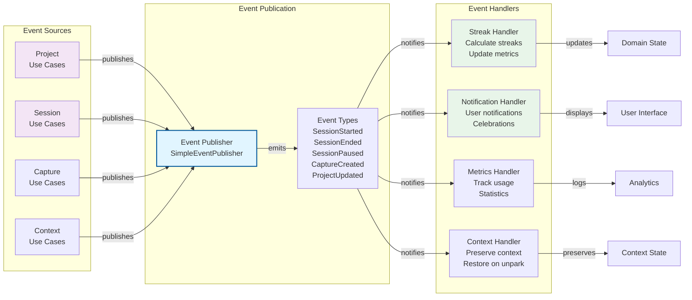
```mermaid
graph LR
    subgraph "Event Sources"
        ProjectUC["Project<br/>Use Cases"]
        SessionUC["Session<br/>Use Cases"]
        CaptureUC["Capture<br/>Use Cases"]
        ContextUC["Context<br/>Use Cases"]
    end

    subgraph "Event Publication"
        EventPub["Event Publisher<br/>SimpleEventPublisher"]
        EventTypes["Event Types<br/>SessionStarted<br/>SessionEnded<br/>SessionPaused<br/>CaptureCreated<br/>ProjectUpdated"]
    end

    subgraph "Event Handlers"
        StreakHandler["Streak Handler<br/>Calculate streaks<br/>Update metrics"]
        NotifyHandler["Notification Handler<br/>User notifications<br/>Celebrations"]
        MetricsHandler["Metrics Handler<br/>Track usage<br/>Statistics"]
        ContextHandler["Context Handler<br/>Preserve context<br/>Restore on unpark"]
    end

    ProjectUC -->|publishes| EventPub
    SessionUC -->|publishes| EventPub
    CaptureUC -->|publishes| EventPub
    ContextUC -->|publishes| EventPub

    EventPub -->|emits| EventTypes
    EventTypes -->|notifies| StreakHandler
    EventTypes -->|notifies| NotifyHandler
    EventTypes -->|notifies| MetricsHandler
    EventTypes -->|notifies| ContextHandler

    StreakHandler -->|updates| DB1["Domain State"]
    NotifyHandler -->|displays| UI["User Interface"]
    MetricsHandler -->|logs| DB2["Analytics"]
    ContextHandler -->|preserves| DB3["Context State"]

    style EventPub fill:#e1f5ff,stroke:#01579b,stroke-width:2px
    style SessionUC fill:#f3e5f5
    style ProjectUC fill:#f3e5f5
    style StreakHandler fill:#e8f5e9
    style NotifyHandler fill:#e8f5e9
```

**Publish-Subscribe Pattern:**

- Use Cases publish domain events asynchronously
- Multiple handlers subscribe to events independently
- Decouples use cases from cross-cutting concerns (metrics, notifications, streak tracking)
- Events fire after entity state changes are persisted

---

## 8. Configuration & ADHD-Friendly Features

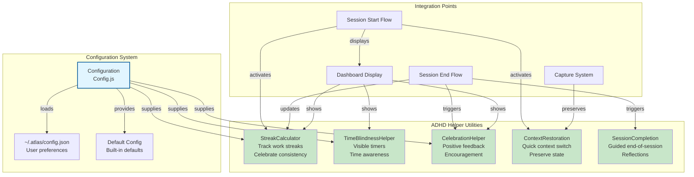
```mermaid
graph TB
    subgraph "Configuration System"
        Config["Configuration<br/>Config.js"]
        ConfigFile["~/.atlas/config.json<br/>User preferences"]
        Defaults["Default Config<br/>Built-in defaults"]
    end

    subgraph "ADHD Helper Utilities"
        Streak["StreakCalculator<br/>Track work streaks<br/>Celebrate consistency"]
        TimeBlind["TimeBlindnessHelper<br/>Visible timers<br/>Time awareness"]
        Celebrate["CelebrationHelper<br/>Positive feedback<br/>Encouragement"]
        Context["ContextRestoration<br/>Quick context switch<br/>Preserve state"]
        Complete["SessionCompletion<br/>Guided end-of-session<br/>Reflections"]
    end

    subgraph "Integration Points"
        SessionStart["Session Start Flow"]
        SessionEnd["Session End Flow"]
        Dashboard["Dashboard Display"]
        Capture["Capture System"]
    end

    Config -->|loads| ConfigFile
    Config -->|provides| Defaults
    Config -->|supplies| Streak
    Config -->|supplies| TimeBlind
    Config -->|supplies| Celebrate

    SessionStart -->|activates| Context
    SessionStart -->|activates| Streak
    SessionStart -->|displays| Dashboard

    SessionEnd -->|triggers| Celebrate
    SessionEnd -->|triggers| Complete
    SessionEnd -->|updates| Streak

    Dashboard -->|shows| Streak
    Dashboard -->|shows| TimeBlind
    Dashboard -->|shows| Celebrate

    Capture -->|preserves| Context

    style Config fill:#e1f5ff,stroke:#01579b,stroke-width:2px
    style Streak fill:#c8e6c9
    style TimeBlind fill:#c8e6c9
    style Celebrate fill:#c8e6c9
    style Context fill:#c8e6c9
    style Complete fill:#c8e6c9
```

**Configuration & Helpers:**

- Central `Config.js` manages all user preferences
- ADHD-friendly helpers integrate at key lifecycle points
- Helpers are optional and can be toggled via configuration
- Dashboard displays time awareness and streak information

---

## 9. Template System Flow

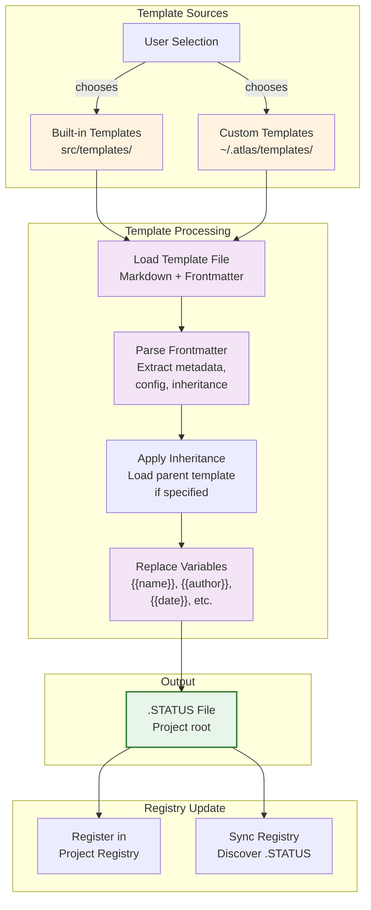
```mermaid
graph TD
    subgraph "Template Sources"
        BuiltIn["Built-in Templates<br/>src/templates/"]
        Custom["Custom Templates<br/>~/.atlas/templates/"]
        User["User Selection"]
    end

    subgraph "Template Processing"
        Load["Load Template File<br/>Markdown + Frontmatter"]
        Parse["Parse Frontmatter<br/>Extract metadata,<br/>config, inheritance"]
        Inherit["Apply Inheritance<br/>Load parent template<br/>if specified"]
        Variables["Replace Variables<br/>{{name}}, {{author}},<br/>{{date}}, etc."]
    end

    subgraph "Output"
        Status[".STATUS File<br/>Project root"]
    end

    subgraph "Registry Update"
        Register["Register in<br/>Project Registry"]
        Sync["Sync Registry<br/>Discover .STATUS"]
    end

    User -->|chooses| BuiltIn
    User -->|chooses| Custom

    BuiltIn --> Load
    Custom --> Load

    Load --> Parse
    Parse --> Inherit
    Inherit --> Variables
    Variables --> Status

    Status --> Register
    Status --> Sync

    style BuiltIn fill:#fff3e0
    style Custom fill:#fff3e0
    style Load fill:#f3e5f5
    style Parse fill:#f3e5f5
    style Variables fill:#f3e5f5
    style Status fill:#e8f5e9,stroke:#2e7d32,stroke-width:2px
```

**Template Variables:**
- `{{name}}` - Project name
- `{{date}}` - Current date (YYYY-MM-DD)
- `{{author}}` - From config
- `{{github_user}}` - From config
- `{{parent}}` - Parent template content (inheritance)

---

## 10. Project Scanning & Registry Synchronization

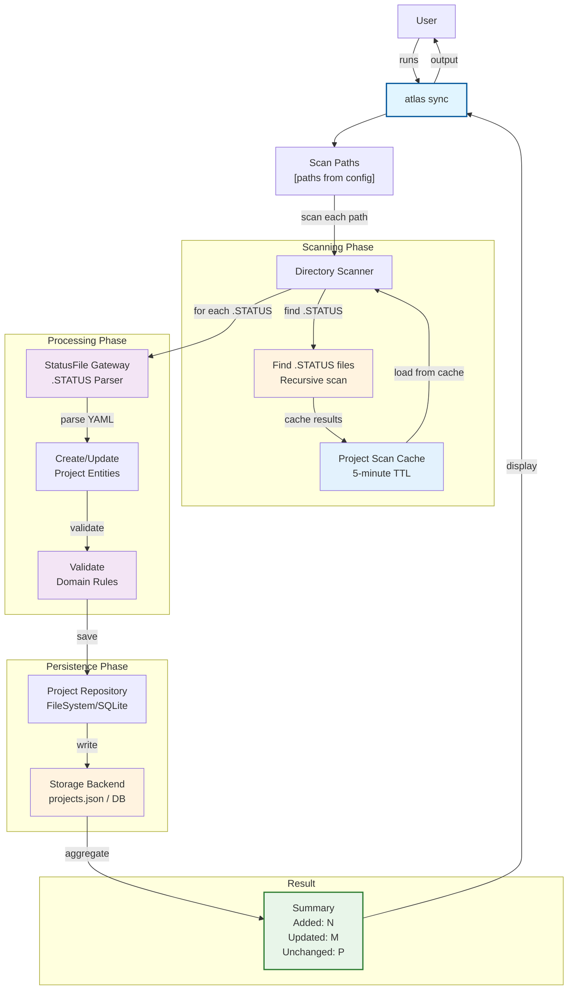
```mermaid
graph TD
    User["User"]
    CLI["atlas sync"]
    ScanPaths["Scan Paths<br/>[paths from config]"]

    subgraph "Scanning Phase"
        Scanner["Directory Scanner"]
        FindStatus["Find .STATUS files<br/>Recursive scan"]
        Cache["Project Scan Cache<br/>5-minute TTL"]
    end

    subgraph "Processing Phase"
        Gateway["StatusFile Gateway<br/>.STATUS Parser"]
        Entities["Create/Update<br/>Project Entities"]
        Validation["Validate<br/>Domain Rules"]
    end

    subgraph "Persistence Phase"
        Repo["Project Repository<br/>FileSystem/SQLite"]
        Storage["Storage Backend<br/>projects.json / DB"]
    end

    subgraph "Result"
        Summary["Summary<br/>Added: N<br/>Updated: M<br/>Unchanged: P"]
    end

    User -->|runs| CLI
    CLI --> ScanPaths

    ScanPaths -->|scan each path| Scanner
    Scanner -->|find .STATUS| FindStatus
    FindStatus -->|cache results| Cache
    Cache -->|load from cache| Scanner

    Scanner -->|for each .STATUS| Gateway
    Gateway -->|parse YAML| Entities
    Entities -->|validate| Validation
    Validation -->|save| Repo
    Repo -->|write| Storage

    Storage -->|aggregate| Summary
    Summary -->|display| CLI
    CLI -->|output| User

    style CLI fill:#e1f5ff,stroke:#01579b,stroke-width:2px
    style FindStatus fill:#fff3e0
    style Cache fill:#e3f2fd
    style Gateway fill:#f3e5f5
    style Validation fill:#f3e5f5
    style Storage fill:#fff3e0
    style Summary fill:#e8f5e9,stroke:#2e7d32,stroke-width:2px
```

---

## 11. Presenter Layer

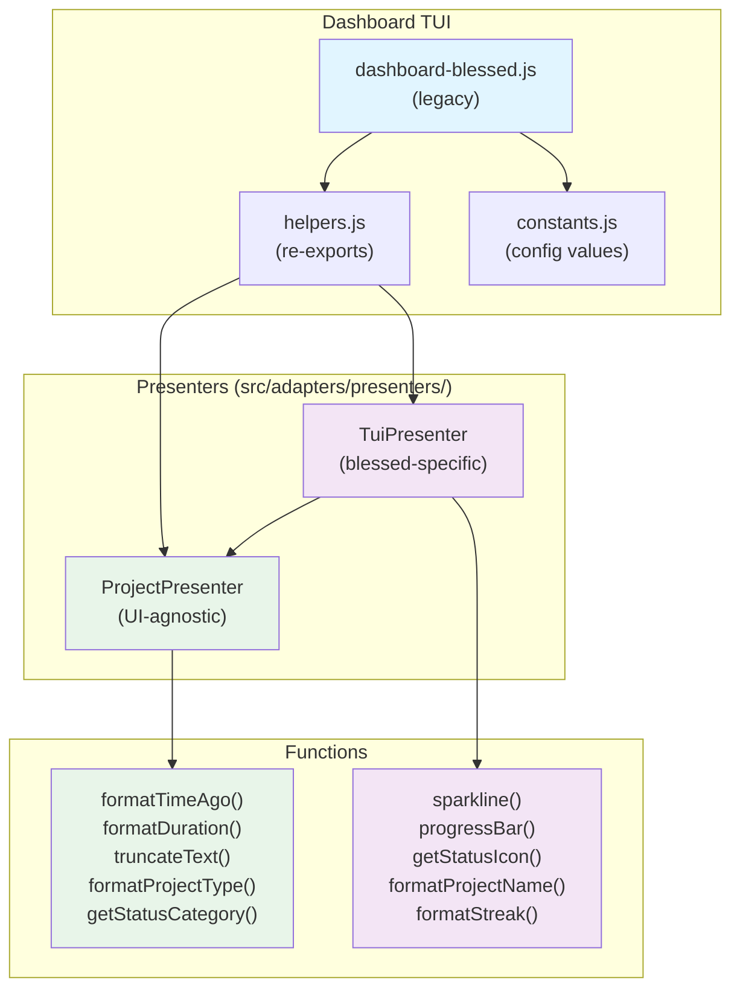
```mermaid
graph TB
    subgraph "Dashboard TUI"
        Dashboard["dashboard-blessed.js<br/>(legacy)"]
        Helpers["helpers.js<br/>(re-exports)"]
        Constants["constants.js<br/>(config values)"]
    end

    subgraph "Presenters (src/adapters/presenters/)"
        ProjectPres["ProjectPresenter<br/>(UI-agnostic)"]
        TuiPres["TuiPresenter<br/>(blessed-specific)"]
    end

    subgraph "Functions"
        UIAgnostic["formatTimeAgo()<br/>formatDuration()<br/>truncateText()<br/>formatProjectType()<br/>getStatusCategory()"]
        BlessedSpec["sparkline()<br/>progressBar()<br/>getStatusIcon()<br/>formatProjectName()<br/>formatStreak()"]
    end

    Dashboard --> Helpers
    Dashboard --> Constants
    Helpers --> TuiPres
    Helpers --> ProjectPres
    TuiPres --> ProjectPres

    ProjectPres --> UIAgnostic
    TuiPres --> BlessedSpec

    style Dashboard fill:#e1f5ff
    style ProjectPres fill:#e8f5e9
    style TuiPres fill:#f3e5f5
    style UIAgnostic fill:#e8f5e9
    style BlessedSpec fill:#f3e5f5
```

**Presenter Pattern Benefits:**
- **Separation of Concerns:** UI formatting separate from business logic
- **Testability:** Pure functions easy to unit test (65 tests)
- **Reusability:** ProjectPresenter can be used by future web/API interfaces
- **Maintainability:** Changes to blessed tags isolated to TuiPresenter

---


---

## 12. Dashboard State Machine (Ink v0.9.x)

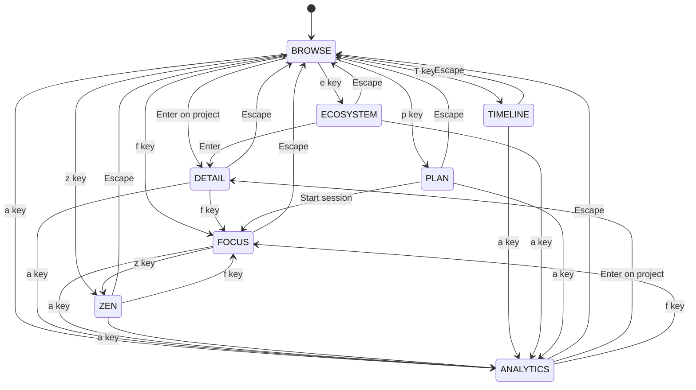
```mermaid
stateDiagram-v2
    [*] --> BROWSE
    BROWSE --> DETAIL: Enter on project
    BROWSE --> FOCUS: f key
    BROWSE --> ZEN: z key
    BROWSE --> TIMELINE: T key
    BROWSE --> ECOSYSTEM: e key
    BROWSE --> PLAN: p key
    BROWSE --> ANALYTICS: a key

    DETAIL --> BROWSE: Escape
    DETAIL --> FOCUS: f key
    DETAIL --> ANALYTICS: a key

    FOCUS --> BROWSE: Escape
    FOCUS --> ZEN: z key
    FOCUS --> ANALYTICS: a key

    ZEN --> BROWSE: Escape
    ZEN --> FOCUS: f key
    ZEN --> ANALYTICS: a key

    TIMELINE --> BROWSE: Escape
    TIMELINE --> ANALYTICS: a key

    ECOSYSTEM --> BROWSE: Escape
    ECOSYSTEM --> DETAIL: Enter
    ECOSYSTEM --> ANALYTICS: a key

    PLAN --> BROWSE: Escape
    PLAN --> FOCUS: Start session
    PLAN --> ANALYTICS: a key

    ANALYTICS --> BROWSE: Escape
    ANALYTICS --> DETAIL: Enter on project
    ANALYTICS --> FOCUS: f key
```

**States:** BROWSE (card list), DETAIL (project), FOCUS (Pomodoro), ZEN (minimal), TIMELINE (time blocks), ECOSYSTEM (multi-project), PLAN (morning ritual), ANALYTICS (velocity + patterns)

**Implementation:** `src/cli/dashboard-ink/lib/stateMachine.ts`

---

## 13. Ink Dashboard Component Tree (v0.9.1)

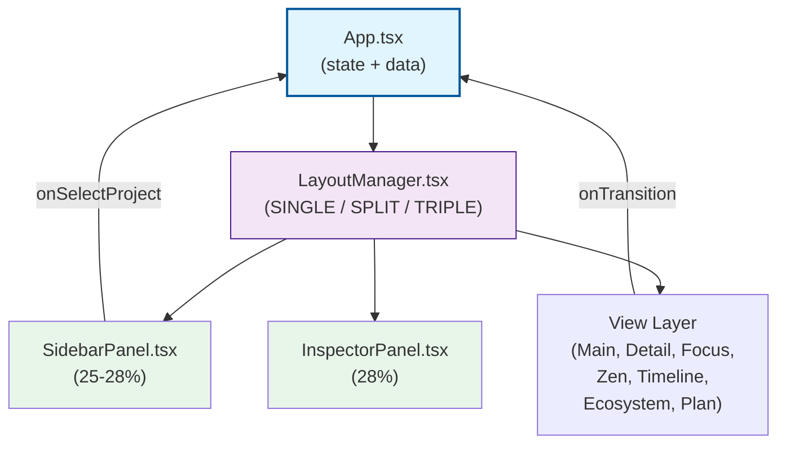
```mermaid
graph TB
    App["App.tsx<br/>(state + data)"]
    LM["LayoutManager.tsx<br/>(SINGLE / SPLIT / TRIPLE)"]
    SP["SidebarPanel.tsx<br/>(25-28%)"]
    IP["InspectorPanel.tsx<br/>(28%)"]
    Views["View Layer<br/>(Main, Detail, Focus,<br/>Zen, Timeline,<br/>Ecosystem, Plan)"]

    App --> LM
    LM --> SP
    LM --> Views
    LM --> IP
    SP -->|onSelectProject| App
    Views -->|onTransition| App

    style App fill:#e1f5ff,stroke:#01579b,stroke-width:2px
    style LM fill:#f3e5f5,stroke:#4a148c
    style SP fill:#e8f5e9
    style IP fill:#e8f5e9
```

**Layout Modes (Tab cycles):**
- **SINGLE:** Main view only (100%)
- **SPLIT:** Sidebar (28%) + Main (72%)
- **TRIPLE:** Sidebar (25%) + Main (47%) + Inspector (28%)

## 14. Visual Pipeline (v0.9.1)

Shows how session data flows through the visual enhancement layers:

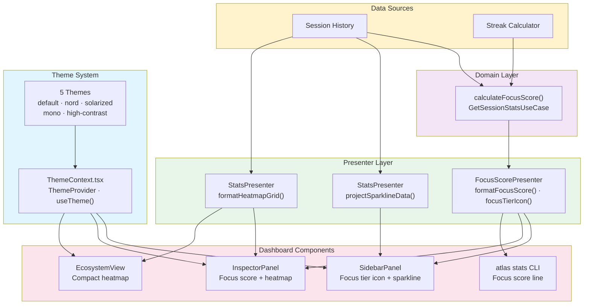
```mermaid
flowchart TB
    subgraph Data["Data Sources"]
        Sessions["Session History"]
        Streak["Streak Calculator"]
    end

    subgraph Domain["Domain Layer"]
        FocusCalc["calculateFocusScore()<br/>GetSessionStatsUseCase"]
    end

    subgraph Presenters["Presenter Layer"]
        FocusPres["FocusScorePresenter<br/>formatFocusScore() · focusTierIcon()"]
        SparkPres["StatsPresenter<br/>projectSparklineData()"]
        HeatPres["StatsPresenter<br/>formatHeatmapGrid()"]
    end

    subgraph Theme["Theme System"]
        ThemeCtx["ThemeContext.tsx<br/>ThemeProvider · useTheme()"]
        Themes["5 Themes<br/>default · nord · solarized<br/>mono · high-contrast"]
    end

    subgraph UI["Dashboard Components"]
        Sidebar["SidebarPanel<br/>Focus tier icon + sparkline"]
        Inspector["InspectorPanel<br/>Focus score + heatmap"]
        Ecosystem["EcosystemView<br/>Compact heatmap"]
        Stats["atlas stats CLI<br/>Focus score line"]
    end

    Sessions --> FocusCalc
    Streak --> FocusCalc
    Sessions --> SparkPres
    Sessions --> HeatPres
    FocusCalc --> FocusPres

    FocusPres --> Sidebar
    FocusPres --> Inspector
    FocusPres --> Stats
    SparkPres --> Sidebar
    HeatPres --> Inspector
    HeatPres --> Ecosystem

    ThemeCtx --> Sidebar
    ThemeCtx --> Inspector
    ThemeCtx --> Ecosystem
    Themes --> ThemeCtx

    style Data fill:#fff3cd
    style Domain fill:#f3e5f5
    style Presenters fill:#e8f5e9
    style Theme fill:#e1f5ff
    style UI fill:#fce4ec
```

**Key design decisions:**
- Theme is pure React Context — no prop drilling
- Presenters are framework-agnostic (used by both CLI and TUI)
- All visual data derived from one `GetSessionStatsUseCase` fetch
- Never use red — ADHD-friendly design principle

---

## 15. Real Data Pipeline (v0.9.2)

Shows how the Ink dashboard fetches, filters, enriches, and renders real data from `~/.atlas`:

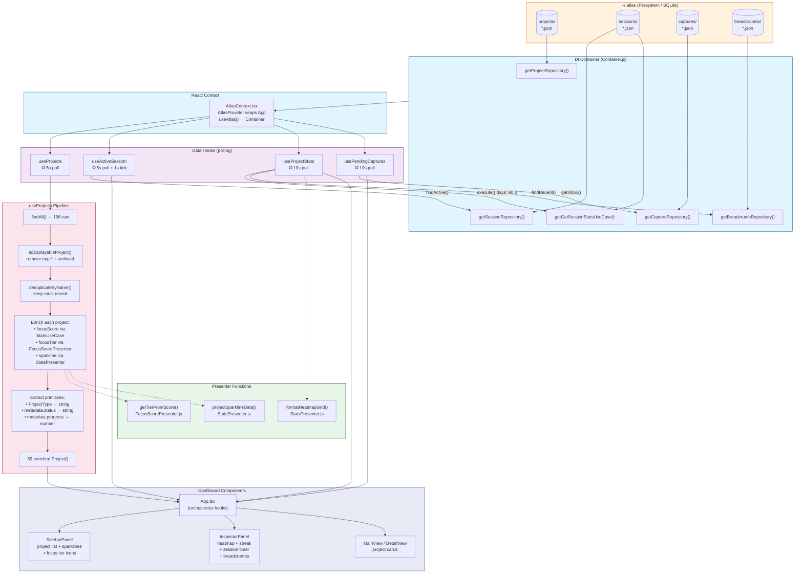
```mermaid
flowchart TB
    subgraph Storage["~/.atlas (Filesystem / SQLite)"]
        ProjStore[("projects/\n*.json")]
        SessStore[("sessions/\n*.json")]
        CapStore[("captures/\n*.json")]
        CrumbStore[("breadcrumbs/\n*.json")]
    end

    subgraph Container["DI Container (Container.js)"]
        ProjRepo["getProjectRepository()"]
        SessRepo["getSessionRepository()"]
        CapRepo["getCaptureRepository()"]
        CrumbRepo["getBreadcrumbRepository()"]
        StatsUC["getGetSessionStatsUseCase()"]
    end

    subgraph Context["React Context"]
        AtlasCtx["AtlasContext.tsx\nAtlasProvider wraps App\nuseAtlas() → Container"]
    end

    subgraph Hooks["Data Hooks (polling)"]
        direction TB
        HP["useProjects\n⏱ 5s poll"]
        HA["useActiveSession\n⏱ 5s poll + 1s tick"]
        HS["useProjectStats\n⏱ 10s poll"]
        HC["usePendingCaptures\n⏱ 10s poll"]
    end

    subgraph Filter["useProjects Pipeline"]
        direction TB
        FetchAll["findAll()  →  196 raw"]
        FilterJunk["isDisplayableProject()\nremove tmp.* + archived"]
        Dedup["deduplicateByName()\nkeep most recent"]
        Enrich["Enrich each project:\n• focusScore via StatsUseCase\n• focusTier via FocusScorePresenter\n• sparkline via StatsPresenter"]
        Extract["Extract primitives:\n• ProjectType → string\n• metadata.status → string\n• metadata.progress → number"]
        Result["59 enriched Project[]"]
    end

    subgraph Presenters["Presenter Functions"]
        FocusPres["getTierFromScore()\nFocusScorePresenter.js"]
        SparkPres["projectSparklineData()\nStatsPresenter.js"]
        HeatPres["formatHeatmapGrid()\nStatsPresenter.js"]
    end

    subgraph UI["Dashboard Components"]
        App["App.tsx\n(orchestrates hooks)"]
        Sidebar["SidebarPanel\nproject list + sparklines\n+ focus tier icons"]
        Inspector["InspectorPanel\nheatmap + streak\n+ session timer\n+ breadcrumbs"]
        Main["MainView / DetailView\nproject cards"]
    end

    %% Storage → Container
    ProjStore --> ProjRepo
    SessStore --> SessRepo
    CapStore --> CapRepo
    CrumbStore --> CrumbRepo
    SessStore --> StatsUC

    %% Container → Context → Hooks
    Container --> AtlasCtx
    AtlasCtx --> HP & HA & HS & HC

    %% useProjects pipeline
    HP --> FetchAll
    FetchAll --> FilterJunk
    FilterJunk --> Dedup
    Dedup --> Enrich
    Enrich --> Extract
    Extract --> Result

    %% Enrichment uses presenters
    Enrich -.-> FocusPres
    Enrich -.-> SparkPres

    %% Other hooks use repos
    HA -->|"findActive()"| SessRepo
    HS -->|"execute({ days: 90 })"| StatsUC
    HS -->|"findRecent()"| CrumbRepo
    HS -.-> HeatPres
    HC -->|"getInbox()"| CapRepo

    %% Hooks → UI
    Result --> App
    HA --> App
    HS --> App
    HC --> App

    App --> Sidebar
    App --> Inspector
    App --> Main

    %% Styles
    style Storage fill:#fff3e0,stroke:#e65100
    style Container fill:#e1f5ff,stroke:#01579b
    style Context fill:#e1f5ff,stroke:#01579b
    style Hooks fill:#f3e5f5,stroke:#4a148c
    style Filter fill:#fce4ec,stroke:#880e4f
    style Presenters fill:#e8f5e9,stroke:#1b5e20
    style UI fill:#e8eaf6,stroke:#283593
```

**Key design decisions (v0.9.2):**

- **AtlasContext** injects the DI Container via React Context — hooks call `useAtlas()` instead of importing Container directly
- **Polling hierarchy**: Projects 5s, Session 5s + 1s tick, Stats/Captures 10s — balances freshness vs load
- **Stale-while-revalidate**: All hooks keep `useRef` for last-good data; on error, return stale data with error state
- **Project filtering**: `isDisplayableProject()` removes `tmp.*` junk and archived entries, `deduplicateByName()` keeps the most recently accessed copy — reduces 196 raw entries to ~59 displayable projects
- **Value object extraction**: Domain `ProjectType` is a value object (`{_value: "node"}`); hooks extract to primitive strings before passing to React to avoid "Objects are not valid as a React child" crashes
- **Cross-validated dogfood tests**: Each pipeline stage is independently verified using dual-path testing (code-under-test vs filesystem oracle)

---

## Diagram Reference Guide

| # | Diagram | Purpose | Key Use Case |
|---|---------|---------|--------------|
| 1 | System Architecture | Shows Clean Architecture layers | Understanding overall structure |
| 2 | Data Flow | Complete session lifecycle | How data moves through system |
| 3 | Entity Relationships | Database schema and cardinality | Understanding data model |
| 4 | Session State Machine | Possible session states | Session lifecycle management |
| 5 | CLI Command Tree | Command hierarchy (14 groups) | CLI navigation and usage |
| 6 | Repository Pattern | Storage abstraction | Understanding backend switching |
| 7 | Event System | Publish-subscribe pattern | Cross-cutting concerns |
| 8 | Configuration & ADHD Features | User preferences integration | ADHD-friendly features |
| 9 | Template System | Project template processing | Creating new projects |
| 10 | Scanning & Registry | Project discovery | Project synchronization |
| 11 | Presenter Layer | UI formatting separation | Dashboard TUI formatting |
| 12 | Dashboard State Machine | Ink view state transitions | Dashboard navigation |
| 13 | Ink Component Tree | React Ink component hierarchy | TUI architecture |
| 14 | Visual Pipeline | Theme + focus + sparkline + heatmap flow | v0.9.1 visual features |
| 15 | Real Data Pipeline | Container → hooks → filter → enrich → render | v0.9.2 real data wiring |

---

## Rendering Notes

All diagrams use standard Mermaid syntax and should render correctly in:
- GitHub markdown (`.md` files)
- GitLab markdown
- Notion
- Mermaid Live Editor (mermaid.live)

To render locally, install Mermaid CLI:
```bash
npm install -g @mermaid-js/mermaid-cli
# Then convert diagrams to PNG/SVG:
mmdc -i docs/DIAGRAMS.md -o docs/diagrams-output.svg
```

---

## Related Documentation

- [ARCHITECTURE.md](./ARCHITECTURE.md) - Detailed architecture explanation
- [CLI-REFERENCE.md](./CLI-REFERENCE.md) - Complete CLI command reference
- [API-GUIDE.md](./API-GUIDE.md) - Programmatic API usage
- [CONFIGURATION.md](./CONFIGURATION.md) - Configuration options
