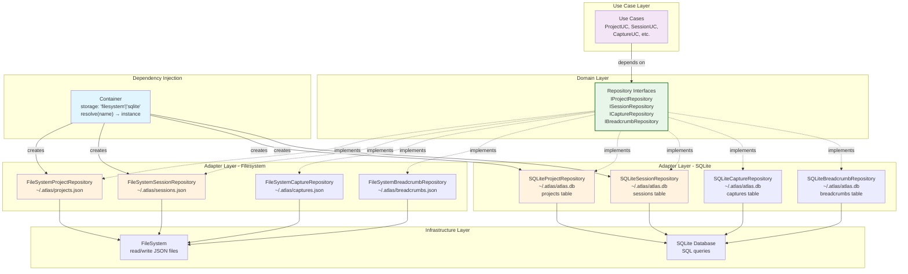

# Atlas CLI - Architecture Diagrams

This document contains comprehensive Mermaid diagrams visualizing the Atlas CLI architecture, data flows, and system interactions.

---

## 1. System Architecture (Clean Architecture Layers)


**Layers Explained:**

- **Presentation:** CLI, Dashboard, and programmatic API interfaces
- **Controllers/Adapters:** Convert between presentation and business logic
- **Use Cases:** Atomic application operations (Session Start, Capture Idea, etc.)
- **Domain:** Core entities and business rules
- **Infrastructure:** Storage backends (Filesystem JSON or SQLite) and configuration

---

## 2. Data Flow - Complete Session Lifecycle


**Key Points:**
- Session lifecycle flows through Use Cases → Domain Entities → Repositories
- Each write operation persists to storage (Filesystem JSON or SQLite)
- Domain events trigger cross-cutting concerns (streak, notifications, etc.)
- Breadcrumbs and Captures are logged independently during session

---

## 3. Entity Relationship Diagram


**Relationships:**
- **1:N (Project → Session):** Each project has multiple sessions
- **1:N (Project → Capture):** Each project receives multiple captures
- **1:N (Project → Breadcrumb):** Each project logs multiple breadcrumbs
- **1:N (Project → Task):** Each project contains multiple tasks
- **1:N (Session → Breadcrumb):** Each session logs multiple breadcrumbs
- **1:N (Session → Capture):** Sessions may trigger captures

---

## 4. Session State Machine


**State Transitions:**
- **Idle → Active:** Start work session
- **Active → Paused:** Take a break (preserves start time)
- **Active → Ended:** Complete work (calculates duration)
- **Paused → Active:** Resume work
- **Active/Paused → Parked:** Save context for later
- **Parked → Unparked:** Restore context

---

## 5. CLI Command Tree


**Command Groups:**

1. **Session:** Session lifecycle management (start, end, pause, resume)
2. **Project:** Project discovery and metadata
3. **Capture:** Quick capture (inbox system for ideas, tasks, bugs, notes)
4. **Context:** Breadcrumb trail for tracking work context
5. **Config:** Configuration management and storage backend selection
6. **Registry:** Project discovery and registration
7. **Info:** System information and UI

---

## 6. Repository Pattern & Storage Abstraction



**Key Pattern Elements:**

- **Repositories:** Abstract interface between Use Cases and storage
- **Multiple Implementations:** Filesystem (JSON) and SQLite backends both implement the same interface
- **Dependency Injection:** Container decides which implementation to instantiate
- **Storage Agnostic:** Use Cases don't care about storage backend

---

## 7. Event System Architecture


**Publish-Subscribe Pattern:**

- Use Cases publish domain events asynchronously
- Multiple handlers subscribe to events independently
- Decouples use cases from cross-cutting concerns (metrics, notifications, streak tracking)
- Events fire after entity state changes are persisted

---

## 8. Configuration & ADHD-Friendly Features


**Configuration & Helpers:**

- Central `Config.js` manages all user preferences
- ADHD-friendly helpers integrate at key lifecycle points
- Helpers are optional and can be toggled via configuration
- Dashboard displays time awareness and streak information

---

## 9. Template System Flow


**Template Variables:**
- `{{name}}` - Project name
- `{{date}}` - Current date (YYYY-MM-DD)
- `{{author}}` - From config
- `{{github_user}}` - From config
- `{{parent}}` - Parent template content (inheritance)

---

## 10. Project Scanning & Registry Synchronization


---

## Diagram Reference Guide

| # | Diagram | Purpose | Key Use Case |
|---|---------|---------|--------------|
| 1 | System Architecture | Shows Clean Architecture layers | Understanding overall structure |
| 2 | Data Flow | Complete session lifecycle | How data moves through system |
| 3 | Entity Relationships | Database schema and cardinality | Understanding data model |
| 4 | Session State Machine | Possible session states | Session lifecycle management |
| 5 | CLI Command Tree | Command hierarchy | CLI navigation and usage |
| 6 | Repository Pattern | Storage abstraction | Understanding backend switching |
| 7 | Event System | Publish-subscribe pattern | Cross-cutting concerns |
| 8 | Configuration & ADHD Features | User preferences integration | ADHD-friendly features |
| 9 | Template System | Project template processing | Creating new projects |
| 10 | Scanning & Registry | Project discovery | Project synchronization |

---

## Rendering Notes

All diagrams use standard Mermaid syntax and should render correctly in:
- GitHub markdown (`.md` files)
- GitLab markdown
- Notion
- Mermaid Live Editor (mermaid.live)

To render locally, install Mermaid CLI:
```bash
npm install -g @mermaid-js/mermaid-cli
# Then convert diagrams to PNG/SVG:
mmdc -i docs/DIAGRAMS.md -o docs/diagrams-output.svg
```

---

## Related Documentation

- [ARCHITECTURE.md](./ARCHITECTURE.md) - Detailed architecture explanation
- [CLI-REFERENCE.md](./CLI-REFERENCE.md) - Complete CLI command reference
- [API-GUIDE.md](./API-GUIDE.md) - Programmatic API usage
- [CONFIGURATION.md](./CONFIGURATION.md) - Configuration options
