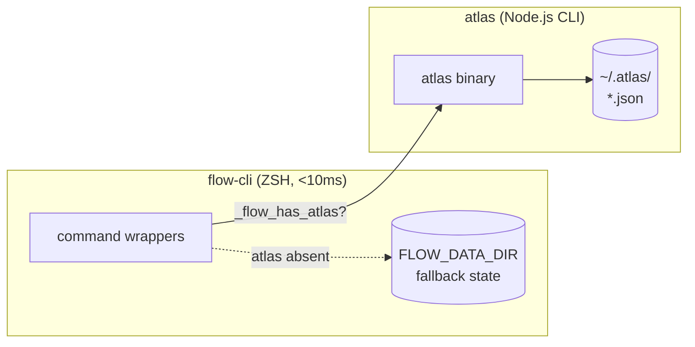

# Dev Tools Ecosystem Integrations

**Last Updated:** 2026-07-04
**Migrated From:** dev-planning/docs/INTEGRATION-MAP.md

> Comprehensive map of how all dev-tools projects connect and depend on each other.

---

## Architecture Overview

### Three-Layer Stack

The dev-tools ecosystem follows a three-layer architecture:

```
┌─────────────────────────────────────────────────────────────┐
│  Layer 3: Rich Automation (Python/Node)                     │
│  • aiterm - Complex workflows, visualization                │
│  • nexus-cli - Knowledge management                         │
│  • scribe - Screenshot + annotation tool                    │
├─────────────────────────────────────────────────────────────┤
│  Layer 2: Shell Workflow (Pure ZSH)                         │
│  • flow-cli - Instant commands (<10ms)                      │
│  • zsh-claude-workflow - Claude automation (deprecated)     │
├─────────────────────────────────────────────────────────────┤
│  Layer 1: State Management                                  │
│  • atlas - Central state engine (source of truth)           │
└─────────────────────────────────────────────────────────────┘
```

**Design Principle:** Each layer delegates instant operations down to lower layers.
- `aiterm feature` → delegates to `flow-cli g feature` for git ops
- `flow dash` → shells out to `atlas dashboard` for the live TUI
- `tm ghost` → delegates to aiterm for rich terminal status

---

## Current Architecture (2026-07-04)

```
┌──────────────────────────────────────────────────────────────────────┐
│                           USER INTERFACES                            │
├──────────────────────────────────────────────────────────────────────┤
│                                                                      │
│  Terminal (ZSH)           Browser                  macOS Apps        │
│       │                      │                         │             │
│       ▼                      ▼                         ▼             │
│  ┌──────────┐         ┌──────────┐             ┌──────────┐         │
│  │ flow-cli │         │ Claude   │             │ scribe   │         │
│  │ aiterm   │         │ (browser)│             │ (macOS)  │         │
│  │          │         │          │             │          │         │
│  └────┬─────┘         └────┬─────┘             └────┬─────┘         │
│       │                    │                        │                │
└───────┼────────────────────┼────────────────────────┼────────────────┘
        │                    │                        │
        ▼                    ▼                        ▼
┌──────────────────────────────────────────────────────────────────────┐
│                          CORE SERVICES                               │
├──────────────────────────────────────────────────────────────────────┤
│                                                                      │
│  ┌─────────────────┐    ┌─────────────────┐    ┌──────────────┐    │
│  │ atlas           │    │ MCP Servers     │    │ homebrew-tap │    │
│  │ (state engine)  │    │ • statistical-  │    │ (releases)   │    │
│  │                 │    │   research      │    │              │    │
│  └─────────────────┘    │ • nexus         │    └──────────────┘    │
│                         │ • rforge        │                         │
│                         │ • obsidian-ops  │                         │
│                         │ • playwright    │                         │
│                         └─────────────────┘                         │
│                                                                      │
└──────────────────────────────────────────────────────────────────────┘
```

---

## Integration Details

### 🔗 aiterm ↔ flow-cli

**Type:** Delegation (Python → ZSH)
**Status:** Active

**Integrations:**

| aiterm command | Delegates to | Why |
|----------------|--------------|-----|
| `ait feature start` | `flow-cli g feature start` | Instant git ops, no Python overhead |
| `ait ghost` | `flow-cli tm ghost` | Terminal detection already in ZSH |
| `ait worktree` | `flow-cli wt` | Pure ZSH worktree management |

**What flows:**
- Feature branch creation
- Git workflow commands
- Terminal status and configuration

**Implementation:**
- aiterm checks if flow-cli is installed
- Delegates via subprocess call
- Falls back to Python implementation if flow-cli unavailable

---

### 🔗 flow-cli ↔ atlas (Live)

**Type:** CLI shell-out (ZSH → atlas binary)
**Status:** Active. flow-cli wraps the `atlas` CLI across ~25 integration points, with ZSH-native fallbacks on hot paths so commands never block when atlas is absent.

flow-cli never touches `~/.atlas/` directly — all reads/writes go through the `atlas` binary. Its own fallback state lives in `$FLOW_DATA_DIR` (`~/.local/share/flow/`).



**Capability detection.** flow-cli probes `command -v atlas` once per session (cached in `_FLOW_ATLAS_AVAILABLE`), honoring `FLOW_ATLAS_ENABLED` (`auto|yes|no`). When atlas is missing, hot-path commands degrade to ZSH-native fallbacks; warm-path commands print an install hint.

#### Hot path (atlas optional — ZSH fallback exists)

| flow-cli | atlas command | Fallback when atlas absent |
|----------|---------------|----------------------------|
| `_flow_session_start` | `atlas session start <project>` | worklog file |
| `_flow_session_end` | `atlas session end [note]` | worklog file |
| `_flow_catch` | `atlas catch <text> [--project=X]` | `inbox.md` |
| `_flow_inbox` | `atlas inbox` | `cat inbox.md` |
| `_flow_where` | `atlas where [project]` | filesystem + `.STATUS` scan |
| `_flow_crumb` | `atlas crumb <text> [--project=X]` | `trail.log` |
| `_flow_list_projects` | `atlas project list --status=<s> --format=names` | `.STATUS` glob scan |

#### Warm path (atlas required)

`atlas dash` / `dashboard`, `stats`, `plan`, `park` / `unpark` / `parked`, `focus`, `trail`, `triage`. No ZSH fallback — flow-cli shows an install message if atlas is unavailable.

#### New flags (atlas v0.9.3 — fulfilling the contract)

flow-cli already called these; atlas v0.9.3 implements them:

| Flag | Output | Used by |
|------|--------|---------|
| `atlas session status --format json` | `{project,durationMinutes,state,task,startedAt}` or `null` | conflict detection on project switch |
| `atlas project list --count` | bare integer | morning briefing |
| `atlas project list --suggest` | one project name (most-recent active) | project suggestion |
| `atlas inbox --count` | bare integer | inbox badge |
| `atlas trail --limit <n>` | newest-N breadcrumbs | recent-activity view |

Also fixed in v0.9.3: `atlas project list --status=<s>` now resolves status from project metadata (previously matched zero scanned projects).

#### Output format & exit-code contract

| Format | Shape | Consumers |
|--------|-------|-----------|
| `names` | one item per line, no headers | `project list` (flow-cli pipes directly) |
| `json` | valid JSON object/array | scripting |
| `shell` | `KEY="value"` pairs | `project show` |
| `table` | human-readable (default) | interactive |

Counts/names must never start with `{` or `[` — flow-cli treats a JSON-prefixed `names` result as a format violation and falls back to a filesystem scan. Exit codes are stable: `0` success, `1` error, `2` not found.

> The authoritative, versioned contract lives in flow-cli at [`docs/ATLAS-CONTRACT.md`](https://github.com/Data-Wise/flow-cli/blob/main/docs/ATLAS-CONTRACT.md). atlas treats it as the source of truth for the CLI surface flow-cli depends on.

---

### 🔗 MCP Servers ↔ Claude Desktop/Browser

**Type:** Protocol (MCP servers → Claude interfaces)
**Status:** Active

**MCP Server Integrations:**

| Server | Runtime | Purpose | Used By |
|--------|---------|---------|---------|
| **statistical-research** | Bun | R execution, Zotero, literature | Claude Desktop, CLI |
| **nexus** | Bun | Knowledge workflow (Obsidian, courses) | Claude Desktop, CLI |
| **rforge** | npm | R package ecosystem management | Claude Desktop, CLI |
| **obsidian-ops** | Python/uv | Obsidian vault operations | Claude Desktop, CLI |
| **desktop-commander** | npm | Persistent shells, filesystem | Claude Desktop, CLI |
| **linear** | npx | Linear project management | Claude Desktop, CLI |
| **memory** | npx | Knowledge graph persistence | Claude Desktop, CLI |
| **session** | npx | Session state persistence | Claude Desktop, CLI |
| **playwright** | npx | Browser automation | Claude Desktop, CLI |
| **docling** | Python/uv | PDF processing | Claude Desktop, CLI |
| **github** | npx | GitHub API integration | Claude Desktop, CLI |
| **filesystem** | npx | File system access (browser only) | claude.ai via extension |

**What flows:**
- Commands from Claude to MCP servers
- Results back to Claude
- File system operations
- R code execution
- Literature searches

**Configuration:**
- Desktop/CLI: `~/.claude/settings.json`
- Browser: `~/projects/dev-tools/claude-mcp/MCP_SERVER_CONFIG.json`

---

### 🔗 homebrew-tap ↔ Published Tools

**Type:** Distribution (Homebrew formulas)
**Status:** Active

**Published Packages:**

| Formula | Version | Source | Runtime |
|---------|---------|--------|---------|
| aiterm | v0.6.0 | PyPI | Python |
| atlas | v0.13.1 | npm | Node.js |
| examark | v0.6.6 | npm | Node.js |
| flow-cli | v4.8.1 | GitHub | ZSH |
| mcp-bridge | v1.0.0 | npm | Node.js |
| nexus-cli | v0.5.1 | PyPI | Python |
| scribe | v1.1.0 | GitHub (cask) | macOS app |

**What flows:**
- Version updates via GitHub Actions
- Automated formula updates (creates PRs)
- Manual merge for safety

**Update Process:**
1. Project releases new version (GitHub release)
2. GitHub Action detects release
3. Creates PR in homebrew-tap with updated formula
4. Manual review and merge
5. Users run `brew upgrade <formula>`

---

### 🔗 flow-cli ↔ zsh-claude-workflow (Deprecated)

**Type:** Shared functions (symlinks)
**Status:** Being phased out

**Historical Connection:**
```
~/.config/zsh/functions/project-detector.zsh → zsh-claude-workflow/lib/project-detector.sh
~/.config/zsh/functions/core-utils.zsh → zsh-claude-workflow/lib/core.sh
```

**Migration Path:**
- zsh-claude-workflow functionality merged into flow-cli
- Old aliases deprecated in favor of flow-cli commands
- Symlinks being removed

---

## Dependency Graph

### Direct Dependencies

```
atlas (state engine)
  ← flow-cli (shells out to atlas CLI for state; ZSH fallbacks on hot paths)
  ← (future) aiterm (queries for coordination)

flow-cli (shell workflow)
  ← aiterm (delegates instant ops)
  ← User (primary interface)

MCP Servers
  ← Claude Desktop (consumes)
  ← Claude CLI (consumes)
  ← claude.ai browser (consumes via extension)

homebrew-tap
  ← aiterm (releases)
  ← atlas (releases)
  ← flow-cli (releases)
  ← nexus-cli (releases)
  ← scribe (releases)
```

### Tool Categories

**Core Infrastructure:**
- atlas - State management
- flow-cli - Shell workflow
- aiterm - Rich automation

**MCP Ecosystem:**
- statistical-research - R + literature
- nexus - Knowledge management
- rforge - R package coordination
- obsidian-ops - Vault operations

**Specialized Tools:**
- scribe - Screenshot + annotation
- homebrew-tap - Distribution
- spacemacs-rstats - Emacs config

**Archived/Deprecated:**
- zsh-claude-workflow - Merged into flow-cli
- dev-planning - Archived (this migration)
- docs-standards - Migrated to flow-cli

---

## Data Flow Examples

### Example 1: flow-cli Session

```
1. User runs: flow dash dev
2. flow-cli reads .STATUS files from ~/projects/dev-tools/*/
3. Displays interactive dashboard (fzf)
4. User selects project
5. Changes directory
```

**Future (with atlas):**
```
1. User runs: flow dash dev
2. flow-cli queries: atlas.get_projects(type="dev")
3. atlas returns cached state + relationships
4. flow-cli displays enriched dashboard
5. Shows dependencies, recent activity, integrations
```

### Example 2: aiterm Feature Workflow

```
1. User runs: ait feature start auth-system -w
2. aiterm delegates to: flow-cli g feature start auth-system
3. flow-cli creates branch instantly (<10ms)
4. aiterm creates worktree (rich progress bar)
5. aiterm installs dependencies (npm/pip)
6. Opens editor in worktree
```

### Example 3: MCP Server Usage (Desktop)

```
1. User opens Claude Desktop
2. MCP servers auto-loaded from ~/.claude/settings.json
3. User: "Search Zotero for mediation papers"
4. Claude uses statistical-research MCP server
5. Server queries Zotero library
6. Returns citations to Claude
7. Claude formats response with bibliography
```

### Example 4: Homebrew Release Flow

```
1. Developer creates GitHub release: aiterm v0.6.1
2. GitHub Action triggers in homebrew-tap
3. Action fetches new tarball URL + SHA256
4. Creates PR updating Formula/aiterm.rb
5. Manual review and merge
6. Users: brew upgrade aiterm
```

---

## Configuration Files

### Global Configuration

| File | Purpose | Used By |
|------|---------|---------|
| `~/.claude/settings.json` | MCP server config (Desktop/CLI) | Claude Desktop, Claude CLI |
| `~/projects/dev-tools/claude-mcp/MCP_SERVER_CONFIG.json` | MCP config (browser) | claude.ai browser extension |
| `~/.config/zsh/.zshrc` | Shell configuration | flow-cli, aiterm shell integration |
| `~/.atlas/` | Atlas state storage | atlas |

### Project Configuration

| File | Purpose | Used By |
|------|---------|---------|
| `.STATUS` | Project status metadata | flow-cli, atlas (`sync --from-status`) |
| `CLAUDE.md` | Claude Code instructions | Claude Code CLI |
| `package.json` | Node.js metadata | Node-based tools |
| `pyproject.toml` | Python metadata | Python-based tools |

---

## Shared Standards

All projects follow conventions defined in **flow-cli/docs/conventions/**:

| Standard | Location |
|----------|----------|
| Project structure | `flow-cli/docs/conventions/PROJECT-STRUCTURE.md` |
| .STATUS file format | `flow-cli/docs/conventions/STATUS-FILES.md` |
| Commit messages | `flow-cli/docs/conventions/COMMIT-MESSAGES.md` |
| Shell function style | `flow-cli/docs/conventions/SHELL-FUNCTIONS.md` |
| ADHD-friendly docs | `flow-cli/docs/conventions/adhd/` |

---

## Integration Opportunities (Future)

### 1. Atlas-Powered Dashboard

**Goal:** flow-cli queries atlas for enriched project data

**Benefits:**
- Show dependency trees in `flow dash`
- Highlight projects with stale dependencies
- Warn about circular dependencies
- Show integration impact (changing X affects Y, Z)

**Status:** Partially implemented — EcosystemView in dashboard

### 2. Unified MCP Configuration

**Goal:** Single source of truth for MCP server configuration

**Benefits:**
- One config file synced across Desktop, CLI, Browser
- Centralized in atlas or flow-cli
- Version control for MCP setup

**Status:** Desktop-commander + session + memory + linear MCP servers added

### 3. Cross-Tool Session Tracking

**Goal:** Atlas tracks sessions across aiterm, flow-cli, Claude

**Benefits:**
- See all work sessions in one place
- Automatic context recovery
- Integrated time tracking

**Status:** Active — `atlas session start/end/pause/resume`, session export (v0.7.0)

---

## Troubleshooting Integration Issues

### flow-cli not found by aiterm

**Symptom:** `ait feature` doesn't delegate to flow-cli

**Fix:**
```bash
# Check if flow-cli is in PATH
which flow

# Install if missing
brew install data-wise/tap/flow-cli

# Verify
flow --version
```

### MCP server not loading

**Symptom:** Claude can't find MCP tools

**Fix:**
```bash
# Desktop/CLI: Check config
cat ~/.claude/settings.json

# Browser: Check extension config
cat ~/projects/dev-tools/claude-mcp/MCP_SERVER_CONFIG.json

# Restart Claude and try again
```

### Homebrew formula outdated

**Symptom:** `brew install` gets old version

**Fix:**
```bash
# Update tap
brew update

# Check latest version
brew info data-wise/tap/<formula>

# Force reinstall
brew reinstall data-wise/tap/<formula>
```

---

## Related Documentation

- **flow-cli architecture**: https://data-wise.github.io/flow-cli/
- **MCP Server List**: `~/projects/dev-tools/_MCP_SERVERS.md`
- **Project Standards**: `flow-cli/docs/conventions/`
- **Atlas Documentation**: https://data-wise.github.io/atlas/

---

**Maintained by:** Atlas (source of truth for relationships)
**Last Audit:** 2026-07-04
**Next Review:** Q3 2026


---

**Now what?** → [MCP Server](./MCP-SERVER.md)
