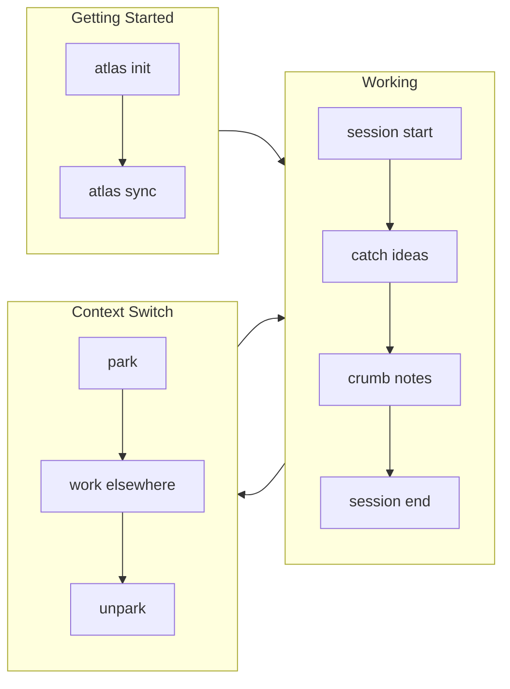

# Atlas Quick Reference Card

> **Print this!** Keep it next to your keyboard until commands become muscle memory.

---

## The Happy Path (v0.14.0) — 3 commands

```bash
atlas                    # The digest: what am I doing / what's next (bare, no args)
atlas session start X    # Start working
atlas session end        # Done — shows git evidence, syncs the registry automatically
```

## The 6 Commands You'll Use Daily

```bash
atlas plan              # Morning planning (v0.8.0) — now a view onto the same digest data
atlas session start     # Start working
atlas catch "idea"      # Capture thought
atlas where             # Where was I? — now a view onto the same digest data
atlas stats             # How am I doing?
atlas session end       # Done for now — evidence-linked (git delta + auto-sync)
```

---

## Visual Command Map



---

## Command Groups

### Sessions (Track Time)

| Command          | What it does          | Example                         |
| ---------------- | --------------------- | ------------------------------- |
| `session start`  | Begin work session    | `atlas session start myproject` |
| `session end`    | End with celebration  | `atlas session end "fixed bug"` |
| `session status` | Check current session | `atlas session status`          |

### Quick Capture (Don't Lose Ideas)

| Command          | What it does           | Example                         |
| ---------------- | ---------------------- | ------------------------------- |
| `catch`          | Capture idea instantly | `atlas catch "try redis cache"` |
| `inbox`          | View captured items    | `atlas inbox`                   |
| `inbox --triage` | Process inbox          | `atlas inbox --triage`          |

### Context (Where Was I?)

| Command | What it does         | Example                       |
| ------- | -------------------- | ----------------------------- |
| `where` | Show current context | `atlas where`                 |
| `crumb` | Leave breadcrumb     | `atlas crumb "stuck on auth"` |
| `trail` | Show recent crumbs   | `atlas trail --days 7`        |

### Context Switching (ADHD Power Feature)

| Command  | What it does         | Example                     |
| -------- | -------------------- | --------------------------- |
| `park`   | Save current context | `atlas park "urgent thing"` |
| `parked` | List saved contexts  | `atlas parked`              |
| `unpark` | Restore context      | `atlas unpark`              |

### Analytics (See Progress)

| Command           | What it does     | Example                          |
| ----------------- | ---------------- | -------------------------------- |
| `stats`           | Weekly summary   | `atlas stats`                    |
| `stats month`     | Monthly summary  | `atlas stats month`              |
| `stats --project` | Project-specific | `atlas stats --project atlas`    |
| `stats --export`  | Export report    | `atlas stats --export weekly.md` |
| `stats --velocity` | 4-week velocity | `atlas stats --velocity`         |
| `stats --patterns` | Best day/hour   | `atlas stats --patterns`         |
| `stats --calibrate` | Time calibration | `atlas stats --calibrate myapp --minutes 30` |

### Tasks (v0.13.1)

| Command      | What it does        | Example                                 |
| ------------ | ------------------- | --------------------------------------- |
| `task add`   | Add a task          | `atlas task add "Write docs" --priority high` |
| `task list`  | List tasks          | `atlas task list --incomplete --project myapp` |
| `task done`  | Complete a task     | `atlas task done <id>`                  |
| `task rm`    | Delete a task       | `atlas task rm <id>`                    |
| `agenda`     | Merged task+schedule view | `atlas agenda 14 --format json`    |
| `schedule push` | Push schedule records | `atlas schedule push --data '<json>'` |

### Calendar Export (v0.7.0)

| Command                        | What it does   | Example                              |
| ------------------------------ | -------------- | ------------------------------------ |
| `session export`               | Export to iCal | `atlas session export sessions.ics`  |
| `session export --format json` | Export as JSON | `atlas session export --format json` |

### Morning Ritual (v0.8.0)

| Command              | What it does              | Example                    |
| -------------------- | ------------------------- | -------------------------- |
| `plan`               | Guided daily planning     | `atlas plan`               |
| `sync --from-status` | Import from .STATUS files | `atlas sync --from-status` |
| `doctor` | Audit the settings contract | `atlas doctor` |
| `agenda` | Merged task+schedule view | `atlas agenda 14` |

### Projects

| Command        | What it does            | Example                     |
| -------------- | ----------------------- | --------------------------- |
| `project add`  | Register project        | `atlas project add ~/myapp` |
| `project list` | List all projects       | `atlas project list`        |
| `project list --kind` | Filter by research kind | `atlas project list --kind program` |
| `focus`        | Set project focus       | `atlas focus myproject "implement auth"` |
| `sync`         | Sync from .STATUS files | `atlas sync`                |
| `sync --research` | Sync preserving research metadata | `atlas sync --research` |

### Setup & Config

| Command | What it does | Example |
| ------- | ------------- | ------- |
| `config show` | Show settings | `atlas config show` |
| `config setup` | Interactive wizard | `atlas config setup` |
| `config add-path` | Add scan path | `atlas config add-path ~/projects` |
| `template list` | List templates | `atlas template list` |
| `completions` | Shell completions | `atlas completions zsh > ~/.config/zsh/completions/_atlas` |
| `migrate --status` | Migrate a `.STATUS` file to atlas/v1 | `atlas migrate --status --apply` |
| `migrate` | Switch storage backend | `atlas migrate --from filesystem --to sqlite` |

---

## Keyboard Shortcuts (Dashboard)

Start dashboard: `atlas dash`

**v0.14 — 3 views, not 8** (Now / Timer / Plan — see `src/cli/dashboard-ink/lib/keymap.ts`, the single source of truth; `?` shows this table live in-app):

| Key         | Scope   | Action                                           |
| ----------- | ------- | ------------------------------------------------ |
| `1` / `n`   | global  | Switch to **Now**                                |
| `2` / `t`   | global  | Switch to **Timer**                              |
| `3` / `p`   | global  | Switch to **Plan**                               |
| `Tab`       | global  | Cycle layout (SINGLE/SPLIT/TRIPLE)               |
| `q`         | global  | Quit                                             |
| `?`         | global  | Toggle help overlay                              |
| `j` / `k` / `↑↓` | Now | Navigate project list                       |
| `Enter`     | Now     | Select project                                   |
| `e`         | Now     | Toggle ecosystem-wide stats in the right pane    |
| `Space`     | Timer   | Pause/resume                                     |
| `r`         | Timer   | Reset (while paused)                             |
| `+`/`-`     | Timer   | Adjust duration (while paused)                   |
| `z`         | Timer   | Toggle zen (minimal chrome)                      |
| `j` / `k` / `↑↓` | Plan | Navigate suggestions                        |
| `e`         | Plan    | Cycle energy level                               |
| `a`         | Plan    | Toggle analytics pane                            |
| `s`         | Plan    | Start session (jumps to Timer)                   |

**v0.14 — TUI consolidation:** 8 views → 3 (Now/Timer/Plan), 8 state-machine states → 3, one Pomodoro timer implementation (was 3), central `lib/keymap.ts`, new `?` help overlay. `atlas dash` unchanged; only internal navigation moved.

**v0.13.1 — Task CLI (`atlas task add/list/done/rm`) · `atlas schedule push` · `atlas agenda` · AnalyticsView (`a` key) · StatusBar · CLI project remove fix · Vitest + Playwright E2E · Man pages · Zsh completions · ADHD nav design**

**v0.12.2 — ESLint adoption: flat config, CI lint gate, 0 warnings across all sources**

**v0.12.1 — Patch: Node 26 support (better-sqlite3 12.11.1) · FW-30 id convergence · PatternAnalyzer crash fix · +42 edge tests**

**v0.12.0 — `atlas sync --research` alias · plain-sync research warning · `.atlas-scan-children` marker · venue comment strip**

**Multi-Panel Layout Modes:**

| Key        | Mode       | Layout                                 |
| ---------- | ---------- | -------------------------------------- |
| `Tab` (1×) | `▣ Single` | Full-screen (default)                  |
| `Tab` (2×) | `▥ Split`  | Sidebar 28% + Main 72%                 |
| `Tab` (3×) | `▦ Triple` | Sidebar 25% + Main 47% + Inspector 28% |

**Sidebar panel (Split/Triple):**

- Compact rows: `● atlas  75% ▂▃▅▇█` — focus tier + name + progress + sparkline
- Focus tier icons: `●` deep (80+) • `◕` strong (60-79) • `◑` steady (40-59) • `◔` warming (20-39) • `○` drift (0-19)
- Sparklines: 5-day activity `▁▂▃▄▅▆▇█` — green=rising, yellow=declining
- `⏱` badge on row with active session
- `📥N` inbox count in header when captures pending
- `j/k` navigate when focused • `Enter` opens project detail

**Inspector panel (Triple only):**

- Name + type + status bar + focus score (`◕ 72 strong`)
- Focus text + up to 3 Next actions
- Live Pomodoro mini-timer: `● FOCUSING` → `◑ PAUSED` → `☕ BREAK`
- Activity heatmap: 7-day × 13-week grid using `· ░ ▒ ▓ █` (theme-colored)
- Streak + best day summary line
- `Space` pause/resume • `r` reset (when inspector focused)

**Themes (v0.9.1):** Press `t` to cycle: default → nord → solarized → mono → high-contrast

**v0.8.0 Views:**

- `e` - Ecosystem: See all dev-tools projects from .STATUS files
- `p` - Plan: Morning ritual with yesterday's work, inbox, focus

**Focus Mode:**

- Prompts "What will you focus on?" before timer
- Shows task during Pomodoro
- After completion: `c` (done), `p` (partial), `n` (pivoted)

---

## Common Workflows

### Morning Start (v0.8.0)
```bash
atlas plan               # Guided planning (shows yesterday, inbox, streak)
atlas session start      # Begin work with focus set
```

### Got an Idea
```bash
atlas catch "the idea"   # Don't lose it!
# Keep working...
```

### Switching Projects
```bash
atlas park "switching"   # Save context
cd ~/other-project
atlas session start      # New project
# Later...
atlas unpark             # Resume first project
```

### End of Day
```bash
atlas session end "progress notes"
atlas stats              # See your day
```

---

## Status File Integration

Atlas reads `.STATUS` files for project metadata:

```markdown
## Project: my-project
## Status: active
## Progress: 75
## Focus: Implementing auth flow

## Next Actions
- [ ] Add OAuth provider
- [x] Create login page
```

Sync all `.STATUS` files:
```bash
atlas sync
```

---

## ADHD-Friendly Settings

Configure in `~/.atlas/config.json`:

```json
{
  "preferences": {
    "adhd": {
      "showStreak": true,
      "celebrationLevel": "enthusiastic",
      "timeCues": true
    }
  }
}
```

Or via CLI:
```bash
atlas config prefs set adhd.celebrationLevel enthusiastic
```

---

## Flags You'll Actually Use

| Flag               | What it does            |
| ------------------ | ----------------------- |
| `--format json`    | Machine-readable output |
| `--project NAME`   | Filter by project       |
| `--days N`         | Time range              |
| `--dry-run`        | Preview without changes |
| `--storage sqlite` | Use SQLite backend      |

---

## Scripting & flow-cli Integration

Flags built for shells/wrappers (used by flow-cli). All print to stdout only and exit 0.

| Command | Output | Example |
| ------- | ------ | ------- |
| `session status --format json` | `{project,durationMinutes,state,task,startedAt}` or `null` | `atlas session status --format json` |
| `project list --count` | bare integer | `atlas project list --status active --count` |
| `project list --suggest` | one project name (most-recent active) | `atlas project list --suggest` |
| `inbox --count` | bare integer | `atlas inbox --count` |
| `trail --limit N` | newest-N breadcrumbs | `atlas trail --limit 5` |

> See [Integrations](INTEGRATIONS.md) for the full flow-cli ↔ atlas contract.

---

## File Locations

| What      | Where                  |
| --------- | ---------------------- |
| Config    | `~/.atlas/config.json` |
| Projects  | `~/.atlas/projects/`   |
| Sessions  | `~/.atlas/sessions/`   |
| Captures  | `~/.atlas/captures/`   |
| Breadcrumbs | `~/.atlas/breadcrumbs/` |
| Tasks     | `~/.atlas/tasks.json` (filesystem) or `atlas.db` (SQLite) |
| Templates | `~/.atlas/templates/`  |

---

## Getting Help

```bash
atlas --help              # All commands
atlas session --help      # Session commands
atlas project --help      # Project commands
```

**Docs:** [data-wise.github.io/atlas](https://data-wise.github.io/atlas/)

---

<div style="text-align: center; margin-top: 2em; color: #666;">
<em>Atlas v0.17.0 | Made for ADHD brains</em>
</div>

---

**Now what?** → [Try the 15-minute Tutorial](TUTORIAL.md) or jump into [Scenarios](user-guide/workflows/SCENARIOS.md)
