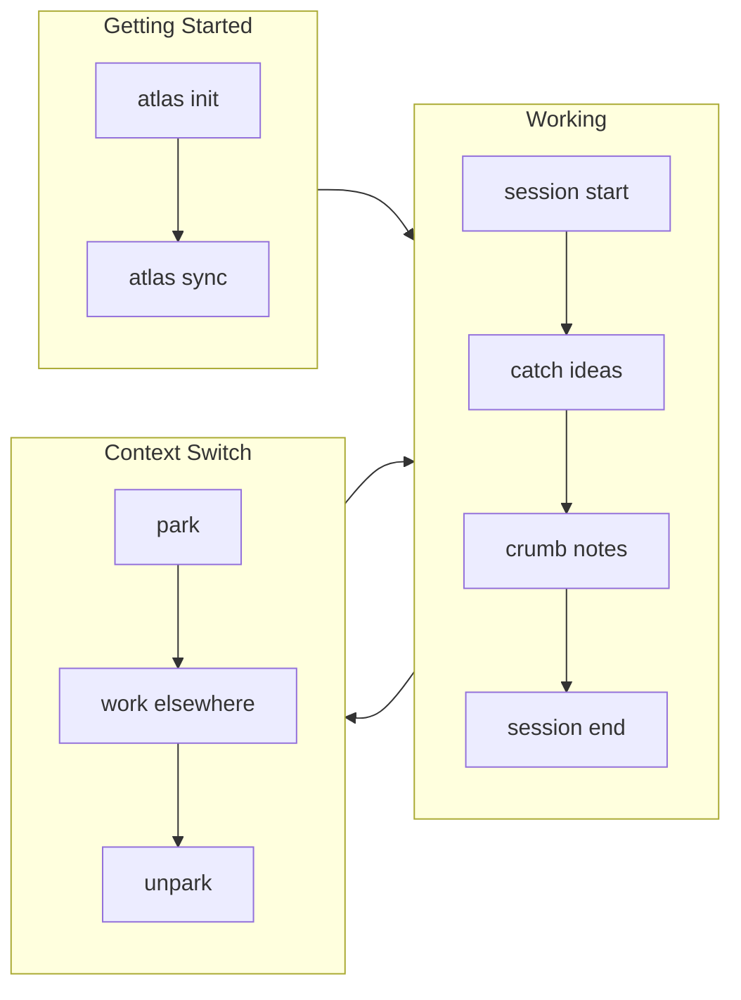

# Atlas Quick Reference Card

> **Print this!** Keep it next to your keyboard until commands become muscle memory.

---

## The 6 Commands You'll Use Daily

```bash
atlas plan              # Morning planning (v0.8.0)
atlas session start     # Start working
atlas catch "idea"      # Capture thought
atlas where             # Where was I?
atlas stats             # How am I doing?
atlas session end       # Done for now
```

---

## Visual Command Map



---

## Command Groups

### Sessions (Track Time)

| Command          | What it does          | Example                         |
| ---------------- | --------------------- | ------------------------------- |
| `session start`  | Begin work session    | `atlas session start myproject` |
| `session end`    | End with celebration  | `atlas session end "fixed bug"` |
| `session status` | Check current session | `atlas session status`          |

### Quick Capture (Don't Lose Ideas)

| Command          | What it does           | Example                         |
| ---------------- | ---------------------- | ------------------------------- |
| `catch`          | Capture idea instantly | `atlas catch "try redis cache"` |
| `inbox`          | View captured items    | `atlas inbox`                   |
| `inbox --triage` | Process inbox          | `atlas inbox --triage`          |

### Context (Where Was I?)

| Command | What it does         | Example                       |
| ------- | -------------------- | ----------------------------- |
| `where` | Show current context | `atlas where`                 |
| `crumb` | Leave breadcrumb     | `atlas crumb "stuck on auth"` |
| `trail` | Show recent crumbs   | `atlas trail --days 7`        |

### Context Switching (ADHD Power Feature)

| Command  | What it does         | Example                     |
| -------- | -------------------- | --------------------------- |
| `park`   | Save current context | `atlas park "urgent thing"` |
| `parked` | List saved contexts  | `atlas parked`              |
| `unpark` | Restore context      | `atlas unpark`              |

### Analytics (See Progress)

| Command           | What it does     | Example                          |
| ----------------- | ---------------- | -------------------------------- |
| `stats`           | Weekly summary   | `atlas stats`                    |
| `stats month`     | Monthly summary  | `atlas stats month`              |
| `stats --project` | Project-specific | `atlas stats --project atlas`    |
| `stats --export`  | Export report    | `atlas stats --export weekly.md` |

### Calendar Export (v0.7.0)

| Command                        | What it does   | Example                              |
| ------------------------------ | -------------- | ------------------------------------ |
| `session export`               | Export to iCal | `atlas session export sessions.ics`  |
| `session export --format json` | Export as JSON | `atlas session export --format json` |

### Morning Ritual (v0.8.0)

| Command              | What it does              | Example                    |
| -------------------- | ------------------------- | -------------------------- |
| `plan`               | Guided daily planning     | `atlas plan`               |
| `sync --from-status` | Import from .STATUS files | `atlas sync --from-status` |

### Projects

| Command        | What it does            | Example                     |
| -------------- | ----------------------- | --------------------------- |
| `project add`  | Register project        | `atlas project add ~/myapp` |
| `project list` | List all projects       | `atlas project list`        |
| `sync`         | Sync from .STATUS files | `atlas sync`                |

---

## Keyboard Shortcuts (Dashboard)

Start dashboard: `atlas dash`

| Key         | Action                                           |
| ----------- | ------------------------------------------------ |
| `j` / `k`   | Navigate up/down                                 |
| `Enter`     | Select project                                   |
| `f`         | Focus mode (Pomodoro)                            |
| `z`         | Zen mode                                         |
| `T`         | Timeline view                                    |
| `e`         | Ecosystem view                                   |
| `p`         | Plan view (morning ritual)                       |
| `c`         | Quick capture                                    |
| `t`         | Cycle theme                                      |
| `Tab`       | Cycle layout (SINGLE/SPLIT/TRIPLE)               |
| `Shift+Tab` | Cycle panel focus (split/triple)                 |
| `Space`     | Pause/resume Pomodoro (inspector focused)        |
| `r`         | Reset Pomodoro timer (inspector focused, paused) |
| `?`         | Show help                                        |
| `q`         | Quit                                             |

**v0.9.1 Multi-Panel Layout Modes:**

| Key        | Mode       | Layout                                 |
| ---------- | ---------- | -------------------------------------- |
| `Tab` (1×) | `▣ Single` | Full-screen (default)                  |
| `Tab` (2×) | `▥ Split`  | Sidebar 28% + Main 72%                 |
| `Tab` (3×) | `▦ Triple` | Sidebar 25% + Main 47% + Inspector 28% |

**Sidebar panel (Split/Triple):**
- Compact rows: `● atlas   75%` — icon + name + progress
- `⏱` badge on row with active session
- `📥N` inbox count in header when captures pending
- `j/k` navigate when focused • `Enter` opens project detail
- `Shift+Tab` to move keyboard focus between panels

**Inspector panel (Triple only):**
- Name + type + status bar + 8-char progress bar
- Focus text + up to 3 Next actions
- Live Pomodoro mini-timer: `● FOCUSING` → `◑ PAUSED` → `☕ BREAK`
- `Space` pause/resume • `r` reset (when inspector focused)
- Last 3 breadcrumbs

**v0.8.0 Views:**
- `e` - Ecosystem: See all dev-tools projects from .STATUS files
- `p` - Plan: Morning ritual with yesterday's work, inbox, focus

**Focus Mode:**
- Prompts "What will you focus on?" before timer
- Shows task during Pomodoro
- After completion: `c` (done), `p` (partial), `n` (pivoted)

---

## Common Workflows

### Morning Start (v0.8.0)
```bash
atlas plan               # Guided planning (shows yesterday, inbox, streak)
atlas session start      # Begin work with focus set
```

### Got an Idea
```bash
atlas catch "the idea"   # Don't lose it!
# Keep working...
```

### Switching Projects
```bash
atlas park "switching"   # Save context
cd ~/other-project
atlas session start      # New project
# Later...
atlas unpark             # Resume first project
```

### End of Day
```bash
atlas session end "progress notes"
atlas stats              # See your day
```

---

## Status File Integration

Atlas reads `.STATUS` files for project metadata:

```markdown
## Project: my-project
## Status: active
## Progress: 75
## Focus: Implementing auth flow

## Next Actions
- [ ] Add OAuth provider
- [x] Create login page
```

Sync all `.STATUS` files:
```bash
atlas sync
```

---

## ADHD-Friendly Settings

Configure in `~/.atlas/config.json`:

```json
{
  "preferences": {
    "adhd": {
      "showStreak": true,
      "celebrationLevel": "enthusiastic",
      "timeCues": true
    }
  }
}
```

Or via CLI:
```bash
atlas config prefs set adhd.celebrationLevel enthusiastic
```

---

## Flags You'll Actually Use

| Flag               | What it does            |
| ------------------ | ----------------------- |
| `--format json`    | Machine-readable output |
| `--project NAME`   | Filter by project       |
| `--days N`         | Time range              |
| `--dry-run`        | Preview without changes |
| `--storage sqlite` | Use SQLite backend      |

---

## File Locations

| What      | Where                  |
| --------- | ---------------------- |
| Config    | `~/.atlas/config.json` |
| Projects  | `~/.atlas/projects/`   |
| Sessions  | `~/.atlas/sessions/`   |
| Captures  | `~/.atlas/captures/`   |
| Templates | `~/.atlas/templates/`  |

---

## Getting Help

```bash
atlas --help              # All commands
atlas session --help      # Session commands
atlas project --help      # Project commands
```

**Docs:** [data-wise.github.io/atlas](https://data-wise.github.io/atlas/)

---

<div style="text-align: center; margin-top: 2em; color: #666;">
<em>Atlas v0.9.1 | Made for ADHD brains</em>
</div>
