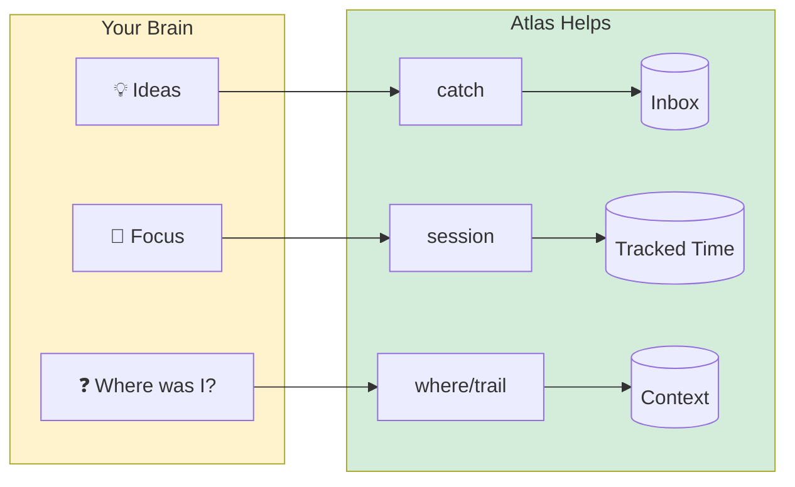

# Getting Started with Atlas

**Welcome!** This tutorial gets you from zero to productive with Atlas in about 15 minutes.

!!! tip "ADHD-Friendly Design"
    This tutorial has **"Try This Now"** prompts. Do them! Hands-on learning sticks better than reading.

## What Atlas Does (Visual Overview)



Atlas helps you:

| Problem                                           | Atlas Solution                |
| ------------------------------------------------- | ----------------------------- |
| "What was I working on?"                          | `atlas where` + `atlas trail` |
| "I'll forget this idea"                           | `atlas catch "idea"`          |
| "How long have I been at this?"                   | `atlas session status`        |
| "I need to switch but don't want to lose context" | `atlas park` / `atlas unpark` |
| "Am I making progress?"                           | `atlas stats`                 |

---

## Tutorial Structure

- **Part 1: Quick Start** (5 min) - Get running fast
- **Part 2: Core Workflow** (5 min) - Daily usage patterns
- **Part 3: ADHD Features** (5 min) - Context switching & restoration
- **Part 4: Dashboard** (3 min) - Visual project overview
- **Part 5: Templates** (3 min) - Starting new projects
- **Part 6: Task Management** (2 min) - Tasks and agenda (v0.13.0)
- **Part 7: Analytics View** (2 min) - Deep productivity insights (v0.13.0)
- **Part 8: Tips & Tricks** - Power user shortcuts

**Each section has "Try This Now" prompts** - do them for best results!

---

## Part 1: Quick Start (5 minutes)

### Installation

Pick one method:

**Option A: Homebrew (macOS)**
```bash
brew tap data-wise/tap
brew install atlas
```

**Option B: curl (Linux/macOS)**
```bash
curl -fsSL https://raw.githubusercontent.com/Data-Wise/atlas/main/install.sh | bash
```

**Option C: From source**
```bash
git clone https://github.com/Data-Wise/atlas.git
cd atlas && npm install && npm link
```

### First Run

```bash
# Initialize Atlas
atlas init

# See what commands are available
atlas --help
```

**What just happened?**
- Created `~/.atlas/` directory for data storage
- Atlas is ready to track your projects

### Try This Now #1: Your First Project

```bash
# Go to any project directory (or create one)
cd ~/projects/my-project  # or wherever

# Register this project
atlas project add

# Verify it worked
atlas project list
```

**Quick win!** You just registered your first project.

### Try This Now #2: Your First Session

```bash
# Start working on something
atlas session start

# Check your session
atlas session status

# End when you're done (or after 5 minutes)
atlas session end "tried out atlas"
```

**Notice:** You got a celebration message! Atlas celebrates your work.

---

## Part 2: Core Workflow (5 minutes)

### The Daily Rhythm

Most Atlas usage follows this pattern:

1. **Start session** → Work → **End session**
2. **Capture ideas** as they pop up (without breaking flow)
3. **Check context** when you return ("where was I?")

### Starting Your Day

```bash
# See what you were working on
atlas where

# Start a session for a specific project
atlas session start myproject
```

**What you'll see:**
- "Last time you were..." message (context restoration)
- Your current streak (if you worked yesterday)
- Current focus/task

### Try This Now #3: Quick Capture

Imagine you're working and remember something:

```bash
# Capture without stopping work
atlas catch "check the API documentation"

# Capture for a specific project
atlas catch -p myproject "add input validation"

# Capture as a bug report
atlas catch "login fails on Safari" --type bug

# View your inbox
atlas inbox

# Filter by type (idea, task, bug, note, question, parked, win)
atlas inbox --type bug

# Show latest 5 items
atlas inbox --limit 5

# See inbox statistics
atlas inbox --stats
```

**Key insight:** Capture gets it out of your head instantly. Process later.

### Breadcrumbs (ADHD Gold)

Leave yourself notes about WHERE you are:

```bash
# You're stuck on something
atlas crumb "blocked on database migration issue"

# Work on something else...
# Come back later:

# See your trail
atlas trail
```

**Why this works:** Breadcrumbs help you remember your thought process.

### Try This Now #4: Project Focus

```bash
# Show overall workflow status
atlas status

# Set what you're focusing on
atlas focus myproject "implementing user authentication"

# Check your context
atlas where
```

**Note:** For detailed project status with `--set`, `--progress`, etc., your project needs a `.STATUS` file. Create one with:
```bash
atlas init --template minimal   # in your project directory
```

---

## Part 3: ADHD Features (5 minutes)

### The Problem: Context Switching

You're deep in work on Project A. Urgent email arrives about Project B.

**Without Atlas:** Panic. Forget where you were. Lose 15 minutes re-orienting.

**With Atlas:** Park your context, handle the interrupt, restore when ready.

### Try This Now #5: Park & Unpark

```bash
# You're working on projectA
atlas session start projectA
atlas focus projectA "refactoring authentication module"
atlas crumb "found the bug in line 247 of auth.js"

# INTERRUPT! Need to switch to projectB
atlas park "urgent bug fix needed"

# Work on projectB
atlas session start projectB
# ... do the urgent work ...
atlas session end

# Return to projectA - restore exactly where you were
atlas unpark
```

**What just happened?**
- `park` saved: your project, task, duration, breadcrumbs, and a note
- `unpark` restored: new session with same project/task, showed your note

**Check parked contexts anytime:**
```bash
atlas parked
```

### Context Restoration

Every time you start a session, Atlas tells you:
- What you were working on last time
- When you last worked on this
- Your current streak

```bash
atlas session start myproject

# You'll see something like:
# 🔥 3-day streak! Keep it going!
# 📍 Last time you were: "implementing login flow" (2 hours ago)
# 🎯 Session started: myproject
```

**Disable if it's too much:**
```bash
atlas config prefs set adhd.showContextRestore false
atlas config prefs set adhd.showStreak false
```

### Try This Now #6: Celebration Levels

Atlas celebrates your work. Too much? Too little? Adjust:

```bash
# See current level
atlas config prefs get adhd.celebrationLevel

# Options: minimal, normal, enthusiastic
atlas config prefs set adhd.celebrationLevel enthusiastic

# End a session to test
atlas session end "finished the feature"
```

### Time Awareness (No Time Blindness)

Atlas can show gentle time cues without nagging:

```bash
# Enable time awareness
atlas config prefs set adhd.showTimeCues true

# Set reminder interval (minutes)
atlas config prefs set adhd.timeBlindnessInterval 30
```

During focus mode in the dashboard, you'll get gentle reminders.

---

## Part 4: Dashboard (3 minutes)

### Launch the TUI

```bash
atlas dash
```

**What you see:**
- All your projects
- Active session highlighted
- Progress bars
- Recent activity
- Command shortcuts at bottom

### Try This Now #7: Navigate the Dashboard

| Key     | Action                | Try It                   |
| ------- | --------------------- | ------------------------ |
| `↑↓`    | Move between projects | Navigate up/down         |
| `Enter` | View project details  | Select a project         |
| `a`     | Analytics view        | Deep productivity insights |
| `f`     | Focus mode (Pomodoro) | 25-min timer             |
| `T`     | Timeline view         | Today's time blocks      |
| `Tab`   | **Cycle layout mode** | Single → Split → Triple  |
| `d`     | Decision helper       | "What should I work on?" |
| `/`     | Search                | Find a project           |
| `*`     | Clear filter          | Show all                 |
| `q`     | Quit                  | Exit dashboard           |

### Focus Mode (Pomodoro)

1. Press `f` in the dashboard
2. **NEW in v0.7.0:** Prompted "What will you focus on?"
3. Enter your task (or press Esc to skip)
4. Minimal UI appears with 25-minute timer showing your task
5. Work without distraction
6. Press `Space` to pause/resume
7. When timer ends: `c` (completed), `p` (partial), `n` (pivoted)

**During focus mode:**
- `+`/`-` - Adjust timer by 5 minutes
- `r` - Reset timer
- `c` - Quick capture (without leaving focus)

### Timeline View (v0.7.0)

Press `T` (Shift+T) to see today's sessions visualized:

```
┌─────────────────────────────────────────────────────────────────────┐
│ 📅 Today's Time Blocks                               12/29/2025    │
├─────────────────────────────────────────────────────────────────────┤
│                                                                     │
│  09:00  ████████████████  atlas (45m)                               │
│  10:00  ░░░░░░░░                                                    │
│  11:00  ██████████████████████████  research-project (1h 10m)       │
│  12:00  ░░░░░░░░                                                    │
│  13:00  ████████  atlas (25m)                                       │
│                                                                     │
│  Total: 2h 20m across 3 sessions                                    │
└─────────────────────────────────────────────────────────────────────┘
```

Press `Esc` to return to the main view.

### Real Data Dashboard (v0.9.2)

The dashboard displays **live data** from your `~/.atlas` directory. Projects, sessions, captures, and breadcrumbs are fetched automatically and refreshed on a polling schedule (projects every 5s, stats every 10s). Temporary and archived projects are filtered out, so you only see what matters.

### Multi-Panel Layout (v0.9.1)

Press `Tab` to cycle through three layout modes without leaving the dashboard:

```
▣ SINGLE (default)        ▥ SPLIT                ▦ TRIPLE
┌────────────────┬──    ┌────┬─────────┬──    ┌────┬──────┬───────┬──
│ Card stack     │      │Side│ Card   │      │Side│ Card │ Timer │
│ All views fill │      │list│ stack  │      │list│ stack│ Detail│
└────────────────┴──    ────┴─────────┘         ────┴──────┴───────┘
100% width            28% sidebar + 72%       25% + 47% + 28%
```

**Try it:**
1. Press `Tab` once → **Split** view: project list sidebar + main content
2. Press `Tab` again → **Triple** view: sidebar + content + inspector panel
3. Press `Tab` again → back to **Single** (full screen)
4. Press `Shift+Tab` → cycle keyboard focus between panels

**Sidebar rows look like this (v0.9.1):**
```
│ ● atlas       75% ▂▃▅▇█│  <- deep focus (green) + sparkline
│ ◔ flow-cli    95% █▅▃▂▁│  <- warming tier (yellow) + declining
│ ◕ mcp-server  80% ▃▃▅▆█⏱│  <- strong focus + active session
│ ◑ rmediation  60% ▂▁··▂│  <- steady tier (cyan)
```

**Focus tier icons (v0.9.1):** `●` deep (80+) • `◕` strong (60-79) • `◑` steady (40-59) • `◔` warming (20-39) • `○` drift (0-19)
**Sparklines:** 5-day activity history using `▁▂▃▄▅▆▇█` — green = trending up, yellow = trending down
**`⏱`** marks the project with your active timer
**`📥N`** shows in the sidebar header when you have N unprocessed inbox items

**Inspector panel (Triple mode — right column):**
```
│ Inspector               │
│ 🎯 atlas                │  ← selected project
│ node-package            │
│ ● active  75% ██████░░  │  ← status + 8-char bar
│ Focus  ◕ 72 strong      │  ← focus score + tier (v0.9.1)
│ ─────────────────────── │
│ Focus                   │
│ Implementing auth flow  │
│ Next                    │
│ · Add OAuth provider    │  ← up to 3 next actions
│ ─────────────────────── │
│ ⏱ SESSION               │
│ 24:10  ██████░░         │  ← live Pomodoro countdown
│ ● FOCUSING              │  → ◑ PAUSED → ☕ BREAK TIME
│ ─────────────────────── │
│ Activity (13w)          │  ← heatmap header (v0.9.1)
│ Mon ·░▒▓█·░▒▓█·░▒      │  7-day × 13-week grid
│ Tue ·····░░▒▒▓▓█        │  using ·░▒▓█ characters
│ ...                     │
│ 🔥 4d streak  23 sess   │  ← summary line
│ ─────────────────────── │
│ Recent                  │
│ · stuck on OAuth …      │  ← last 3 breadcrumbs
```

When inspector is focused (`Shift+Tab` to reach it):
- `Space` → pause/resume the Pomodoro
- `r` → reset the countdown
- `Shift+Tab` → move focus to next panel

**Layout indicator** appears in the command bar: `▣ Single` / `▥ Split` / `▦ Triple`

### Themes (v0.9.1)

Press `t` in the dashboard to cycle through 5 built-in themes:

| Theme | Look | Best for |
|-------|------|----------|
| `default` | Purple accents, warm grays | General use |
| `nord` | Arctic blue palette | Dark terminals |
| `solarized` | Warm tans and blues | Light or dark |
| `mono` | Pure grayscale | Minimal distraction |
| `high-contrast` | Maximum readability | Accessibility |

All panels, sparklines, heatmap, and focus tier colors adapt to the selected theme.

### Focus Score (v0.9.1)

`atlas stats` now includes a focus score — a weighted quality metric:

```
Focus Score:       ◕ 72 strong
```

The score combines duration (30%), flow sessions (30%), completion rate (25%), and consistency (15%). See the [Visual Guide](./VISUAL-GUIDE.md) for the full formula and tier breakdown.


### Decision Helper

Can't decide what to work on? Press `d`:

```
🎲 What should you work on?

Based on:
- Time of day (morning = fresh tasks)
- Project progress (unfinished work)
- Recent activity (what's hot)

Suggestion: myproject
Reason: In progress (60%), last worked on 2h ago
```

---

## Part 5: Templates (3 minutes)

### Why Templates?

Every new project needs the same setup: README, status tracking, initial structure.

Templates automate this.

### Try This Now #8: See Available Templates

```bash
atlas init --list-templates
```

**Built-in templates:**
- `node` - Node.js/npm package
- `r-package` - R package
- `python` - Python package
- `quarto` - Quarto document
- `research` - Research project
- `minimal` - Just a .STATUS file

### Create a Project from Template

```bash
# Create a Node.js project
atlas init --template node --name my-awesome-app

# Creates:
# - .STATUS file with project metadata
# - Standard Node.js structure
```

**What's in the .STATUS file?**
```markdown
## Project: my-awesome-app
## Status: active
## Progress: 0
## Type: node

## Focus
Getting started with initial setup

## Current Tasks
- [ ] Initialize npm package
- [ ] Set up testing framework
- [ ] Create basic structure

## Notes
Created from node template
```

### Try This Now #9: Create a Custom Template

```bash
# Create from scratch
atlas template create my-template

# Or copy an existing one
atlas template create my-node --from node

# Or extend (inherit + customize)
atlas template create custom-node --extends node

# Edit it
atlas template dir  # shows where templates live
# Edit ~/.atlas/templates/my-template.md
```

**Template variables:**
```bash
# Set your info once
atlas config prefs set templateVariables.author "Your Name"
atlas config prefs set templateVariables.github_user youruser

# Use in templates: {{author}}, {{github_user}}
```

### Template Inheritance

Create variations without copying:

```yaml
---
name: My Custom Node Template
extends: node
---
{{parent}}

## Custom Section
My additional content here
```

**The `{{parent}}` placeholder** includes the base template's content.

---

## Part 6: Task Management (v0.13.0)

### Working with Tasks

Atlas tracks tasks alongside sessions and captures:

```bash
# Add a task
atlas task add "Implement OAuth login" --priority high --project myapp

# List incomplete tasks
atlas task list --incomplete

# Complete a task
atlas task done <task-id>

# Delete a task
atlas task rm <task-id>
```

### Merged Agenda

See tasks and schedule items in chronological order:

```bash
# 7-day view (default)
atlas agenda

# 14-day window
atlas agenda 14

# JSON output for scripting
atlas agenda --format json
```

### Try This Now #10: Your First Task

```bash
# Add a task for this project
atlas task add "Try the dashboard analytics view" --project myproject

# List your tasks
atlas task list --incomplete

# Complete it when done
atlas task done <id>
```

---

## Part 7: Analytics View (v0.13.0)

### Deep Productivity Insights

Press `a` in the dashboard for the full-screen analytics view:

- **Focus Velocity** — 30-day sparkline showing your session trends
- **Flow Patterns** — 7×24 heatmap showing your best working hours
- **Project Cycling** — Use `←`/`→` to see analytics per project

### Try This Now #11: Explore Analytics

```bash
atlas dash
# Press 'a' to enter analytics view
# Use ←/→ to cycle projects
# Press 'f' to jump to focus mode
# Press Esc to return to browse
```

---

## Part 8: Tips & Tricks

### Workflow Shortcuts

**Morning routine:**
```bash
alias start-day='atlas where && atlas dash'
```

**End of day:**
```bash
alias finish-day='atlas session end && atlas inbox --stats'
```

### Sync from .STATUS Files

If you have existing projects with `.STATUS` files:

```bash
# Add paths to scan
atlas config add-path ~/projects
atlas config add-path ~/work

# Sync all projects
atlas sync

# Watch for changes (auto-sync)
atlas sync --watch
```

### Keyboard-Driven Workflow

```bash
# Start session (current directory)
atlas session start

# Quick capture (no project needed)
alias idea='atlas catch'

# Check context
alias wh='atlas where'

# Breadcrumb
alias crumb='atlas crumb'
```

### Inbox Triage

Process your captured ideas:

```bash
atlas inbox --triage

# Interactive mode:
# [a]ssign to project
# [s]kip for now
# [d]elete/archive
# [q]uit
```

### Project Filtering

```bash
# Show only active projects
atlas project list --status active

# Show only R packages
atlas project list --tag r-package

# JSON output for scripting
atlas project list --format json
```

### flow-cli Integration (v0.9.3)

Atlas exposes machine-readable flags designed for shell wrapper scripts like [flow-cli](https://github.com/Data-Wise/flow-cli):

```bash
# Session state as JSON (for scripting)
atlas session status --format json
# → {"project":"atlas","durationMinutes":25,"state":"active","task":"Work session","startedAt":"..."}

# Bare integer counts (no labels, no formatting)
atlas inbox --count           # → 3
atlas project list --count    # → 54

# Smart project suggestion (most recently active)
atlas project list --suggest  # → atlas

# Limit breadcrumb output
atlas trail --limit 3         # shows last 3 crumbs only
atlas trail --limit 5 --days 7
```

These flags are used by `at` (the flow-cli atlas dispatcher) to embed live atlas state into shell prompts, dashboards, and health-check scripts without parsing human-readable output.

### Man Pages

```bash
# Read the main man page
man atlas

# Read specific command docs
man atlas-session
man atlas-project
man atlas-status
```

### Shell Completions

```bash
# ZSH
atlas completions zsh >> ~/.zshrc

# Bash
atlas completions bash >> ~/.bashrc

# Fish
atlas completions fish > ~/.config/fish/completions/atlas.fish
```

**Now you get tab completion!**

### Session Export (v0.7.0)

Export your work sessions to calendar apps:

```bash
# Export to iCal file
atlas session export sessions.ics

# Export last 60 days
atlas session export --days 60 sessions.ics

# Export specific project
atlas session export --project myproject project-sessions.ics

# Export as JSON (for scripting)
atlas session export --format json > sessions.json
```

**Works with:**
- Apple Calendar (double-click the .ics file)
- Google Calendar (import from settings)
- Outlook (import calendar)
- Any app that supports iCal/ICS format

### Storage Backend

Default is JSON files. For better performance:

```bash
# Migrate to SQLite
atlas migrate --to sqlite

# Preview first
atlas migrate --to sqlite --dry-run

# Use SQLite for just one command
atlas --storage sqlite status
```

### Configuration Wizard

Interactive setup:

```bash
atlas config setup

# Walks through:
# - Scan paths
# - Storage backend
# - ADHD preferences
# - Session settings
# - Dashboard preferences
```

### Advanced Status Updates

```bash
# Increment progress by 10% (default)
atlas status myproject --increment

# Increment by custom amount
atlas status myproject --increment 25

# Complete current action
atlas status myproject --complete

# Set multiple next actions at once
atlas status myproject --next "Task 1,Task 2,Task 3"

# Create .STATUS if it doesn't exist
atlas status myproject --set active --create
```

---

## Quick Reference Card

### Essential Commands

| Command                         | What It Does       |
| ------------------------------- | ------------------ |
| `atlas session start [project]` | Begin working      |
| `atlas session end [note]`      | Stop working       |
| `atlas catch "text"`            | Quick capture      |
| `atlas where`                   | Where was I?       |
| `atlas park [note]`             | Save context       |
| `atlas unpark`                  | Restore context    |
| `atlas dash`                    | Visual dashboard   |
| `atlas inbox`                   | See captured items |
| `atlas trail`                   | Breadcrumb history |
| `atlas stats`                   | Session analytics  |
| `atlas plan`                    | Morning planning   |
| `atlas agenda`                  | Merged task+schedule view |
| `atlas task add "X"`           | Add a task         |
| `atlas task list`              | List tasks         |
| `atlas status [project]`       | Show/update status |
| `atlas doctor`                  | Audit projects     |
| `atlas sync`                    | Sync from .STATUS  |
| `atlas config paths`           | Show scan paths    |
| `atlas template list`          | List templates     |
| `atlas completions zsh`        | Generate completions |

### Quick Setup

```bash
# 1. Install
brew install atlas  # or curl method

# 2. Initialize
atlas init

# 3. Add a project
atlas project add

# 4. Start working
atlas session start

# 5. Launch dashboard
atlas dash
```

### Common Patterns

**Start your day:**
```bash
atlas where              # Context check
atlas dash              # Launch dashboard
# Press 'd' for "what to work on?"
# Press 's' to start session
```

**During work:**
```bash
atlas catch "idea"      # Capture thoughts
atlas crumb "note"      # Leave breadcrumbs
atlas focus "task"      # Update focus
```

**Handling interrupts:**
```bash
atlas park "reason"     # Save state
# Handle interrupt...
atlas unpark           # Restore state
```

**End of day:**
```bash
atlas session end      # Stop working
atlas inbox           # Review captures
atlas trail --days 1  # Review today's notes
```

---

## Troubleshooting

### "No projects found"

```bash
# Register your current directory
atlas project add

# Or sync from .STATUS files
atlas config add-path ~/projects
atlas sync
```

### "No active session"

```bash
# Start one!
atlas session start
```

### Configuration not loading

```bash
# Check config exists
ls ~/.atlas/config.json

# Reset if needed
atlas config prefs reset
```

### Dashboard looks weird

```bash
# Terminal too small
# Resize terminal to at least 80x24

# Try different theme (v0.9.1)
# Press 't' in dashboard to cycle themes
# 'mono' theme works best on limited-color terminals
# 'high-contrast' theme helps in bright rooms
```

### Lost parked context?

```bash
# List all parked contexts
atlas parked

# They're stored in ~/.atlas/parked/
ls ~/.atlas/parked/
```

---

## What's Next?

### Learn More

- [CLI Reference](./CLI-REFERENCE.md) - Complete command documentation
- [Configuration](./CONFIGURATION.md) - All settings explained
- [API Guide](./API-GUIDE.md) - Use Atlas in your code
- [Architecture](./ARCHITECTURE.md) - How it works
- [What's New](./WHAT-S-NEW.md) - Release highlights

### Integration Ideas

**Alfred workflow:**
```bash
# Quick capture from anywhere
alfred "atlas catch {query}"
```

**Git hooks:**
```bash
# Auto-breadcrumb on commit
echo 'atlas crumb "committed: $(git log -1 --oneline)"' > .git/hooks/post-commit
chmod +x .git/hooks/post-commit
```

---

### Zellij Integration (Recommended)

Zellij is a modern terminal multiplexer with session persistence. Combined with Atlas, you get both mental AND terminal context preservation.

**Install:**
```bash
brew install zellij
```

**Why Zellij + Atlas:**
| Zellij              | Atlas            | Combined Benefit                |
| ------------------- | ---------------- | ------------------------------- |
| Session persistence | Park/unpark      | Full context survival           |
| Visual keybindings  | ADHD helpers     | Less to remember                |
| Named sessions      | Project registry | One command restores everything |

**The Perfect Layout:**
```
┌─────────────────────────────────────────────────────────────┐
│  Zellij (myproject)                                         │
├─────────────────────────────┬───────────────────────────────┤
│  ❯ vim src/index.js         │  ❯ npm run test:watch         │
│                             │  PASS ✓✓✓                     │
├─────────────────────────────┴───────────────────────────────┤
│  ❯ atlas dash                                               │
│  🎯 Active: myproject (45m) │ 🔥 5-day streak               │
├─────────────────────────────────────────────────────────────┤
│ Alt+←→↑↓: Navigate │ Ctrl+P: Pane │ Ctrl+O,D: Detach        │
└─────────────────────────────────────────────────────────────┘
```

**Quick Start Workflow:**
```bash
# Start a project session
zellij --session myproject

# Create layout (inside Zellij)
Ctrl+P, D                      # Split down for dashboard
Alt+↓                          # Move to bottom pane
atlas dash                     # Start dashboard
Alt+↑                          # Back to top
Ctrl+P, R                      # Split right for tests
Alt+→                          # Move to right pane
npm run test:watch             # Start tests
Alt+←                          # Back to editor pane
vim src/index.js               # Start coding!
```

**Detach & Reattach (The Magic):**
```bash
# End of day - close terminal or:
Ctrl+O, D

# Next day - everything is exactly where you left it:
zellij attach myproject
```

**Zellij Cheatsheet:**
| Keys         | Action                  |
| ------------ | ----------------------- |
| `Alt + ←→↑↓` | Navigate between panes  |
| `Ctrl+P, D`  | Split pane down         |
| `Ctrl+P, R`  | Split pane right        |
| `Ctrl+P, X`  | Close pane              |
| `Ctrl+P, Z`  | Zoom (fullscreen pane)  |
| `Ctrl+P, F`  | Floating pane (overlay) |
| `Ctrl+O, D`  | Detach session          |
| `Ctrl+O, W`  | Session manager         |

**Auto-Start Zellij (optional):**
```bash
# Add to ~/.zshrc
if [[ -z "$ZELLIJ" ]]; then
    zellij attach --create default
fi
```

**Pro Tip:** Use Zellij sessions named after your Atlas projects:
```bash
zellij --session atlas-dev     # For atlas project
zellij --session myapp         # For myapp project
zellij list-sessions           # See all sessions
```

### Advanced Features

**Programmatic API:**
```javascript
import { Atlas } from '@data-wise/atlas';

const atlas = new Atlas({ storage: 'sqlite' });
const projects = await atlas.projects.list({ status: 'active' });
await atlas.sessions.start('myproject');
```

**Custom templates with logic:**
```yaml
---
name: Advanced Template
extends: base
---
{{parent}}

## Project: {{name}}
Author: {{author}}
Created: {{date}}
```

**Multiple storage backends:**
```bash
# Work backend
ATLAS_CONFIG=~/.atlas-work atlas dash

# Personal backend
ATLAS_CONFIG=~/.atlas-personal atlas dash
```

---

## Final Tips

### For ADHD Users

1. **Use breadcrumbs liberally** - They're cheap, capture them
2. **Park before context switches** - Every time, no exceptions
3. **Let Atlas celebrate you** - Positive reinforcement works
4. **Trust the inbox** - Get it out of your head
5. **Dashboard over CLI** - Visual > Text for many ADHD brains

### For Everyone

1. **Session start/end is the core** - Build this habit first
2. **Capture > Organize** - Don't triage immediately
3. **Templates save time** - Invest 30 min, save hours
4. **Sync if you have .STATUS files** - Don't double-maintain
5. **Dashboard decision helper** - Use when overwhelmed

### Habit Formation

**Week 1:** Just session start/end
```bash
atlas session start
# work...
atlas session end
```

**Week 2:** Add quick capture
```bash
alias c='atlas catch'
c "idea text"
```

**Week 3:** Add breadcrumbs
```bash
alias crumb='atlas crumb'
crumb "stuck on X"
```

**Week 4:** Use park/unpark
```bash
atlas park "lunch break"
atlas unpark
```

**Week 5:** Master the dashboard
```bash
atlas dash  # live here
```

### Remember

- **Perfect is the enemy of done** - Atlas helps you track "good enough"
- **Streaks are motivating** - But missing a day is fine
- **Context restoration is magic** - Trust it
- **The inbox is not a todo list** - It's a brain dump

---

## Get Help

- **GitHub Issues:** https://github.com/Data-Wise/atlas/issues
- **Discussions:** https://github.com/Data-Wise/atlas/discussions

**Welcome to Atlas!**

Start with `atlas session start` and build from there. The rest will follow naturally.
