# Atlas Workflows

> **ADHD-Friendly Patterns** - These workflows are designed for brains that context-switch, lose track of time, and have brilliant ideas at inconvenient moments.

---

## The Core Loop

Every Atlas workflow follows this pattern:

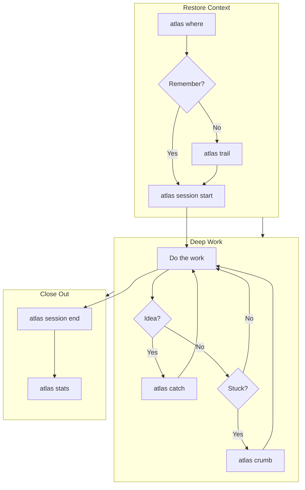

---

## Daily Workflows

### Morning Start

**Goal:** Get back into flow quickly

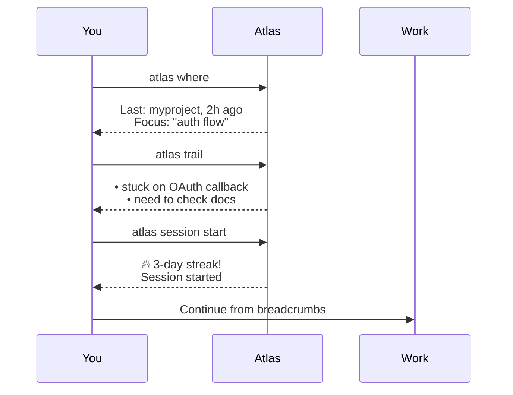

**Commands:**
```bash
# 1. See what you were doing
atlas where

# 2. Check your breadcrumbs for context
atlas trail

# 3. Start your session
atlas session start

# 4. Check any parked contexts
atlas parked
```

!!! tip "ADHD Tip"
    Run `atlas where` before opening your IDE. Your brain needs context before code.

---

### The Capture Reflex

**Goal:** Don't lose brilliant ideas

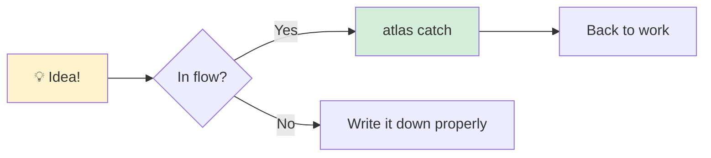

**The Rule:** If it takes more than 5 seconds to capture, you'll lose the thought.

```bash
# Instant capture (< 2 seconds to type)
atlas catch "use redis for session cache"

# With project context
atlas catch "add error boundary" -p myapp

# With type for better triage later
atlas catch "login button misaligned" --type bug
```

**Later, when you have time:**
```bash
# See your captured ideas
atlas inbox

# Process them one by one
atlas inbox --triage
```

!!! warning "Don't Triage During Deep Work"
    Capture instantly. Triage later. Mixing them kills focus.

---

### Context Switching (Park/Unpark)

**Goal:** Switch projects without losing your place

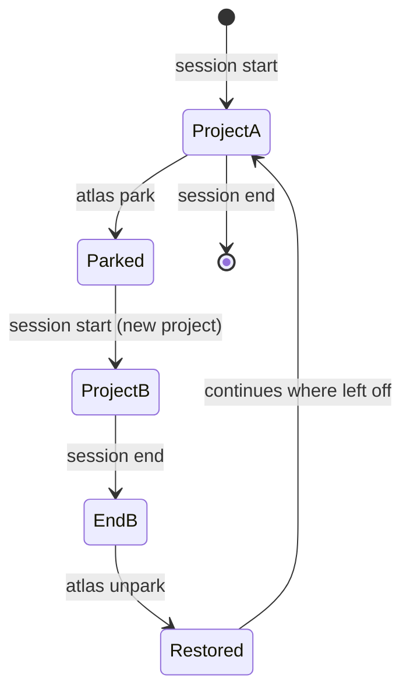

**Scenario:** You're deep in Project A when an urgent issue comes up in Project B.

```bash
# You're working on Project A...
atlas session status
# Project: myapp, Duration: 45m, Task: implementing auth

# Emergency! Need to switch to Project B
atlas park "urgent: prod bug in api"

# Switch to Project B
cd ~/projects/api
atlas session start "fix prod bug"

# ... fix the bug ...

atlas session end "fixed null pointer in user endpoint"

# Return to Project A
atlas unpark
# Restored: myapp
# Last crumb: "stuck on OAuth callback"
# Duration when parked: 45m

# Continue right where you left off!
```

!!! tip "ADHD Tip"
    Always add a note when parking. Future-you will thank present-you.

---

### The Pomodoro Flow

**Goal:** Timeboxed focus with enforced breaks

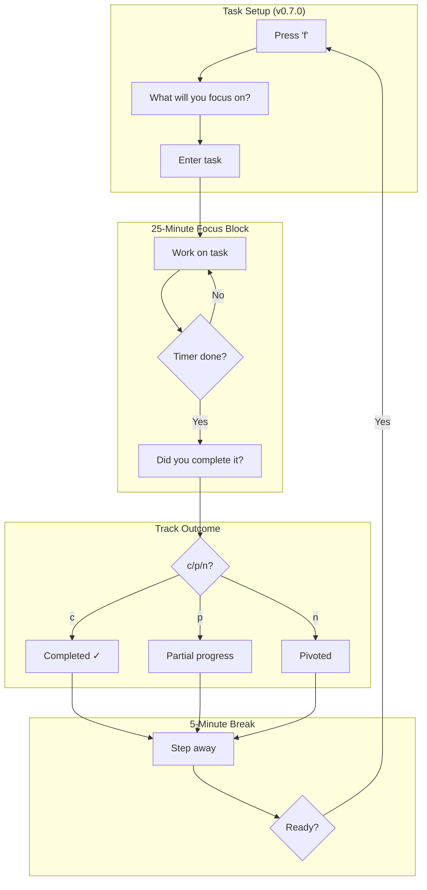

**In Dashboard:**
```bash
atlas dash
# Press 'f' to start focus mode
# Prompted: "What will you focus on?"
# Work with task displayed on screen
# After timer: c (completed), p (partial), n (pivoted)
```

**The dashboard shows:**
- Your focus task prominently displayed
- Timer countdown
- Today's completed Pomodoros
- Break enforcement dialog with task outcome tracking

---

### End of Day Ritual

**Goal:** Clean shutdown for tomorrow's success

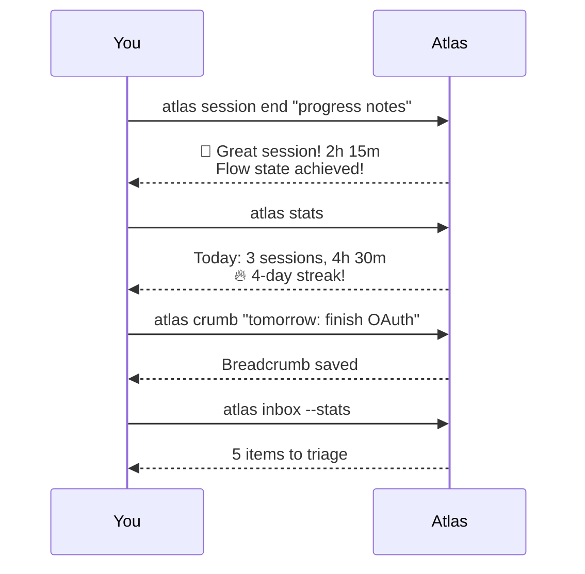

**Commands:**
```bash
# 1. End your session with notes
atlas session end "completed login page, OAuth pending"

# 2. See your stats
atlas stats

# 3. Leave a breadcrumb for tomorrow
atlas crumb "next: implement OAuth callback handler"

# 4. Optional: Quick triage if you have energy
atlas inbox --triage
```

!!! tip "ADHD Tip"
    The end-of-day crumb is your gift to morning-you. Be specific!

---

### Timeline View (v0.7.0)

**Goal:** Visualize your work patterns

```bash
atlas dash
# Press 'T' (Shift+T) for timeline view
```

**The timeline shows:**
- Today's sessions as color-coded time blocks
- Gaps between sessions
- Total work time
- Session count

```
 09:00  ████████████████  atlas (45m)
 10:00  ░░░░░░░░
 11:00  ██████████████████████████  research (1h 10m)
 12:00  ░░░░░░░░
 13:00  ████████  atlas (25m)
```

!!! tip "ADHD Tip"
    The timeline helps with time blindness - see where your time actually went!

---

### Multi-Panel Layout (v0.9.1)

**Goal:** See your project list and content side-by-side without leaving the dashboard

```bash
atlas dash
# Press Tab to cycle layouts
# ▣ Single (default) → ▥ Split → ▦ Triple → ▣ Single
```

**Split workflow — project list + main content:**
1. Press `Tab` → sidebar appears on the left
2. `Shift+Tab` → move keyboard focus to sidebar
3. `j`/`k` to scroll the project list
4. `Enter` to open project in the main panel
5. `Shift+Tab` again → back to main panel

**Sidebar rows at a glance:**
```
│ ● atlas       75% │  <- green = active
│ ◐ flow-cli    50% │  <- yellow = paused
│ ● mcp-server  80% ⏱│  <- ⏱ = active session running
│ 1–12/25            │  <- scroll indicator when > 12 projects
```

**Inbox badge:** `📥N` appears in sidebar header when N captures need triage.

!!! tip "Multi-Panel ADHD Tip"
    Use **Split** mode to keep your full project list visible while working in
    the main panel. The inbox badge reminds you to triage without needing to
    switch views.

---

### Session Export (v0.7.0)

**Goal:** Get your work sessions into your calendar

```bash
# Export last 30 days to iCal
atlas session export sessions.ics

# Import into your calendar app
# - Apple Calendar: double-click the file
# - Google Calendar: Settings > Import & Export > Import
# - Outlook: File > Import

# Export specific project
atlas session export --project myproject project-work.ics

# Export as JSON for analysis
atlas session export --format json > sessions.json
```

!!! tip "ADHD Tip"
    See your focus patterns over time by importing sessions to your calendar. Great for weekly reviews!

---

## Project Lifecycle

### Starting a New Project

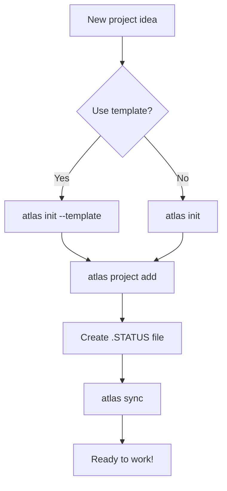

**With Template:**
```bash
# See available templates
atlas init --list-templates

# Create with template
atlas init --template node --name my-new-app
cd my-new-app

# Register it
atlas project add
```

**From Existing Project:**
```bash
cd ~/projects/existing-project

# Register it
atlas project add --tags backend,python

# Create a .STATUS file
cat > .STATUS << 'EOF'
## Project: existing-project
## Status: active
## Progress: 30
## Focus: Initial setup

## Next Actions
- [ ] Set up CI/CD
- [ ] Add tests
EOF

# Sync to pick up the status
atlas sync
```

---

### Project Health Check

**Goal:** Weekly review of your projects

```bash
# See all projects and their status
atlas project list

# Check your weekly stats
atlas stats week

# Per-project breakdown
atlas stats --format json | jq '.byProject'

# Find neglected projects
atlas project list --format json | jq '.[] | select(.lastSession | . < (now - 604800))'
```

---

## ADHD-Specific Workflows

### The Hyperfocus Recovery

**Problem:** You hyperfocused for 4 hours and now you're fried.

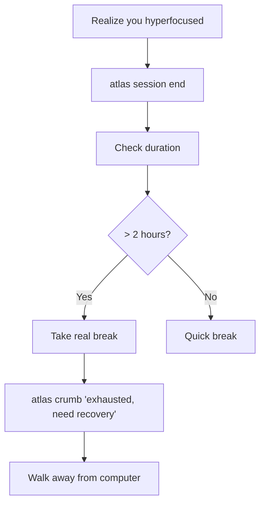

**Commands:**
```bash
# End the marathon session
atlas session end "hyperfocused on feature X"

# Leave a warning for yourself
atlas crumb "exhausted after 4h hyperfocus - start slow tomorrow"

# Check your stats (probably impressive!)
atlas stats
```

!!! warning "Hyperfocus Hangover"
    After a long hyperfocus session, your next session should be short. Atlas's time cues help with this.

---

### The Stuck Loop

**Problem:** You keep working on the same thing but making no progress.

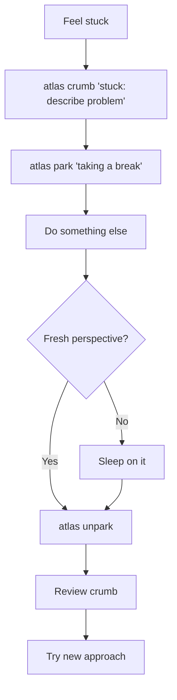

**Commands:**
```bash
# Document where you're stuck
atlas crumb "stuck: OAuth callback returns 500, tried X, Y, Z"

# Step away (this is important!)
atlas park "stuck - need fresh eyes"

# Later...
atlas unpark
atlas trail  # See your stuck note
```

---

### The Idea Avalanche

**Problem:** Too many ideas, can't focus on any.

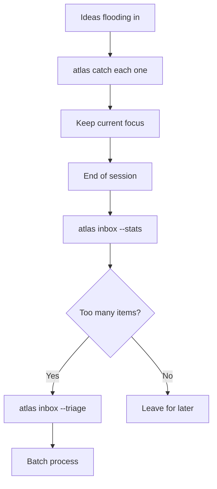

**Commands:**
```bash
# Rapid-fire capture (don't stop to think!)
atlas catch "idea 1"
atlas catch "idea 2"
atlas catch "idea 3"

# Later, see how many you captured
atlas inbox --stats

# Process when you have bandwidth
atlas inbox --triage
```

!!! tip "Capture Mode"
    During an idea avalanche, your only job is capture. Don't evaluate, don't organize, just capture.

---

## Integration Workflows

### With Git

```bash
# Start session when beginning work
atlas session start "feature: user-dashboard"

# ... do work, make commits ...

# End session with PR reference
atlas session end "PR #42 ready for review"
```

### With Zellij/tmux

**Layout suggestion:**

```
┌─────────────────────────────────────────────────┐
│                     Code                         │
│                                                 │
├─────────────────────┬───────────────────────────┤
│      Terminal       │     atlas dash            │
│                     │                           │
└─────────────────────┴───────────────────────────┘
```

Keep `atlas dash` visible to see:
- Current session duration
- Streak status
- Time cues

### With VS Code Tasks

Create `.vscode/tasks.json`:
```json
{
  "version": "2.0.0",
  "tasks": [
    {
      "label": "Atlas: Start Session",
      "type": "shell",
      "command": "atlas session start",
      "problemMatcher": []
    },
    {
      "label": "Atlas: Quick Capture",
      "type": "shell",
      "command": "atlas catch \"${input:captureText}\"",
      "problemMatcher": []
    }
  ],
  "inputs": [
    {
      "id": "captureText",
      "type": "promptString",
      "description": "What do you want to capture?"
    }
  ]
}
```

---

## Workflow Cheat Sheet

| Situation      | Workflow                                            |
| -------------- | --------------------------------------------------- |
| Starting work  | `where` → `trail` → `session start`                 |
| Got an idea    | `catch "idea"` (don't stop working)                 |
| Need to switch | `park` → switch → `session start` → later: `unpark` |
| Feeling stuck  | `crumb "stuck on X"` → take break                   |
| End of day     | `session end` → `stats` → `crumb "tomorrow: X"`     |
| Monday morning | `stats week` → `parked` → `inbox --triage`          |

---

## Visual Summary

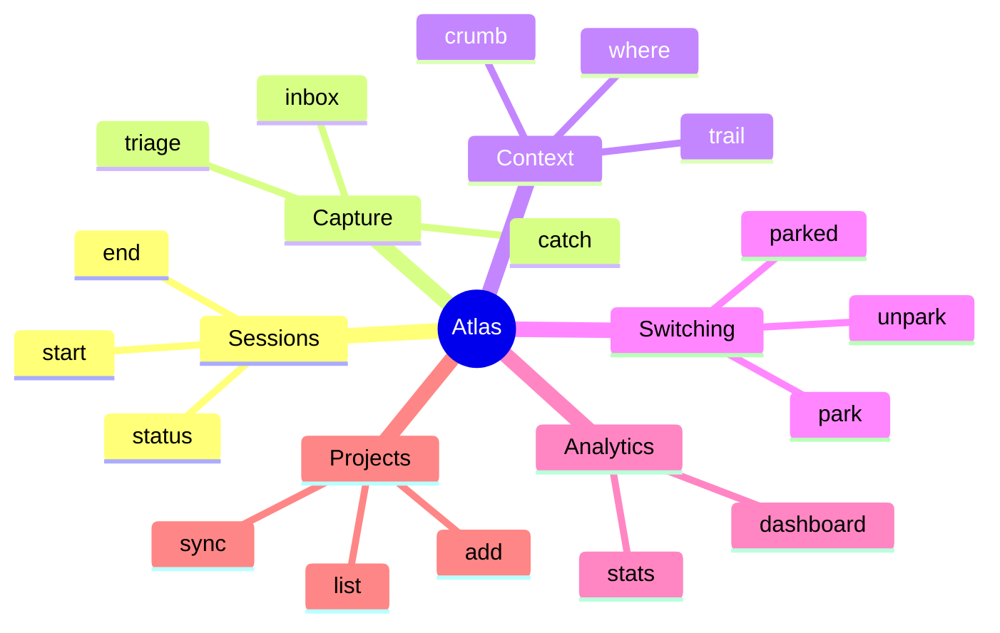

---

<div style="text-align: center; margin-top: 2em;">

**Remember:** Atlas is a tool, not a taskmaster.

Use what helps. Ignore what doesn't. Your brain knows best.

</div>
