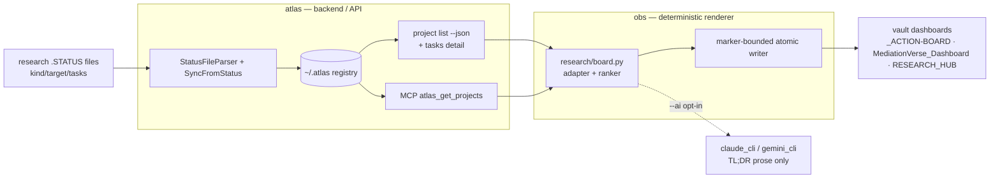

# Phase 3 Implementation Plan — Research Registry → Research Board

> Parent: RFC-000. Builds on PR #21 (atlas Phase 1+2, merged-ready). Author posture: expert
> backend (atlas Node/Clean-Arch, obs Python core) + frontend (the vault board / optional HTML).
> Date: 2026-06-25. Status: **CORE MERGED — board live.**
>
> **Shipped + merged:** atlas #21 (registry kind/target/tasks + json/MCP), #23 (`atlas doctor` audit + `--fix`), #24 (json progress/next/priority); docs-standards #1 (ADR-001 ownership + settings contract); savant #46 (skills); pmed-modern #3 (.STATUS); obs #59 (`obs link`), #60 + #61 (`obs research board`). Live board rendered to vault `00_meta/_RESEARCH-BOARD.md` (3 manuscripts + 1 program). Coverage: `atlas doctor` = 47/276 (real projects).
>
> **Remaining (small, next batch):** collider `journal:`→venue; `MediationVerse_Dashboard` target + retire `status-sync` + scheduled `--dry-run` drift guard; wire scaffolders to call `obs link`; `atlas doctor --fix --write` curated CLAUDE.md backfill + registry hygiene; MCP `progress/next` parity. See §7 + RESEARCH_HUB → Research-Ops Platform.

---

## 0. Where we are / what's left

**Done (PR #21):** research `.STATUS` parsed (`kind`/`target`/`tasks`) → `metadata`; `sync --from-status`
carries + change-detects them; `project list --kind` + `--format json` (`kind`/`target`/`taskCount`);
MCP `atlas_get_projects` filter; registry-load bug fixed; docs + gap analysis. 1470 tests green.

**Left (this plan):** the **visible payoff** — a deterministic **research board** in the vault — plus the
backend surface it needs, parser parity, the human CLI surface, and rollout.

---

## 1. Architecture — the data path (backend ↔ frontend)



**Contract:** atlas JSON/MCP is the **API**; obs is the **renderer**; vault markdown is the **UI**.
Determinism is a hard requirement — output is a pure function of atlas state (zero diff on re-run).

**Backend gap discovered:** the board must list a program's *proposals* (text/priority/done), but
`project list --format json` exposes only `taskCount`. → **Epic A1 is a hard prerequisite for obs.**

---

## 2. Epics & tasks

### Epic A — atlas backend completion (Node, Jest) · branch `feature/research-registry-surface`

| ID | Task | Files | Effort | Acceptance / Tests |
|----|------|-------|--------|--------------------|
| **A1** 🔴 | Expose proposal **details** in JSON. Add `tasks` to `ProjectsAPI.list()` output (or richer `project show <name> --json`). Decide: full `tasks` on list vs only on `show`. | `src/index.js` (`ProjectsAPI.list`/`show`) | **S** | json item has `tasks:[{text,priority,done}]`; unit test asserts shape; package → `[]`. |
| **A2** | Table-view `kind`: add a `🔬`/kind column or marker to `project list` table (`--format table`). | `src/index.js` `formatOutput`, presenter | **S–M** | table shows kind for research rows; existing table tests pass; snapshot updated. |
| **A3** | `atlas plan` research grouping — a "Manuscripts & Programs" section with status/next/taskCount. | `bin/atlas.js` plan, `formatPlan`, plan use-case | **M** | `atlas plan` lists manuscripts+programs w/ priority/next; test on fixture. |
| **A4** | **Parser parity → single path (Decision 1).** Document plain `sync` = packages-only; `--from-status` = the research path. Add a guard/test so the split is explicit (no silent divergence). | docs + a guard test | **S** | `plain sync ignores research keys` test; CLI-REF/guide note. |
| **A5** | Focused tests closing ⚠️ rows: `ProjectsAPI.list()` research fields + `--kind` filter; MCP handler forwards `kind`. | `test/unit/...` | **S** | direct unit coverage, not just transitive. |
| ~~**A6**~~ | **DEFERRED (Decision 2)** — formal `Task` entities + `atlas task list`. Not in Phase 3; lightweight `metadata.tasks` stands. | — | — | revisit when a proposal workflow is requested. |

### Epic B — obs `research board` (Python core, pytest) · branch `feature/research-board`

| ID | Task | Files | Effort | Acceptance / Tests |
|----|------|-------|--------|--------------------|
| **B1** | Command skeleton: `obs research board` dispatch (zsh → `obs_cli.py` → `research/board.py`) with flags `--out --targets --ai --dry-run --json`. | `src/obs.zsh`, `src/python/obs_cli.py`, `src/python/research/board.py` | **S** | `obs research board --help`; no-op `--dry-run` exits 0. |
| **B2** | atlas adapter: read `atlas project list --json` (+ A1 tasks); `.STATUS`-direct fallback when atlas absent. | `research/board.py` (adapter) | **M** | adapter unit test on fixture JSON; fallback path test. |
| **B3** | Deterministic ranker + model: stable sort (priority → progress desc → id); leverage score `priority_weight × unblock × (1−progress_penalty)`; fixed number/date formatting. | `research/board.py` | **M** | golden ranker test; running twice = identical. |
| **B4** | Marker-bounded **atomic** writer: mutate only `<!-- obs:board:start/end -->`; `os.replace`; `--dry-run` prints unified diff, exit 1 on drift. | `research/board.py` (writer) | **M** | marker-isolation test (hand prose preserved); atomic-under-interrupt test. |
| **B5** | Targets: `_ACTION-BOARD.md` (act-now + status-at-a-glance) + `MediationVerse_Dashboard.md` (package table + CRAN cascade — **supersedes `status-sync`**). RESEARCH_HUB block deferred (Decision 3). | renderer + templates | **M** | golden-file per target (diff == 0 vs current hand-built board). |
| **B6** | **Frontend/UX**: board layout (see §3) — sections, status icons, progress bars, kind chips, per-program proposal rollup. | templates | **S–M** | matches §3 mock; passes golden-file. |
| **B7** | pytest: golden-file, idempotency, marker isolation, fallback, safety (`--dry-run` no writes). | `src/python/tests/`, `tests/fixtures/` | **M** | all green; fixture = atlas JSON snapshot. |
| **B8** | `--ai` opt-in: layered AI refines only the TL;DR prose / tie-breaks; never required for determinism. | `ai/providers/*` | **S** | with/without `--ai`, marker block deterministic except a single prose line. |

### Epic C — integration & rollout

| ID | Task | Effort | Notes |
|----|------|--------|-------|
| **C1** | Retire `mediationverse-status-sync` (flag-gated; keep disabled-but-present one cycle). | **S** | rollback = re-enable prompt. |
| **C2** | Roll `kind:`/`tasks:` into remaining research `.STATUS` (collider, product-of-three, sensitivity, sequential). | **S** | lights up the board with real data. |
| **C3** | Scheduling: `obs research board --dry-run` as launchd/CI **drift guard**; write on cadence (Mon pipeline). | **S** | exit codes 0/1/2. |
| **C4** | Cut **atlas release** w/ #21 fixes → `brew upgrade` (installed binary carries the load-bug guard). | **S** | durability (gap #10). |
| **C5** | Docs: obs board guide; update RFC-000 + SPEC statuses; CHANGELOGs. | **S** | |

### Epic D — *(DEFERRED — Decision 4)* interactive HTML research dashboard

| ID | Task | Effort | Notes |
|----|------|--------|-------|
| **D1** | A live HTML dashboard (cowork artifact) reading atlas MCP — KPI cards (manuscripts/programs/packages), filterable proposal table, CRAN-cascade view. | **M** | true "frontend"; complements the static vault board; reuses the same JSON contract. |

---

## 3. Frontend — the research board (UX design)

`_ACTION-BOARD.md`, inside `<!-- obs:board:start -->…<!-- obs:board:end -->`:

```
## 🎯 Research Action Board            generated: 2026-06-25   (single line, OUTSIDE markers)

TL;DR — <1-line, deterministic; --ai may refine>

### ▶ Act now (ranked)
| # | Item | Kind | Effort | Risk | Why now |
|---|------|------|--------|------|---------|
| 1 | medrobust submit_cran() | package | 10 min | 🟢 | unblocks medsim→mediationverse cascade |
| 2 | collider R&R upload | manuscript | 1–2 d | 🔴 Aug 7 | hard deadline |

### 📊 Status at a glance
**Manuscripts**
| Paper | Venue | Status | Progress | Next |
| collider | AMPPS | 🔴 R&R | ███████░░ 95% | upload submission/rev1 |
| product-of-three | JASA | 🟢 draft | ████████░ 95% | final proofread |

**Programs**  (proposals = done/total)
| Program | Venue | Status | Progress | Proposals | Next |
| pmed-modern | Epi/JASA/… | 🟢 active | ███████░░ 92% | 0/5 done | advance 05 |

**Packages**  → MediationVerse_Dashboard (CRAN cascade)
```

**Frontend rules (determinism = part of the "frontend"):**
- Status icon map fixed (`🔴 blocked/deadline · 🟡 paused/wip · 🟢 active/ready`).
- Progress bar = 8-cell unicode `█/░` from `round(progress/12.5)` — pure function of integer progress.
- Kind chips lowercase; venues verbatim from `target`; stable column order.
- No timestamps inside markers (only the `generated:` line outside). Re-run on unchanged state ⇒ **0 diff**.

---

## 4. Sequencing & critical path

```
A1 ──▶ B2 ──▶ B3 ──▶ B4 ──▶ B5 ──▶ B6 ──▶ B7 ──▶ C1
                                   ▲
A2, A3, A4, A5 (atlas surface) ────┘ (parallel; not on critical path)
C2 (roll .STATUS) feeds real data into B7/C1   ·   C4 (release) anytime   ·   D1 optional
```

**Critical path:** A1 (tasks-in-JSON) → obs B2→B7 → C1 (retire prompt). Everything else parallelizes.

**Milestones:** M1 atlas surface complete (A1–A5). · M2 obs board renders golden fixture (B1–B7).
· M3 board live on real data + prompt retired (C1–C3). · M4 release + docs (C4–C5). · (M5 optional D1.)

**Rough total:** ~**4–6 focused days** (atlas surface ~1–1.5d, obs board ~2–4d incl. fixtures, rollout ~0.5–1d).

---

## 5. Risks & mitigations

| Risk | Mitigation |
|------|------------|
| **iCloud write corruption** (vault on iCloud) | atomic temp + `os.replace`; marker-only mutation; `--dry-run` drift guard in CI/launchd. |
| **Non-determinism** breaks golden tests | no timestamps in markers; stable sort + fixed formatting; AI gated to one prose line. |
| **Marker collision / hand edits clobbered** | mutate only between markers; test asserts out-of-marker prose preserved byte-for-byte. |
| **atlas not installed / version drift** | `.STATUS`-direct fallback (B2); pin JSON schema; release (C4). |
| **JSON contract drift** atlas↔obs | a cross-repo contract fixture: atlas json snapshot committed in obs `tests/fixtures/` + a schema check. |
| **Parser parity confusion** | resolve Decision 1 explicitly + document; assert chosen behavior. |

---

## 6. Test strategy (cross-repo)

- **atlas (Jest):** A1 json shape; A2 table; A3 plan; A5 list/`--kind`/MCP forwarding. Keep suite green.
- **obs (pytest):** golden-file per target, idempotency, marker isolation, fallback, `--dry-run` safety.
- **Contract test:** atlas `project list --json` snapshot → committed obs fixture → board golden output.
  One source of truth for the schema; breaks loudly if atlas changes the shape.

---

## 7. Locked decisions (2026-06-25)

1. **Parser parity (A4) → Single research path.** `sync --from-status` (StatusFileParser) is the ONLY
   research parser; plain `atlas sync` (StatusFileGateway) stays packages-only, documented + guarded.
   No second parser to keep in sync.
2. **Proposals model (A6) → Lightweight `metadata.tasks`.** Render-only task entries on the program
   Project. Formal `Task` entities + `atlas task` CLI are **deferred out of Phase 3** (revisit when a
   real proposal workflow — toggle done, due dates — is actually needed).
3. **Board targets (B5) → `_ACTION-BOARD.md` + `MediationVerse_Dashboard.md`.** RESEARCH_HUB status
   block **deferred** to a follow-up.
4. **Frontend scope → Vault board only.** Epic D (interactive HTML dashboard) **deferred**; revisit
   after the deterministic markdown board ships.

---

## 8. Definition of Done

- `obs research board` reproduces the hand-built `_ACTION-BOARD` from atlas/`.STATUS`, **deterministically,
  0 stale rows**; `MediationVerse_Dashboard` matches old `status-sync`; the LLM prompt is retired.
- atlas: research surfaced in table + plan + json(tasks) + MCP; parity decided; tests green; release cut.
- Docs updated (obs guide, RFC-000/SPEC statuses); remaining research `.STATUS` carry `kind:`/`tasks:`.

---

## 9. Recommended execution order
**1)** A1 (unblocks obs) → **2)** B1–B4 (skeleton+adapter+ranker+writer) → **3)** B5–B7 (targets+UX+golden) →
**4)** A2/A3/A5 (atlas surface, parallel) → **5)** C2 (real `.STATUS`) → **6)** C1/C3 (retire+schedule) →
**7)** C4/C5 (release+docs). A4 decided before A-merge; A6/D1 only if chosen.
