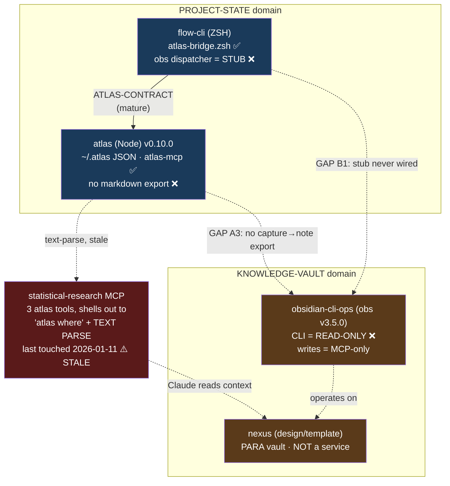

# SPEC: Ecosystem Integration Gaps — atlas ↔ nexus, flow-cli ↔ obsidian-cli-ops

> **Status:** draft
> **Created:** 2026-06-20
> **From Brainstorm:** `/workflow:brainstorm -d -s` (deep, save) — this session
> **Scope:** Cross-repo. Saved in `atlas/docs/specs/` because atlas is the ecosystem hub and the session repo, but the work spans **four+ repos** (atlas, flow-cli, obsidian-cli-ops, mcp-servers/statistical-research). atlas does NOT own the flow-cli or obs work.
> **Goal:** Find integration gaps (primary) + plan tighter integration where it makes sense (secondary).

---

## ⚠️ Naming disambiguation (read first — this is a documentation hazard)

Three similarly-named things are NOT the same. Conflating them will corrupt any downstream work:

| Name | What it is | Repo |
|------|-----------|------|
| **nexus** | Obsidian knowledge-management **architecture/template** for ADHD researchers (docs + vault-template + early Electron app). NOT a running CLI. | `dev-tools/nexus` |
| **nexus-cli** | A **separate** research/teaching/writing CLI (v0.5.0), candidate for merge into `obs` (RFC#35). Unrelated to the `nexus` design docs. | (separate) |
| **obsidian-cli-ops** | The `obs` binary (v3.5.0) — Obsidian vault management + graph analysis. | `dev-tools/obsidian-cli-ops` |

The user's phrase "obsidian-ops-cli" = **obsidian-cli-ops**. "atlast" = **atlas**.

---

## Overview

The dev-tools ecosystem has two domains that should connect but barely do:

- **Project-state domain:** `atlas` (Node state engine, `~/.atlas`) ← `flow-cli` (ZSH wrapper, mature `ATLAS-CONTRACT`).
- **Knowledge-vault domain:** `obsidian-cli-ops` (the `obs` executor) + `nexus` (the vault design/template).

The bridge between them exists only as a **stale, text-parsing MCP shim** (`statistical-research`) and a **dead `obs` stub** in flow-cli. The single keystone blocker is that **`obs` cannot write notes from the CLI** — note creation is MCP-only. Fixing that one thing unblocks both integration pairs.

---

## Decisions (locked via grilling, 2026-06-20)

These six answers narrow the spec from "all integration gaps" to one concrete, opinionated build. They override the original mirror/export framing.

| # | Decision | Consequence |
|---|----------|-------------|
| **D1** | **Pain = capture scatter.** The job-to-be-done is *one entry point, one place to find it* — NOT session/stats synthesis. | The capture path (A3) is THE deliverable. The stale MCP context bridge (A1/A2) drops to a parallel cleanup, off the critical path. |
| **D2** | **Route, not mirror.** The Obsidian vault is the **source of truth** for captures. | `atlas catch` becomes a **write-through to `obs write`**. Spec's earlier "markdown export / mirror" framing is retired. |
| **D3** | **Triage dies, vault wins.** atlas's triage *use-case* (`atlas inbox`/`atlas triage`) is retired; you triage in Obsidian. | atlas's `TriageInbox` use-case is removed. The captures *repository* survives — but **only as a write-ahead queue** (see D4), not a triage inbox. **Strategic narrowing of atlas** (see Implementation Notes). |
| **D4** | **Queue + flush, never block.** When `obs`/vault is unreachable, `atlas catch` lands instantly in `~/.atlas` and flushes to the vault when `obs` returns. | Mirrors the flow-cli `ATLAS-CONTRACT` hot-path-with-fallback pattern. Needs a flush/sync mechanism + a "pending flush" state on captures. |
| **D5** | **Build my side now** against the planned `obs write` interface; wire on RFC#35 Phase 1. | No idle waiting, no throwaway stopgap. atlas + flow-cli work proceeds against a contract, not a shipped binary. |
| **D6** | **Consolidate to one atlas MCP surface.** statistical-research consumes `atlas-mcp`/JSON; delete the duplicated text-parsing tools. | Resolves A1+A2 — but it's a **separate cleanup track**, since D1 says context-synthesis isn't the pain. |

**Resulting atlas role:** session/project/breadcrumb state engine **+ resilient capture write-through queue** to the vault. Captures are no longer triaged or browsed in atlas.

---

## Current-state map (verified, not from stale docs)



### Verified facts per tool

| Tool | Integration surface (verified) |
|------|-------------------------------|
| **atlas** | Outputs: `--format json/names/shell`, `--count`, `--suggest`, `stats --velocity/--patterns`, `session export --format ical/json`; `atlas-mcp` server with 5 read + 4 write tools; clean JSON in `~/.atlas/captures.json` + `breadcrumbs.json`. **Zero** Obsidian/nexus references in its own code. **No markdown export** for captures/breadcrumbs (only iCal sessions). |
| **flow-cli** | `atlas-bridge.zsh` + `docs/ATLAS-CONTRACT.md` (hot/warm/opportunistic paths, `command -v` probe + session cache). Dispatcher convention = 4 components (fn + help + completions + man). `obs` is a **help-text stub only** — no dispatcher function exists. Dropped its `obs.1`; obs binary/man now owned by obsidian-cli-ops. |
| **obsidian-cli-ops** | `obs` v3.5.0 (Python + ZSH). **25 CLI commands, all read-only** (search, analyze, health, ai, trends, daily-digest). **Writes (`create_note`, `append_to_note`, `write_note`) are MCP-only** — no CLI equivalent. `.STATUS`→vault sync is in `IDEAS.md`, unbuilt. RFC#35 considers absorbing nexus-cli (moving target). |
| **nexus** | Docs + `vault-template/` (PARA: `00_inbox`…`60_tasks`) + frontmatter schemas + early `nexus-desktop/` Electron app. Designed a 5-layer stack WITH atlas in mind. **Not a runnable service** — terminates at manual Obsidian + Claude. |
| **statistical-research** (the actual bridge) | MCP server (`src/index.ts`) with `atlas_get_context/recent/stats`. Implementation shells out via `Bun.spawn(["atlas","where"])` and **parses text** (predates atlas JSON). Last commit **2026-01-11** → ignores atlas v0.9.3 JSON + v0.10.0 temporal. Tool names (`atlas_get_recent/stats`) **don't match** atlas-mcp's own tools (`atlas_get_sessions/trail/inbox`) → drift/duplication. |

---

## The gaps (prioritized)

### Pair A — atlas ↔ nexus

| ID | Gap | Severity |
|----|-----|----------|
| **A1** | The only live bridge (`statistical-research` MCP) is **stale**: text-parses `atlas where`, predates atlas's JSON contract (v0.9.3) and temporal intelligence (v0.10.0). | High |
| **A2** | **Tool drift / duplication:** statistical-research reimplements atlas access (3 text-parsing tools) instead of consuming atlas's own `atlas-mcp` (5 richer JSON tools). Two atlas MCP surfaces now disagree. | Medium |
| **A3** | **No data bridge:** atlas captures/breadcrumbs never become Obsidian vault notes. atlas has no markdown exporter. nexus's "external memory" vision is unrealized. | High |
| **A4** | nexus is a **template, not a service** — "integration" dead-ends at manual Obsidian use; nothing automates vault writes. | Medium |

### Pair B — flow-cli ↔ obsidian-cli-ops

| ID | Gap | Severity |
|----|-----|----------|
| **B1** | flow-cli's `obs` dispatcher is a **dead stub** (help-text placeholder, no function). The proven `atlas-bridge.zsh` pattern is sitting unused for obs. | Medium |
| **B2** | **KEYSTONE BLOCKER:** `obs` CLI is **read-only**; note creation/append is **MCP-only**. Every shell-based bridge (flow-cli `obs`, atlas shell-out) can only READ until this is fixed. | **Critical** |
| **B3** | ~~obsidian-cli-ops mid-decision on nexus-cli merge (RFC#35) — moving target.~~ **RESOLVED 2026-06-20:** RFC#35 verified. All three options keep vault-write in `obs`; the keystone write commands are *already* planned as RFC#35 Phase 1 (`obs write`/`obs daily`/`obs template`, ported from nexus-cli). Building the keystone **aligns with** RFC#35, doesn't race it. | ~~Med~~ → resolved |

### Cross-cutting keystone

**A3 and B2 are the same lock.** Give `obs` a CLI write command and BOTH the atlas→vault capture bridge AND the flow-cli `obs` dispatcher become buildable via the established shell-bridge pattern. **One prerequisite unblocks both pairs.**

**RFC#35 update (verified 2026-06-20):** The keystone is **not new development** — nexus-cli (v0.5.0, 422 tests) already implements `vault write/daily/template`, and RFC#35's recommended path (Option B) ports them into `obs` as `obs write` / `obs daily` / `obs template` (spec line 94: *"new in obs"*). So Phase 0 below = **execute RFC#35 Phase 1**, not author a fresh command. Target those command names, not invented ones.

---

## Tighter integration — does it make sense? (the secondary ask)

### ✅ Worth building (in dependency order)

1. **[KEYSTONE] `obs create-note` / `obs append-daily` CLI write command** — in obsidian-cli-ops. Unblocks everything below. Without it, all other items are blocked.
2. **flow-cli `obs` dispatcher** → wraps obsidian-cli-ops via new `lib/obs-bridge.zsh` (clone of atlas-bridge: `command -v obs` probe, session cache, graceful fallback). Read-only first; gains write once #1 lands.
3. **atlas markdown export** — `atlas capture export --format md` and breadcrumbs → daily-note format. Optional mirror so `atlas catch` can also land in the vault.
4. **Modernize statistical-research atlas tools** — consume atlas JSON (`atlas where --format json` / `atlas stats --format json`) or call `atlas-mcp` directly; retire text-parsing. Resolves A1+A2.

### ❌ Do NOT do (over-coupling / hazards)

- **Don't merge atlas & nexus.** Verified complementary: state engine (JSON/SQLite, operational "what now?") vs knowledge structure (Obsidian markdown, "what have I learned?"). Different storage models, different purposes.
- **Don't make atlas hard-depend on obsidian-cli-ops** (Node→Python coupling). Keep it optional + capability-probed, exactly like `ATLAS-CONTRACT`.
- **Don't conflate `nexus` with `nexus-cli`** in any code or doc. They are different projects.
- **Don't deep-wire flow-cli↔obs until RFC#35 settles** — or target only the stable read surface.

---

## Hubs — extending route-to-vault to dashboards (added 2026-06-20)

The user's real Obsidian vault (`~/Library/Mobile Documents/iCloud~md~obsidian/Documents/`, a single vault with `Research/`, `Knowledge_Base/`, `Life_Admin/` areas) already runs **three different hub-update paradigms** — one per hub in `Research/00_meta/`. Any atlas→vault hub feature must *pick* one, not invent a fourth.

| Hub (real) | Paradigm | Updated by | CLI? | atlas? | Robustness |
|------------|----------|------------|------|--------|-----------|
| `MediationVerse_Dashboard.md` | **Push-sync** ← r-pkg `.STATUS` | a regen script ("do not hand-edit") | ✅ (script) | ✅ if atlas runs it | ⚠️ needs a live daemon — **currently dormant** |
| `Research_Lab_Dashboard.md` | **Dataview** ← note frontmatter | Obsidian renders on view | ✅ write *source* notes | ✅ atlas writes per-project notes | ✅ no moving parts |
| `RESEARCH_HUB.md` | **Static** ("update weekly") | manual | ✅ any writer (none wired) | ✅ if atlas regenerates | manual gap |

### Can hubs be updated, by channel?

- **Via CLI:** **nexus-cli — yes today** (`vault write/daily/template`). **obs — not until RFC#35 `obs write`.** Status-sync scripts — yes for push-sync hubs, but see drift.
- **By atlas:** **no today** (zero vault awareness; `.STATUS` sync is inbound-only). Natural fit = atlas project registry → a `Dev_Projects_Hub`, mirroring how r-pkg `.STATUS` feeds `MediationVerse_Dashboard`.
- **Through nexus:** the **Dataview way** — write structured per-project notes; Obsidian computes the hub. nexus-cli is the CLI that writes those notes.

### ⚠️ Drift finding (independent of this integration)

`research-session-defaults.md` and the dashboard header claim `MediationVerse_Dashboard` is *"auto-synced weekly by the mediationverse-status-sync scheduled task."* **CONFIRMED FALSE (2026-06-20):** no launchd agent, no crontab, no local task — **and** the cloud-routine API lists 14 routines, **none** a status-sync (only "Quarterly skill-authoring-standard refresh" is even enabled). The automation does not exist anywhere; the dashboard is hand-refreshed. research-vault memory ("now-archived, refresh manually") was the only accurate record. **Fix:** (a) correct the global rule + dashboard header to stop claiming dead automation, and (b) decide — revive as a real routine, or formally make it manual. *(Third stale-"done" claim this session — cf. nexus "✅ complete" bridge + stale `origin/main`.)*

### Recommendation (D7, proposed)

**For atlas→vault hubs, prefer the Dataview paradigm over push-sync.** Push-sync needs a daemon you must keep alive — and you already have one rotting (MediationVerse). Dataview has no moving parts: atlas writes per-project frontmatter notes via `obs write` (D2/D5 path), Obsidian renders the hub, nothing goes silently stale. Push-sync stays an option only where a *flat table snapshot* (not a live query) is required.

---

## Recommended path

Reordered around D1–D6: the capture write-through is the product; everything else supports or parallels it.

```
CRITICAL PATH (capture scatter → unified capture):
  P0  obsidian-cli-ops  →  obs write / obs daily       [= RFC#35 Phase 1; PORT nexus-cli, 422-tested] — OTHER TEAM'S REPO
  P1  atlas             →  catch = write-through to obs + queue/flush fallback (D2/D4)   [Medium] — build now (D5)
  P1' atlas             →  retire TriageInbox use-case; captures repo → write-ahead queue (D3)   [Medium] — coordinated w/ P1
  P2  flow-cli          →  obs-bridge.zsh + obs dispatcher; `catch` routes via atlas (D2)   [Low, pattern exists]

PARALLEL CLEANUP (off critical path — D1 says this isn't the pain):
  C1  statistical-research → consume atlas-mcp/JSON, delete 3 text-parse tools (D6, resolves A1/A2)   [Medium]
```

**Build-order logic:** P1/P1'/P2 are all in *your* repos and buildable **now** against the planned `obs write` contract (D5) — they don't wait on P0 to be *written*, only to be *wired* at the end. P0 is the other team's RFC#35 Phase 1 (a port, not new code). C1 is independent and can happen anytime.

**The honest critical-path truth:** the one thing you cannot ship without is P0 — and it's **not in your control**. Until obsidian-cli-ops lands `obs write` (RFC#35 Phase 1), your P1/P2 are built-but-dark. So the real first action is **socializing the dependency** with the obs side (Open Q1 sub-question), not writing atlas code.

---

## API Design (proposed — for the keystone)

```
# obsidian-cli-ops: CLI write commands — PORT from nexus-cli (RFC#35 Phase 1 names), NOT invented
obs write   --vault <id> --title <t> [--subfolder <f>] [--stdin | --content <md>]   → note path
obs daily   --vault <id> [--date <YYYY-MM-DD>] [--stdin | --content <md>]           → status (append to daily note)
obs template --vault <id> --template <name> [...]                                    → note from template
# all support --json (consistent with obs read commands). These mirror nexus-cli's vault read/write/daily/template.
```

```
# atlas: catch becomes a WRITE-THROUGH to obs (D2), with offline queue+flush (D4)
atlas catch "<text>" [--type ...]   → writes to vault via `obs write`; if obs down, queues in ~/.atlas (state: pending-flush)
atlas flush                         → drains pending-flush captures to the vault when obs returns (idempotent)
# RETIRED (D3): atlas inbox / atlas triage / TriageInbox use-case — triage now happens in Obsidian
# captures.json survives ONLY as the write-ahead queue, not a browsable inbox
```

```
# flow-cli: obs-bridge.zsh (clone of atlas-bridge.zsh)
_flow_has_obs()   { command -v obs &>/dev/null; ... session-cached ... }
obs() { if _flow_has_obs; then command obs "$@"; else _flow_log_error "'obs' requires obsidian-cli-ops"; fi }
```

---

## Data Models

Bridge mapping (atlas JSON → Obsidian note frontmatter):

| atlas capture field | Obsidian note frontmatter | Notes |
|---|---|---|
| `text` | body (after H1) | |
| `type` (idea/task/bug/note) | `type:` | maps to nexus task/note types |
| `project` | `project:` / `[[project]]` wikilink | |
| `tags[]` | `tags:` | direct |
| `createdAt` | `created:` | ISO → date |
| `context` | `context:` | optional |

(nexus vault-template frontmatter schema is the target — see `nexus/vault-template/30_resources/templates/`.)

---

## Dependencies

- **Phase 0:** obsidian-cli-ops Python write path already exists (MCP `create_note`); CLI command is a thin wrapper. RFC#35 status check first.
- **Phase 1:** flow-cli dispatcher scaffold (4 components) + `obs-bridge.zsh`.
- **Phase 2:** atlas `ExportSessionsUseCase` is the template for a `ExportCapturesUseCase`.
- **Phase 3:** atlas JSON flags (shipped v0.9.3) + atlas-mcp (shipped).

## UI/UX Specifications

N/A — CLI + MCP only. No GUI surface (nexus-desktop is out of scope).

## Open Questions

1. ~~**RFC#35 (nexus-cli → obs merge):** ship Phase 0 before or after it lands?~~ **RESOLVED 2026-06-20:** All RFC#35 options keep vault-write in `obs`; the keystone *is* RFC#35 Phase 1 (port nexus-cli's `vault write/daily/template`). Build it as RFC#35 Phase 1 — no rework risk. Remaining sub-question: does obsidian-cli-ops want atlas/flow-cli as named consumers in the RFC#35 acceptance criteria? *(Owner: obsidian-cli-ops)*
2. **Vault targeting:** which vault does atlas write to — config in `~/.atlas/config.json` (new `obsidianVault` key) or passed per-call? *(Still open — needs the vault id obs uses.)*
3. ~~**Mirror vs move?**~~ **RESOLVED (D2):** route — vault is source of truth; `atlas catch` is a write-through.
4. ~~**statistical-research vs atlas-mcp?**~~ **RESOLVED (D6):** consolidate to one surface (statistical-research consumes atlas-mcp). Off critical path.
5. **nexus-desktop:** is the Electron app alive or abandoned? Affects whether nexus ever becomes a service (A4). *(Still open — lower priority given D1.)*
6. **(NEW) flush trigger:** what drains the offline queue (D4) — every `atlas catch` attempt, a `session start` hook, a periodic timer, or manual `atlas flush`? *(Open — affects the never-block guarantee.)*
7. **(NEW) which capture types route?** D3 retires triage wholesale, but does *every* type (idea/task/bug/note) belong in the vault, or do operational `task`/`bug` items still want an atlas/issue home? *(Open — you picked "triage dies" over "split by type," so default is all-route; confirm tasks/bugs really belong in Obsidian.)*

## Review Checklist

- [ ] RFC#35 status confirmed before Phase 0
- [ ] `nexus` vs `nexus-cli` distinction preserved in all artifacts
- [ ] atlas integration stays optional + capability-probed (no hard Node→Python dep)
- [ ] obs CLI write commands mirror existing MCP tool semantics (no behavior drift)
- [ ] statistical-research modernization doesn't break its existing 43-test suite
- [ ] Cross-repo: each repo's own CLAUDE.md conventions followed (one PR per repo)

## Implementation Notes

- The `flow-cli ATLAS-CONTRACT` is the **reference pattern** for every integration here: optional dependency, `command -v` probe, session-cached, graceful fallback, versioned contract doc, exit-code discipline. Clone it (`OBS-CONTRACT.md`) rather than inventing a new style.
- atlas is the hub but should remain **unaware of Obsidian internals** — it emits markdown/JSON; obsidian-cli-ops owns vault placement. Keeps the Node/Python boundary clean.
- This is cross-repo: expect **4 separate PRs** (one per repo), not one. Sequence by the dependency chain above.
- **⚠️ STRATEGIC NARROWING OF ATLAS (D3) — eyes open.** Retiring `atlas inbox`/`atlas triage` cedes the *triage* half of "Quick Capture," a **headline feature** in atlas's own `CLAUDE.md` and docs (`Quick Capture: Ideas, tasks, bugs with triage workflow`). Consequences to budget for: (a) doc/marketing rewrite across CLAUDE.md, README, CLI-REFERENCE, TUTORIAL; (b) `TriageInbox` use-case + tests deleted; (c) MCP `atlas_get_inbox` semantics change (now reports queue depth, not a triage list); (d) flow-cli `inbox`/`triage` commands need rerouting or retirement too. This is a real product decision, not a refactor — confirm you want atlas to *stop being where you triage* before P1' is built.
- **D6 vs D1 tension:** you chose to consolidate the MCP surface (D6), but the stated pain is capture scatter (D1), not context-synthesis. C1 is therefore correctly *off* the critical path — do it as cleanup, don't let it delay the capture work.

## History

- **2026-06-20** — Initial draft from deep brainstorm. Investigation via 4 parallel agents + advisor-prompted verification that corrected the nexus doc's stale "atlas↔nexus ✅ complete (2025-01-11)" claim → actual state is a 5-month-stale text-parsing MCP shim in a sixth repo (statistical-research), last touched 2026-01-11.
- **2026-06-20 (update)** — RFC#35 verified against obsidian-cli-ops `SPEC-merge-nexus-cli-2026-06-19.md`. Keystone reframed: not blocked by RFC#35, it **is** RFC#35 Phase 1. Keystone is a **port** of nexus-cli's existing `vault write/daily/template` (422 tests) → `obs write/daily/template`, not new development. Corrected API names (`obs create-note` → `obs write`). B3 + Open Q1 resolved.
- **2026-06-20 (decisions)** — Six decisions locked via grilling (D1–D6): pain = capture scatter; route not mirror; triage dies (vault wins); queue+flush never-block; build-my-side-now; consolidate MCP. Spec pivoted from "all gaps" to an opinionated capture-write-through build. Flagged strategic narrowing of atlas (cedes triage). 2 new open questions (flush trigger, which types route).
