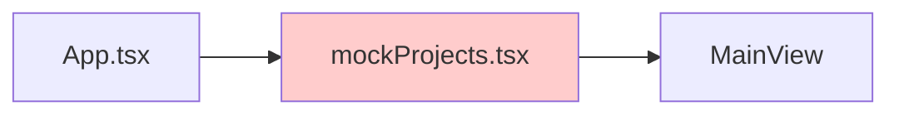
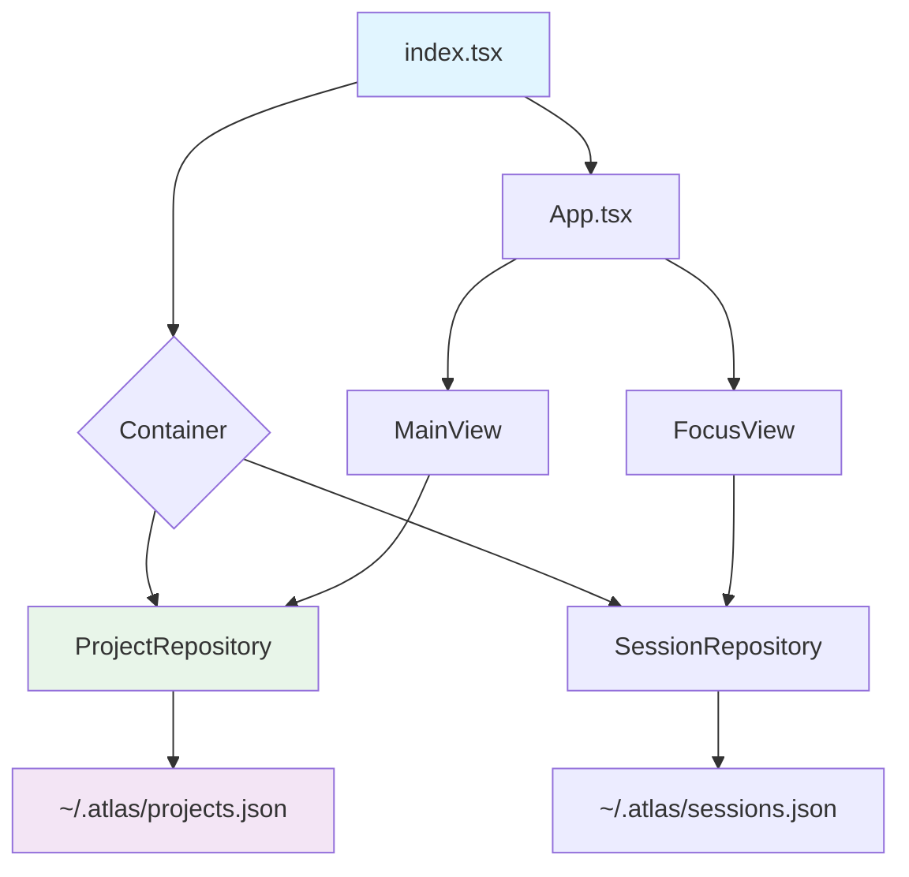
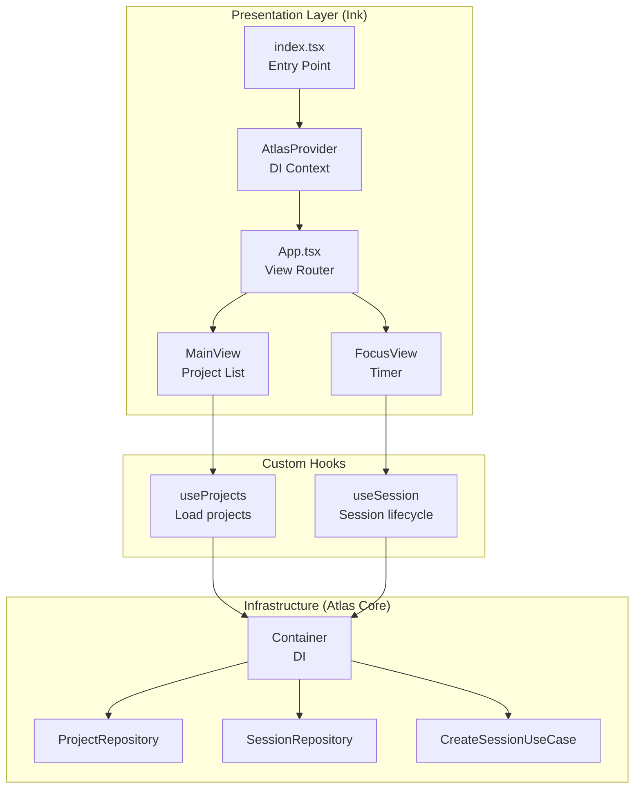

# Specification: Ink Dashboard Data Integration

**Status:** draft
**Created:** 2026-01-07
**From Brainstorm:** [BRAINSTORM-ink-real-data-integration.md](https://github.com/Data-Wise/atlas/blob/main/BRAINSTORM-ink-real-data-integration.md)
**System Design:** [SYSTEM-DESIGN-ink-data-integration.md](https://github.com/Data-Wise/atlas/blob/main/SYSTEM-DESIGN-ink-data-integration.md)
**Version:** 1.0

---

## Overview

Replace mock data in the Ink dashboard with real project and session data from Atlas's FileSystem repositories, while maintaining Clean Architecture principles and preserving testability.

**Context:** Sprint 1 successfully migrated the dashboard to Ink (React for CLIs) with 73% code reduction. All 7 views are functional but use hardcoded mock data instead of production storage.

**Goal:** Enable the Ink dashboard to display and manage real Atlas data from `~/.atlas/` storage.

---

## Primary User Story

**As a** developer using Atlas,
**I want** the Ink dashboard to show my actual projects and sessions,
**So that** I can track real work instead of seeing mock data.

### Acceptance Criteria

1. ✅ Dashboard loads projects from `~/.atlas/projects.json` (FileSystemProjectRepository)
2. ✅ FocusView timer creates real sessions in `~/.atlas/sessions.json`
3. ✅ Session state persists across dashboard restarts
4. ✅ Active session indicator shows on project cards
5. ✅ Error handling for missing/corrupt data files
6. ✅ Mock data still available for testing (moved to fixtures)

---

## Secondary User Stories

### Story 2: Data Refresh

**As a** developer running a long Atlas dashboard session,
**I want** the dashboard to reflect external changes (like `atlas sync`),
**So that** I don't need to restart to see updated project data.

**Acceptance Criteria:**
- Dashboard refreshes project data every 30 seconds
- External changes appear within refresh interval
- No UI flickering or performance degradation

### Story 3: Session Management

**As a** developer using the Focus mode,
**I want** my timer sessions to persist and appear in session history,
**So that** I can track my productivity over time.

**Acceptance Criteria:**
- Starting timer creates Session entity in repository
- Ending timer calculates and saves duration
- Session outcome is recorded
- Sessions appear in `atlas stats` output

---

## Architecture

### Current State



### Target State



### Component Diagram



---

## API Design

### New Context API

```typescript
// lib/AtlasContext.tsx
interface AtlasContextType {
  container: Container;
}

export const AtlasContext: React.Context<AtlasContextType>;
export function AtlasProvider(props: { container: Container; children: ReactNode }): JSX.Element;
export function useAtlas(): Container;
```

### Custom Hooks API

```typescript
// lib/hooks/useProjects.ts
interface UseProjectsReturn {
  projects: Project[];
  loading: boolean;
  error: Error | null;
  refresh: () => Promise<void>;
}

export function useProjects(): UseProjectsReturn;

// lib/hooks/useSession.ts
interface UseSessionReturn {
  session: Session | null;
  createSession: (params: { project: string; task?: string }) => Promise<Session>;
  endSession: (outcome: string) => Promise<void>;
  loading: boolean;
  error: Error | null;
}

export function useSession(): UseSessionReturn;

// lib/hooks/useActiveSession.ts
interface UseActiveSessionReturn {
  activeSessions: Map<string, Session>;  // projectName -> Session
  loading: boolean;
}

export function useActiveSession(): UseActiveSessionReturn;
```

---

## Data Models

### Project (Existing Domain Entity)

```typescript
// domain/entities/Project.js
class Project {
  id: string;                // Unique identifier
  name: string;              // Project name
  type: ProjectType;         // node, r-package, teaching, etc.
  path: string;              // Absolute path
  description: string;       // Optional description
  tags: string[];            // Tags for filtering
  metadata: {
    status: string;          // active, paused, archived
    progress: number;        // 0-100
    nextActions: string[];   // TODO items
  };
  createdAt: Date;
  lastAccessedAt: Date;
  totalSessions: number;     // Session count
  totalDuration: number;     // Total minutes
}
```

### Session (Existing Domain Entity)

```typescript
// domain/entities/Session.js
class Session {
  id: string;
  project: string;           // Project name
  task: string;              // Task description
  branch: string;            // Git branch
  startTime: Date;
  endTime: Date;
  pausedAt: Date | null;
  state: SessionState;       // ACTIVE, PAUSED, ENDED
  outcome: string;           // User-provided outcome
  context: {
    breadcrumbs: string[];
    captures: string[];
  };
}
```

### Formatted Project (Presenter Output)

```typescript
// Returned by ProjectPresenter.formatProjectSummary()
interface FormattedProject {
  id: string;
  name: string;
  type: string;
  status: string;
  progress: number;
  focus: string;              // Current focus/task
  next: string;               // Next action
  lastAccessed: string;       // "2 days ago"
  totalSessions: number;
  totalDuration: string;      // "5h 32m"
  isActive: boolean;          // Has active session
}
```

---

## Dependencies

### Existing (Already Available)

- `react` - UI framework
- `ink` - React renderer for CLIs
- Atlas core (`src/domain`, `src/use-cases`, `src/adapters`)

### New (To Install)

None required for Phase 1-2.

**Optional (Phase 3):**
- `chokidar` - File system watcher for instant updates (alternative to polling)

---

## UI/UX Specifications

### User Flow: Launch Dashboard

```
User runs: atlas dash
  ↓
index.tsx creates Container
  ↓
Loads projects from ~/.atlas/projects.json
  ↓
Renders App with AtlasProvider
  ↓
MainView calls useProjects()
  ↓
Loading spinner shows
  ↓
Projects load and display
```

### User Flow: Start Session

```
User navigates to project
  ↓
Presses 's' to quick-start session
  ↓
FocusView calls useSession().createSession()
  ↓
CreateSessionUseCase executes
  ↓
Session saved to ~/.atlas/sessions.json
  ↓
Timer starts in FocusView
  ↓
User works...
  ↓
Presses 'e' to end session
  ↓
useSession().endSession() executes
  ↓
Session updated with duration and outcome
  ↓
Celebration message shows
  ↓
Returns to MainView
```

### Loading States

```typescript
// Spinner component for loading
if (loading) {
  return (
    <Box>
      <Spinner type="dots" />
      <Text> Loading projects...</Text>
    </Box>
  );
}
```

### Error States

```typescript
// Error display
if (error) {
  return (
    <Box flexDirection="column" padding={1} borderStyle="round" borderColor="red">
      <Text bold color="red">⚠ Error Loading Projects</Text>
      <Text>{error.message}</Text>
      <Text dimColor>Try running: atlas sync</Text>
      <Text dimColor>Press 'r' to retry</Text>
    </Box>
  );
}
```

### Active Session Indicator

```
┌─────────────────────────────────────┐
│ atlas                    [ACTIVE] ⏱ │ ← Session indicator
│ 🟢 Active | 100% | P1               │
│ Focus: v0.9.0 Sprint 1              │
│ Duration: 1h 23m                    │ ← Session duration
└─────────────────────────────────────┘
```

### Accessibility

- ✅ Keyboard navigation (no mouse required)
- ✅ Clear visual hierarchy (borders, colors)
- ✅ Loading states announced
- ✅ Error messages are actionable

---

## Open Questions

### Q1: Should we cache projects in React state or always fetch from repository?

**Options:**
- **A)** Cache in React state, refresh on interval
- **B)** Always fetch from repository (leverages repo cache)

**Recommendation:** Option A for better control over refresh timing.

---

### Q2: How to handle missing ~/.atlas/ directory?

**Options:**
- **A)** Show error message, exit dashboard
- **B)** Show onboarding screen: "Run `atlas sync` to discover projects"
- **C)** Auto-create directory with empty files

**Recommendation:** Option B (friendliest UX for new users).

---

### Q3: Should DataLoader use polling or file watchers?

**Options:**
- **A)** Polling (setInterval every 30s)
- **B)** File system watchers (chokidar)
- **C)** Hybrid (polling + watchers)

**Recommendation:** Option A for Phase 3 (simplest, most reliable). Option C for future enhancement.

---

### Q4: Where to put mock data after migration?

**Options:**
- **A)** Delete mockProjects.tsx entirely
- **B)** Rename to mockProjects.fixtures.tsx, use in tests
- **C)** Move to __fixtures__/ directory

**Recommendation:** Option B (preserves test data).

---

## Review Checklist

### Architectural Review

- [x] Maintains Clean Architecture (no domain logic in React)
- [x] Uses Dependency Injection (Container)
- [x] Presenter pattern preserved
- [x] Repository pattern used correctly
- [x] No tight coupling between layers

### Code Quality

- [ ] TypeScript interfaces defined
- [ ] JSDoc comments added
- [ ] Error handling implemented
- [ ] Loading states handled
- [ ] No console.log left in code

### Testing

- [ ] Unit tests for custom hooks
- [ ] Integration tests for data loading
- [ ] Manual testing checklist completed
- [ ] E2E tests updated (if applicable)

### Documentation

- [ ] README updated with new architecture
- [ ] CLAUDE.md updated with data flow
- [ ] Inline code comments added

### Performance

- [ ] No unnecessary re-renders
- [ ] Repository cache utilized
- [ ] Refresh interval reasonable (30s)
- [ ] No memory leaks (intervals cleaned up)

---

## Implementation Notes

### Phase 1: Minimal Integration (~2 hours)

**Files to modify:**
1. `src/cli/dashboard-ink/index.tsx` - Pass Container to App
2. `src/cli/dashboard-ink/components/App.tsx` - Accept container prop, load real projects
3. `src/cli/dashboard-ink/components/views/MainView.tsx` - Use formatted projects

**Files to create:**
1. `src/cli/dashboard-ink/components/shared/ErrorBoundary.tsx`
2. `src/cli/dashboard-ink/components/shared/Spinner.tsx`

**Testing:**
```bash
# Test with real data
node bin/atlas.js dash

# Verify projects load from ~/.atlas/projects.json
ls -lh ~/.atlas/projects.json

# Check dashboard renders correctly
# Navigate, filter, search should all work
```

---

### Phase 2: React Context + Hooks (~4 hours)

**Files to create:**
1. `src/cli/dashboard-ink/lib/AtlasContext.tsx` - Context provider
2. `src/cli/dashboard-ink/lib/hooks/useProjects.ts`
3. `src/cli/dashboard-ink/lib/hooks/useSession.ts`
4. `src/cli/dashboard-ink/lib/hooks/useActiveSession.ts`

**Files to modify:**
1. `src/cli/dashboard-ink/index.tsx` - Wrap with AtlasProvider
2. `src/cli/dashboard-ink/components/App.tsx` - Remove direct repo access
3. `src/cli/dashboard-ink/components/views/MainView.tsx` - Use useProjects()
4. `src/cli/dashboard-ink/components/views/FocusView.tsx` - Use useSession()

**Testing:**
```bash
# Unit tests for hooks
npm test -- useProjects.test.ts
npm test -- useSession.test.ts

# Integration test
npm test -- dashboard-data.test.ts
```

---

### Phase 3: Auto-Refresh (~3 hours)

**Files to create:**
1. `src/cli/dashboard-ink/lib/DataLoader.ts` - Auto-refresh class

**Files to modify:**
1. `src/cli/dashboard-ink/lib/hooks/useProjects.ts` - Add DataLoader integration

**Testing:**
```bash
# Manual test:
# 1. Launch dashboard
# 2. In another terminal: atlas sync
# 3. Wait 30s
# 4. Dashboard should show new projects
```

---

## History

### 2026-01-07 - Initial Draft

- Created spec from brainstorm and system design documents
- Defined 3 user stories with acceptance criteria
- Documented 3-phase implementation approach
- Added comprehensive API design and data models

---

**Next Steps:**

1. **Review this spec** with team/stakeholders
2. **Select implementation path** (Recommended: Hybrid A→B→C)
3. **Start Phase 1** (Minimal Integration)
4. **Validate** with real data testing
5. **Iterate** to Phase 2 and 3

---

**Status:** Ready for implementation
**Estimated Total Effort:** ~9 hours (2 + 4 + 3)
**Risk Level:** Low (incremental, reversible)
