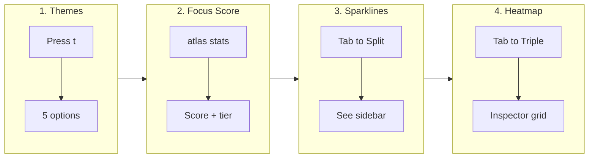

# Visual Features Tutorial

**Time:** ~12 minutes | **Level:** Intermediate | **Requires:** Atlas v0.9.1+, a few existing sessions

!!! tip "ADHD-Friendly Design"
    This tutorial has **"Try This Now"** prompts. Do them! Hands-on learning sticks better than reading.

---

## What You'll Learn

v0.9.1 adds four visual layers to the Atlas dashboard. By the end of this tutorial you'll know how to:

| Feature | What it does | Where to find it |
|---------|-------------|------------------|
| Themes | Customize all dashboard colors | `t` key in dashboard |
| Focus Score | See a quality metric for your work | `atlas stats`, inspector panel |
| Sparklines | Spot activity trends at a glance | Sidebar rows |
| Heatmap | See 13 weeks of history | Inspector + Ecosystem view |



---

## Part 1: Themes (~3 min)

### Why Themes?

Staring at the same colors all day gets tiring. Themes let you pick a palette that matches your mood, terminal, or lighting conditions.

### Try This Now #1: Cycle Themes

```bash
# Launch the dashboard
atlas dash

# Press 't' to cycle through themes:
#   default → nord → solarized → mono → high-contrast → default
```

**What to look for:**

- Panel borders change color
- Status text colors shift
- Progress bars update
- Even the Pomodoro timer recolors

### The Five Themes

| Theme | When to use |
|-------|------------|
| **default** | General use — purple accents, warm grays |
| **nord** | Dark terminal, evening coding — cool arctic blues |
| **solarized** | Eye comfort — warm browns and teals |
| **mono** | Maximum focus — zero color distraction |
| **high-contrast** | Bright room or accessibility needs |

### Try This Now #2: Set a Persistent Theme

```bash
# Set your preferred theme in config
atlas config prefs set preferences.theme nord

# Restart dashboard — it remembers
atlas dash
```

!!! note "Theme applies to all panels"
    Sidebar, inspector, main view, heatmap, and sparklines all respect your theme choice. No hardcoded colors anywhere.

---

## Part 2: Focus Score (~3 min)

### What Is Focus Score?

A single number (0-100) that summarizes the *quality* of your recent work. It's not about hours — it's about how well you're working.

### The Formula

```
Focus Score = Duration(30%) + Flow(30%) + Completion(25%) + Consistency(15%)
```

| Component | Measures | 100% looks like |
|-----------|----------|-----------------|
| Duration | Average session length | 45+ min sessions |
| Flow | % of sessions reaching flow state | 100% flow sessions |
| Completion | Session completion rate | Always end sessions properly |
| Consistency | Streak vs period | 7+ day streak |

### The Five Tiers

| Score | Symbol | Tier | What it means |
|-------|--------|------|---------------|
| 80-100 | ● | **deep** | Consistently excellent focus |
| 60-79 | ◕ | **strong** | Solid, productive rhythm |
| 40-59 | ◑ | **steady** | Building momentum |
| 20-39 | ◔ | **warming** | Getting started or ramping up |
| 0-19 | ○ | **drift** | New to tracking, or taking a break |

!!! success "ADHD-Friendly"
    There are no "bad" tiers. Drift just means you're starting out. The scale uses green and yellow — **never red**.

### Try This Now #3: Check Your Focus Score

```bash
# See your focus score in stats
atlas stats

# Look for this line in the output:
#   Focus Score:       ◕ 72 strong

# Try different time ranges
atlas stats --days 30
atlas stats --days 7
```

**No sessions yet?** Start and end a few quick sessions first:

```bash
atlas session start myproject
# wait a minute
atlas session end "testing focus score"
# repeat 2-3 times, then check stats
```

---

## Part 3: Sparklines (~3 min)

### What Are Sparklines?

Tiny inline charts showing your last 5 days of activity per project — right in the sidebar. No need to open stats or switch views.

### Reading Sparklines

```
▁▂▃▅█   ← Activity increasing (green)
█▅▃▂▁   ← Activity decreasing (yellow)
▃▃▃▃▃   ← Steady activity (white)
····▃   ← Mostly idle, recent burst
```

Characters map to relative activity: `·` = none, `▁` = minimal, `█` = peak day.

### Try This Now #4: See Sparklines in the Sidebar

```bash
# Launch dashboard
atlas dash

# Press Tab once → Split layout
# Look at sidebar rows:
#   ● atlas       75% ▂▃▅▇█
#                         ^^^^ sparkline!

# Press Tab again → Triple layout
# Sparklines still visible in the narrower sidebar
```

!!! tip "Trend Colors"
    Sparklines use your theme's colors:

    - **Green** (rising): last 2 days > first 2 days
    - **Yellow** (falling): activity declining — gentle nudge, not alarm
    - **White** (flat): consistent activity

### What the Sparkline Tells You

| Pattern | Meaning |
|---------|---------|
| `▁▂▃▅█` | Momentum building — keep going! |
| `█▅▃▂▁` | Winding down — maybe switch projects? |
| `▁▁▁▁▁` | Light but consistent — that's fine |
| `····█` | Fresh start after a break |
| `█····` | Haven't touched this in days |

---

## Part 4: Activity Heatmap (~3 min)

### What Is the Heatmap?

A GitHub-style contribution grid showing 13 weeks of session activity. Each cell = one day, shaded by intensity:

```
· ░ ▒ ▓ █
none → light → moderate → heavy → peak
```

### Two Modes

| Mode | Location | Rows | Use |
|------|----------|------|-----|
| **Full** | Inspector panel (Triple layout) | 7 (Mon-Sun) | Deep dive into one project |
| **Compact** | Ecosystem view (`e` key) | 4 (Mon/Wed/Fri/Sat) | Quick cross-project overview |

### Try This Now #5: View the Heatmap

```bash
# Launch dashboard
atlas dash

# Press Tab twice → Triple layout
# Look at the inspector panel (right side)
# Below the Pomodoro timer, you'll see:
#
#   Activity (13w)
#   Mon │·░▒▓█·░▒▓█·░▒│
#   Tue │·····░░▒▒▓▓█··│
#   Wed │░░·····░░▒▓█··│
#   ...
#       less ·░▒▓█ more
#   🔥 4d streak · Best: Tue · 23 sessions
```

### Try This Now #6: Compact Heatmap in Ecosystem View

```bash
# From the dashboard, press 'e' for Ecosystem View
# The compact heatmap shows global activity across all projects
# Only 4 rows (Mon/Wed/Fri/Sat) to save space
```

### Reading the Heatmap

- **Dense clusters** = productive periods
- **Gaps** = breaks (that's okay!)
- **Diagonal patterns** = consistent daily habit forming
- **Summary line** shows your streak and total sessions

!!! note "Theme-Aware"
    Heatmap colors come from your theme. Nord uses arctic greens, solarized uses warm tones, mono uses grayscale. Press `t` to see how the heatmap looks in different themes.

---

## Putting It All Together

### The Visual Dashboard Flow

1. Launch `atlas dash`
2. Press `t` to pick your theme
3. Press `Tab` for Split view — scan sparklines in the sidebar
4. Press `Tab` again for Triple — see focus score + heatmap in inspector
5. Press `e` for Ecosystem — compact heatmap across all projects
6. Run `atlas stats` for the CLI focus score

### Quick Reference

| Key | Action |
|-----|--------|
| `t` | Cycle theme |
| `Tab` | Cycle layout (Single → Split → Triple) |
| `Shift+Tab` | Cycle panel focus |
| `e` | Ecosystem view (compact heatmap) |
| `↑↓` / `j k` | Navigate sidebar |

---

## What's Next?

- **[Visual Guide](../../VISUAL-GUIDE.md)** — Deep dive into theme architecture, focus score formula, and heatmap internals
- **[CLI Reference](../../CLI-REFERENCE.md)** — Full `atlas stats` documentation with focus score details
- **[Main Tutorial](../../TUTORIAL.md)** — If you haven't done the Getting Started tutorial yet

---

**You now know every visual feature in Atlas v0.9.1.** The dashboard is your command center — themes make it yours, sparklines keep you aware, focus score keeps you honest, and the heatmap shows the big picture.
